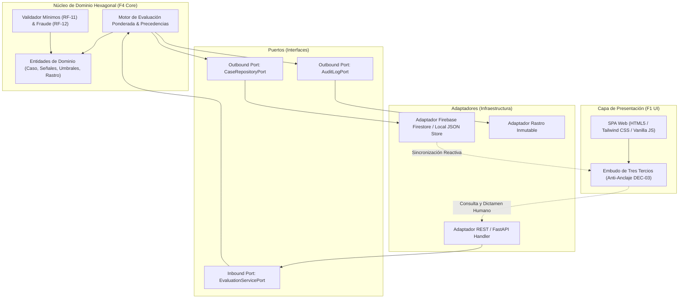
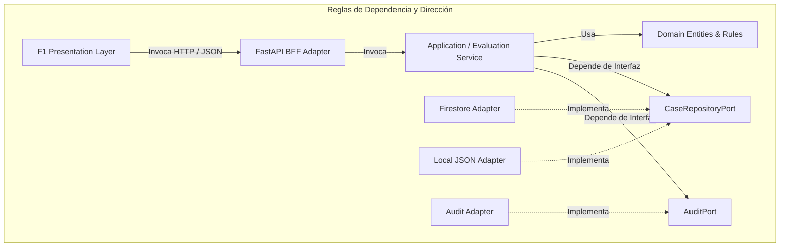
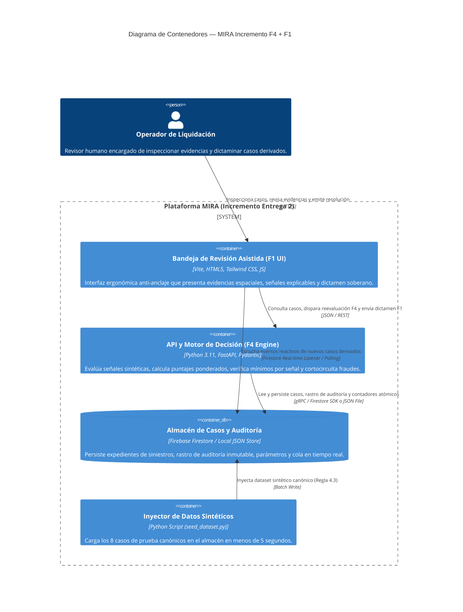

# Architecture Spine — MIRA (Incremento F4 y F1)

## Design Paradigm

El sistema adopta una **Arquitectura Hexagonal (Ports & Adapters)** para el núcleo de evaluación analítica (F4) combinada con una capa **Backend-for-Frontend (BFF)** y un repositorio de datos reactivo (Firebase Firestore / almacén desacoplado) para alimentar la interfaz de usuario de la Bandeja de Revisión Asistida (F1).



### Mapeo de Capas a Módulos

- `backend/core/`: Dominio puro, cálculo ponderado, evaluación de umbrales, validación de mínimos e invariantes de negocio sin dependencias de infraestructura.
- `backend/ports/`: Interfaces abstractas de entrada y salida (protocolos y contratos de repositorio).
- `backend/adapters/`: Implementaciones concretas de endpoints REST (FastAPI), repositorios de datos (Firebase Firestore / Local Store), y adaptadores de auditoría.
- `frontend/src/`: Interfaz SPA desacoplada (Vite + Tailwind CSS), organizada en vistas, componentes ergonómicos del embudo de tres tercios y cliente API.

---

## Inherited Invariants

| Inherited | From Parent / E1 | Binds Here |
| :--- | :--- | :--- |
| **DEC-01** | Bitácora E1 / Cap. 2.11 | Retención quinquenal inalterable de evidencias digitales con cifrado en reposo y tránsito. |
| **DEC-02** | Bitácora E1 / Cap. 2.6 | Definición de validación cobrable: todo expediente resuelto concluyentemente (automático F4 o asistido F1) suma al consumo. |
| **DEC-03** | Bitácora E1 / H-09 | Orden de presentación UI anti-anclaje: evidencias espaciales primero, señales al medio, puntaje al final. |
| **DEC-04** | Bitácora E1 / H-03 | Umbrales operativos de marcha blanca fijados en 90 (aprobación) y 60 (derivación intermedia). |
| **DEC-05** | Bitácora E1 / Cap. 4 | Procesamiento desacoplado asincrónico y SLA objetivo de 24 horas hábiles para revisión humana en F1. |
| **DEC-07** | Bitácora E1 / H-04 | Prohibición absoluta de rechazo automático en decisiones patrimoniales; puntaje < 60 deriva a revisión asistida. |
| **H-12 / RF-11** | Informe E1 / UC-02 | Evaluación vinculante de mínimos por señal individual (señal crítica bajo mínimo fuerza derivación a F1). |
| **RF-12** | Informe E1 / UC-02 | Precedencia de corte de alertas de fraude sobre cualquier puntaje alto. |
| **RF-19** | Informe E1 / UC-03 | Estampado inmutable de marca de discrepancia cuando el dictamen humano difiere de la sugerencia algorítmica. |
| **Regla 4.3** | Bases Entrega 2 PDF | Los modelos de IA no se construyen; se opera con dataset sintético determinista (`dataset.json`) con señales precalculadas. |

---

## Invariants & Rules (ADs)

### AD-1 — Arquitectura Hexagonal y Separación Estricta de F4 y F1 [ADOPTED]
- **Binds:** `backend/core`, `backend/ports`, `backend/adapters`, `frontend/src`
- **Prevents:** Acoplamiento directo entre la lógica matemática de decisión algorítmica y la capa de presentación de revisión asistida; previene contaminación del dominio con librerías de UI o SDKs de base de datos.
- **Rule:** El motor F4 (`backend/core/engine.py`) es una función pura de dominio que recibe `CasoEvaluacionRequest` y `ConfiguracionUmbrales` y devuelve `ResultadoF4`. No conoce HTTP, Firestore ni el DOM. F1 interactúa exclusivamente a través de los adaptadores de API y persistencia.

### AD-2 — Stack de Backend: Python 3.11+ con FastAPI y Pydantic v2 [ADOPTED]
- **Binds:** `backend/`
- **Prevents:** Tipos no tipados, divergencia en esquemas de datos analíticos, desajustes de precisión en fórmulas flotantes de confianza y APIs bloqueantes lentas.
- **Rule:** Toda entidad de datos, vector de señales analíticas y esquema de entrada/salida se modela mediante `Pydantic BaseModel` con tipado estricto. La API REST es expuesta con `FastAPI` y ejecutada mediante `uvicorn`, soportando operaciones asíncronas y validaciones automáticas OpenAPI.

### AD-3 — Persistencia Reactiva con Firebase Firestore y Fallback Autónomo [ADOPTED]
- **Binds:** `backend/adapters/repository`, `frontend/src/services`
- **Prevents:** Bloqueo de la demostración o de la evaluación por falta de credenciales de nube activas; previene pérdida de estado en la cola de revisión asistida.
- **Rule:** La persistencia se gobierna mediante la interfaz `CaseRepositoryPort`. Se implementa `FirestoreCaseRepository` utilizando el SDK oficial de Firebase para sincronización reactiva en tiempo real y persistencia documental. Para garantizar el cumplimiento del **Criterio C4** (ejecución autónoma desde el README en menos de 5 minutos sin configurar cuentas externas), se incorpora un `LocalJsonCaseRepository` que opera de forma idéntica en memoria y disco local mediante `dataset.json`. La selección se realiza vía variable de entorno `MIRA_PERSISTENCE_MODE=firestore|local`.

### AD-4 — Prohibición de Rechazo Automático en Motor F4 (DEC-07) [ADOPTED]
- **Binds:** `backend/core/engine.py`, `ResultadoF4`
- **Prevents:** Generación de rechazos algorítmicos contrarios a la normativa de protección al consumidor y al apetito de riesgo de Compliance.
- **Rule:** La máquina de estados del motor F4 solo puede emitir dos estados terminales algorítmicos: `APROBADO_AUTOMATICO` o `DERIVADO_A_REVISION_ASISTIDA`. El estado `RECHAZADO` solo puede ser emitido como `RECHAZADO_POR_OPERADOR` desde la interfaz F1, exigiendo un autor humano y un motivo obligatorio no vacío.

### AD-5 — Precedencia de Corte por Fraude y Mínimos Individuales (RF-11, RF-12) [ADOPTED]
- **Binds:** `backend/core/engine.py`
- **Prevents:** Aprobación automática de siniestros fraudulentos camuflados bajo un promedio ponderado alto; previene aprobación con prestadores no validados o documentos adulterados.
- **Rule:** Antes de evaluar el puntaje global ponderado contra el umbral de aprobación (90):
  1. Si `alerta_fraude_activa == true`, el motor genera cortocircuito de corte y emite `DERIVADO_A_REVISION_ASISTIDA` con causal `ALERTA_CRITICA_FRAUDE` (precedencia absoluta).
  2. Si para cualquier señal crítica $s_i$, su valor es menor que su umbral mínimo $min_i$ (`s_i < min_i`), el motor emite `DERIVADO_A_REVISION_ASISTIDA` con causal `MINIMO_SENAL_INSATISFECHO`.
  3. Si algún módulo analítico requerido está ausente o en error, el motor emite `DERIVADO_A_REVISION_ASISTIDA` con causal `INFORMACION_INCOMPLETA` (RF-13).

### AD-6 — Mitigación Estructural del Sesgo de Anclaje Cognitivo en UI (DEC-03) [ADOPTED]
- **Binds:** `frontend/src/views/CaseDetailView.html`, `frontend/src/components/`
- **Prevents:** Condicionamiento del criterio de análisis del operador humano derivado de la exposición prematura a una métrica sintética de confianza.
- **Rule:** El contenedor del visor de evidencias y el panel de señales se renderizan en el pliegue visual superior (Tercio Superior y Medio). El puntaje de confianza global y su gráfica de desglose se encuentran encapsulados en el Tercio Inferior (`#panel-puntaje-confianza`), precediendo de forma inmediata al panel de botones resolutivos. La interfaz prohíbe la presencia de badges con el puntaje numérico en la cabecera o lista inicial del caso.

### AD-7 — Registro Inalterable de Discrepancias y Rastro Forense (RF-19, H-14, DEC-01) [ADOPTED]
- **Binds:** `backend/core/audit.py`, `backend/adapters/audit_repository`
- **Prevents:** Pérdida de trazabilidad legal; previene omisión de auditoría cuando un operador decide revocar la recomendación algorítmica.
- **Rule:** Toda resolución humana en F1 que resuelva `Aprobar` sobre un caso derivado por `BAJO_PUNTAJE` o `ALERTA_FRAUDE`, o que resuelva `Rechazar` sobre un caso de puntaje alto, fija automáticamente `discrepancia_detectada = true` y exige un campo de fundamentación obligatoria de longitud mínima $\ge 15$ caracteres. El expediente sella un rastro append-only con timestamp UTC ISO-8601, ID del operador, parámetros aplicados y firma hash SHA-256.

### AD-8 — Arquitectura de Frontend: Vite + Tailwind CSS v3 [ADOPTED]
- **Binds:** `frontend/`
- **Prevents:** Interfaces pesadas, desorden estilístico, inconsistencia visual con el PRD y la especificación de UX de Sally.
- **Rule:** Se utiliza `Vite` como empaquetador ultrarrápido y `Tailwind CSS v3` para el sistema de diseño de tokens. La navegación es fluida, con transiciones reactivas de apertura de expediente en menos de 500 ms (NFR-F1-02).



---

## Consistency Conventions

| Concern | Convention |
| :--- | :--- |
| **Naming (Entidades & Clases)** | PascalCase para clases y modelos Pydantic (`Caso`, `SenalAnalitica`, `ResultadoF4`, `ResolucionHumana`). |
| **Naming (Atributos & Variables)** | snake_case en Python (`caso_id`, `puntaje_confianza`, `discrepancia_detectada`). camelCase en JS (`casoId`, `puntajeConfianza`). |
| **Naming (Archivos & Módulos)** | kebab-case para UI y assets (`case-detail-view.js`, `score-panel.js`). snake_case para backend (`decision_engine.py`, `test_engine.py`). |
| **Identificadores de Entidad** | Casos: `CASO-YYYY-XXXX`. Evidencias: `EVID-XX`. Hallazgos: `HALLAZGO-XX`. |
| **Formatos de Fecha y Hora** | ISO-8601 con zona horaria explícita (`2026-10-03T18:30:00Z` o `-03:00`). |
| **Formatos de Moneda y Montos** | Enteros en Pesos Chilenos (CLP) para evitar imprecisiones de coma flotante. |
| **Estados de Caso (Lifecycle)** | `PENDIENTE_EVALUACION_F4`, `APROBADO_AUTOMATICO`, `DERIVADO_A_REVISION_ASISTIDA`, `APROBADO_POR_OPERADOR`, `RECHAZADO_POR_OPERADOR`, `PENDIENTE_ANTECEDENTES`. |
| **Tratamiento de Errores** | Excepciones semánticas derivadas de `DomainError` (`FraudeDetectadoException`, `ModuloNoDisponibleException`, `ValidacionInvalidaException`). En API: Códigos HTTP semánticos (400, 404, 422, 500) con sobre `{ "error": true, "code": "ERR_CODE", "message": "Texto en español" }`. |
| **Seguridad & Principio de Menor Privilegio** | Cero secrets en código duro; validación estricta de inputs con allow-lists; sanitización de paths (`path.basename()`); desinfección HTML anti-XSS en el visor de notas. |

---

## Stack

| Componente / Tecnología | Versión Verificada | Propósito y Justificación Técnica |
| :--- | :--- | :--- |
| **Python** | `3.11+` | Lenguaje central para la lógica analítica de cálculo de F4, tipado estático y robustez numérica. |
| **FastAPI** | `^0.115.0` | Framework web ASGI asíncrono de alto rendimiento, autodocumentado con OpenAPI/Swagger. |
| **Pydantic** | `^2.9.0` | Validación estricta de datos en runtime y parseo declarativo de esquemas JSON. |
| **Uvicorn** | `^0.30.0` | Servidor ASGI ultrarrápido para producción y desarrollo local. |
| **Firebase Admin SDK** | `^6.5.0` | Conexión e inyección a Google Cloud Firestore desde el backend en Python. |
| **Node.js** | `>=18.0.0` | Entorno de ejecución para tooling de frontend y servidor de desarrollo. |
| **Vite** | `^5.4.0` | Empaquetador y dev server de frontend con Hot Module Replacement instantáneo. |
| **Tailwind CSS** | `^3.4.10` | Motor de estilos utilitarios para plasmar con fidelidad el diseño ergonómico de Sally. |
| **Pytest** | `^8.3.0` | Framework de pruebas automatizadas para backend (unitarias, integración y RNF). |
| **Playwright** | `^1.47.0` | Framework de pruebas de extremo a extremo (E2E) para automatizar el recorrido web del usuario. |

---

## Structural Seed

### Diagrama de Contenedores (C4 Container View)



### Diagrama de Componentes del Motor F4 (C4 Component View)

```mermaid
flowchart LR
    subgraph API_Layer["Capa API (FastAPI)"]
        Router["/api/v1/evaluar-caso\n/api/v1/casos\n/api/v1/dictamen-operador"]
    end

    subgraph Service_Layer["Servicios de Aplicación"]
        EvaluationService["EvaluationService\nCoordina el flujo de evaluación"]
        ReviewService["ReviewService\nProcesa resoluciones humanas y discrepancias"]
    end

    subgraph Core_Engine["Motor F4 (Dominio Hexagonal)"]
        ScoreCalculator["ScoreCalculator\nScore = Sum(w_i * s_i)"]
        FraudChecker["FraudChecker (RF-12)\nPrecedencia absoluta"]
        SignalThresholdValidator["SignalThresholdValidator (RF-11)\nMínimos individuales"]
        DecisionResolver["DecisionResolver (DEC-07)\nProhíbe rechazo automático"]
    end

    subgraph Persistence_Layer["Capa de Persistencia"]
        RepoInterface["<<interface>>\nCaseRepositoryPort"]
        FirestoreRepo["FirestoreRepository"]
        LocalFileRepo["LocalJsonRepository"]
    end

    Router --> EvaluationService
    Router --> ReviewService
    EvaluationService --> ScoreCalculator
    EvaluationService --> FraudChecker
    EvaluationService --> SignalThresholdValidator
    EvaluationService --> DecisionResolver
    EvaluationService --> RepoInterface
    ReviewService --> RepoInterface
    RepoInterface <|.. FirestoreRepo
    RepoInterface <|.. LocalFileRepo
```

### Estructura de Directorios del Código Fuente

```text
c:/Entrega2LLM/
├── backend/
│   ├── app/
│   │   ├── core/                      # Dominio Hexagonal Puro
│   │   │   ├── __init__.py
│   │   │   ├── engine.py              # Motor de cálculo y umbrales F4
│   │   │   ├── rules.py               # Precedencia de fraude y mínimos
│   │   │   └── models.py              # Entidades de dominio
│   │   ├── schemas/                   # Esquemas Pydantic v2 de entrada y salida
│   │   │   ├── caso.py
│   │   │   ├── evaluacion.py
│   │   │   └── resolucion.py
│   │   ├── ports/                     # Interfaces abstractas (Puertos)
│   │   │   ├── repository_port.py
│   │   │   └── audit_port.py
│   │   ├── adapters/                  # Adaptadores de infraestructura
│   │   │   ├── api/                   # Controladores REST FastAPI
│   │   │   │   ├── router_evaluacion.py
│   │   │   │   ├── router_casos.py
│   │   │   │   └── router_dictamen.py
│   │   │   ├── repositories/          # Implementaciones de persistencia
│   │   │   │   ├── firestore_repository.py
│   │   │   │   └── local_json_repository.py
│   │   │   └── audit/
│   │   │       └── immutable_audit_logger.py
│   │   └── main.py                    # Punto de entrada de la aplicación FastAPI
│   ├── tests/                         # Suite de pruebas automatizadas
│   │   ├── unit/                      # Tests unitarios del motor F4
│   │   ├── integration/               # Tests de API y persistencia
│   │   ├── e2e/                       # Tests Playwright recorriendo la UI
│   │   └── rqnf/                      # Verificación automatizada de RNF-01 a RNF-10
│   ├── scripts/
│   │   ├── seed_dataset.py            # Carga rápida del dataset sintético
│   │   └── benchmark_rnf01.py         # Prueba de carga de 100 y 1000 llamadas/min
│   └── requirements.txt
├── frontend/
│   ├── public/
│   │   └── assets/                    # Evidencias sintéticas (imágenes de boletas)
│   ├── src/
│   │   ├── components/                # Componentes ergonómicos
│   │   │   ├── CaseHeader.js          # Cabecera con SLA y badges (sin puntaje)
│   │   │   ├── EvidenceViewer.js      # Visor documental con Bounding Boxes
│   │   │   ├── SignalMatrix.js        # Matriz explicable de señales y alertas
│   │   │   ├── DelayedScorePanel.js   # Panel diferido de puntaje (DEC-03)
│   │   │   └── ResolutionPanel.js     # Panel resolutivo 3 vías + discrepancia (RF-19)
│   │   ├── views/
│   │   │   ├── InboxView.js           # Bandeja filtrable de casos derivados F1
│   │   │   └── CaseDetailView.js      # Embudo de tres tercios de inspección
│   │   ├── services/
│   │   │   ├── api.js                 # Cliente HTTP hacia FastAPI
│   │   │   └── firebase.js            # Cliente Firebase para sincronización
│   │   ├── index.css                  # Estilos Tailwind CSS
│   │   └── main.js                    # Montaje de la SPA
│   ├── package.json
│   ├── tailwind.config.js
│   └── vite.config.js
├── data/
│   └── dataset.json                   # Catálogo de los 8 casos canónicos de prueba
├── README.md                          # Guía de levantamiento en < 5 minutos (Criterio C4)
└── _bmad-output/                      # Artefactos metodológicos BMAD
```

---

## Capability → Architecture Map

| Capacidad / Requisito | Componente Responsable | Gobernado por |
| :--- | :--- | :--- |
| **Cálculo ponderado y evaluación de umbrales** | `backend/app/core/engine.py` | AD-1, AD-2, DEC-04 |
| **Verificación de mínimos por señal (RF-11)** | `backend/app/core/rules.py` | AD-5, H-12 |
| **Precedencia absoluta de alerta de fraude (RF-12)** | `backend/app/core/rules.py` | AD-5, RF-12 |
| **Prohibición de rechazo automático patrimonial (RF-14)** | `backend/app/core/engine.py` | AD-4, DEC-07 |
| **Bandeja de casos derivados y orden por SLA (FR-F1-01)** | `frontend/src/views/InboxView.js` | DEC-05, FR-F1-01 |
| **Visor documental con coordenadas espaciales (FR-F1-02)** | `frontend/src/components/EvidenceViewer.js` | AD-8, FR-F1-02 |
| **Diseño anti-sesgo de anclaje (Puntaje diferido) (RF-17)** | `frontend/src/components/DelayedScorePanel.js` | AD-6, DEC-03, RNF-08 |
| **Dictamen humano soberano y justificación (RF-18)** | `frontend/src/components/ResolutionPanel.js` | AD-4, DEC-07 |
| **Captura y registro de marcas de discrepancia (RF-19)** | `backend/app/core/engine.py` + `frontend` | AD-7, RF-19 |
| **Persistencia documental y sincronización en tiempo real** | `backend/app/adapters/repositories/` | AD-3, Regla 4.3 |
| **Rastro de auditoría inmutable y reconstrucción (RF-30)** | `backend/app/adapters/audit/` | AD-7, H-14, RNF-04 |

---

## Deferred

1. **Autenticación federada contra LDAP/Active Directory corporativo (DEC-08):** Se opera con usuarios y roles simulados localmente (`operador_marco`, `supervisor_rodrigo`); la federación SSO corporativa se pospone a la versión de producción v2.
2. **Diseñador gráfico de flujos con drag-and-drop (F2):** No forma parte del incremento funcional de la Entrega 2.
3. **Firma digital criptográfica avanzada PKCS#7 en PDFs de auditoría:** El rastro de auditoría se sella internamente con SHA-256; la firma electrónica avanzada de certificados se delega a v2.
4. **Módulo de rebalanceo algorítmico dinámico de carga entre liquidadores:** La cola en F1 se prioriza por criticidad y SLA; la auto-asignación automatizada se delega a v2.
