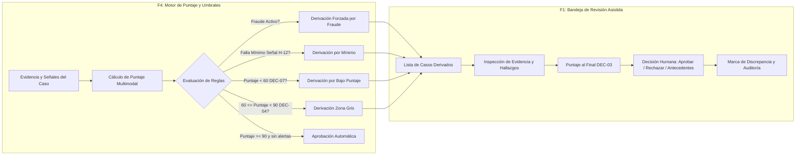

# Project Brief: MIRA — Incremento Funcional F4 y F1

**Elaborado por:** Mary 📊 (Business Analyst — BMad Method)  
**Entrada:** Informe de Análisis de Requisitos de la Entrega 1, Bitácora de Decisiones del Cliente (`DEC-01` a `DEC-09`), Catálogo de Hallazgos (`H-01` a `H-15`) y Bases de Evaluación de la Entrega 2.

---

## 1. Resumen Ejecutivo (Executive Summary)

El presente Project Brief formaliza el alcance, los fundamentos estratégicos, las reglas de negocio y las restricciones arquitectónicas para el primer incremento de software ejecutable de la plataforma **MIRA** (DPRIME SpA), correspondiente a la **Entrega 2**.

A partir del análisis exhaustivo de requisitos y de la bitácora de decisiones consensuada con el Representante del Cliente en la Entrega 1, se ha seleccionado un núcleo funcional vertical, altamente acoplado y de máximo riesgo operacional y regulatorio:
1. **F4 — Puntaje y decisión por umbrales:** El motor de cálculo, ponderación de componentes, evaluación de mínimos por señal, precedencia estricta de fraude y resolución de decisión algorítmica.
2. **F1 — Bandeja de revisión asistida:** La interfaz interactiva del operador humano para la resolución de casos derivados, garantizando el principio de *"intervención humana significativa"*, con desglose probatorio, ubicación espacial del hallazgo en la evidencia, registro de motivos, marca de discrepancia algorítmica y control de tiempos de atención (SLA).

Este incremento no construye los modelos multimodales de fondo (los cuales quedan simulados mediante datos de prueba sintéticos con señales precalculadas, conforme al estándar de la regla 4.3), sino que materializa la **lógica de negocio de decisión, gobierno de umbrales y la experiencia humana de revisión asistida**. La conexión entre ambas funcionalidades es directa y unidireccional: **toda decisión no aprobada automáticamente por F4 es emitida como un caso derivado que alimenta en tiempo real la bandeja de F1**.

---

## 2. El Problema de Negocio y Regulatorio (The Problem)

En la industria de seguros y servicios financieros, la automatización indiscriminada de resoluciones de siniestros o reembolsos enfrenta una triple barrera crítica:
1. **Riesgo Regulatorio y Protección del Asegurado:** La normativa legal prohíbe terminantemente decisiones automatizadas que afecten el patrimonio de las personas sin una vía de explicación y una intervención humana efectiva. Un rechazo automático genera nulidad jurídica, multas y daño reputacional irreparable.
2. **Sesgo Cognitivo de Anclaje del Operador:** Cuando un sistema de apoyo exhibe un puntaje numérico antes de que el revisor examine la evidencia, el operador humano sufre de sesgo de anclaje (tiende a validar el número sugerido), anulando la independencia de la revisión y convirtiendo la intervención humana en un mero trámite administrativo simulado.
3. **Puntos Ciegos en Puntuaciones Globales:** Un promedio ponderado alto puede encubrir una anomalía crítica aislada (por ejemplo, una alteración tipográfica o un documento emitido por un facultativo suspendido). Si el sistema no evalúa umbrales mínimos por componente individual y reglas de precedencia absoluta contra el fraude, se aprueban siniestros fraudulentos camuflados en puntajes agregados altos.

---

## 3. Justificación y Acotación del Alcance a F4 y F1

Conforme a las reglas de selección de la Entrega 2 (Capítulo 4.1 y 4.2):
* **Regla de Conexión:** F4 y F1 conforman un ciclo funcional continuo: F4 calcula señales, aplica umbrales y clasifica el caso; cuando el caso no cumple con aprobación automática directa, se deriva hacia F1, donde el operador humano analiza la evidencia y emite el veredicto definitivo.
* **Regla de Hallazgo Abierto de la Entrega 1:** El incremento aborda y resuelve de manera vinculante el hallazgo **H-12** (*Mínimos por señal individual*), el cual había quedado abierto en la Entrega 1 con verificación `null` en el requisito `RF-11`.

---

## 4. Trazabilidad Vinculante: Decisiones (DEC) y Hallazgos (H) de la Entrega 1

El alcance y comportamiento de este incremento de software están estrictamente gobernados por las siguientes decisiones de la bitácora y hallazgos formalizados en la Entrega 1:

| ID Decisión / Hallazgo | Título / Asunto | Impacto Específico y Mandatorio en F4 y F1 | Cita Textual de la Fuente |
| :--- | :--- | :--- | :--- |
| **DEC-07** *(resuelve **H-04**)* | **Rechazo automático en decisiones que afectan patrimonio del asegurado** | **Prohibición absoluta de rechazo automático en F4.** Si el puntaje es menor a 60, el motor NO rechaza; genera una derivación obligatoria a F1 bajo la causal *"Bajo Puntaje (<60)"*. En F1, el operador humano es el **único facultado para rechazar**, aprobar o pedir antecedentes, garantizando intervención humana significativa. | *"Se adopta (b): decisión de aprobación puede ser automática si puntaje >= 90 y sin señales de fraude activas... Decisión de rechazo SIEMPRE requiere intervención humana. Bajo puntaje (<60) = DERIVACIÓN A REVISIÓN, no rechazo automático."* (Bitácora E1, DEC-07). |
| **DEC-04** *(resuelve **H-03**)* | **Valores de referencia para umbrales de decisión automática** | Fija los umbrales operativos conservadores de F4 para la marcha blanca: **Aprobación Automática:** Puntaje $\ge 90$ (sin fraude y cumpliendo mínimos); **Derivación a Revisión Humana:** Puntaje entre 60 y 89; **Bajo Umbral:** Puntaje $< 60$ (derivación por bajo puntaje según DEC-07). | *"Se sugieren 90/60/20 como punto de partida conservador... en marcha blanca, el costo de un falso positivo es mayor que el de derivar de más."* (Informe E1, H-03 y DEC-04). |
| **DEC-03** *(resuelve **H-09**)* | **Orden de presentación del puntaje en interfaz de revisión asistida** | **Diseño estricto de la UI en F1:** Se prohíbe mostrar el puntaje al inicio. La pantalla presenta en primer plano la lista de evidencias, la ubicación espacial de anomalías (bounding boxes/marcadores) y el desglose de señales. **El puntaje global de confianza se revela únicamente al final**, antes de emitir el voto. | *"Prevalece el usuario real: primero evidencia y alertas, el puntaje al final. Un operador que decide por el número invalida el argumento de intervención humana significativa que sostiene todo el modelo ante Compliance."* (Informe E1, H-09 y DEC-03). |
| **H-12** *(Hallazgo Abierto en E1)* | **Mínimos por señal individual** | **Operacionalización en F4 (`RF-11`):** Se implementa la verificación de umbrales mínimos específicos por señal crítica (autenticidad documental, consistencia de montos, verificación de prestador). Si una señal está por debajo de su mínimo individual, el caso se deriva a F1, aun cuando el puntaje agregado supere los 90 puntos. | *"Cap. 2.6: el detalle de qué señales tienen mínimo propio y cuáles son sus valores está pendiente de definir... RF-11 existe y describe el comportamiento, pero su columna de verificación queda en null..."* (Informe E1, H-12). |
| **RF-12 / CP-RF-12-01** | **Precedencia de señales de fraude** | **Regla de corte en F4:** Si cualquier módulo genera una señal tipificada como alerta de fraude (ej. manipulación de firmas, duplicidad de folio), esta **prevalece sobre cualquier puntaje alto**. Bloquea de inmediato la aprobación y etiqueta el caso en F1 como derivado por *"Alerta Crítica de Fraude"*. | *"Señal de fraude activa con puntaje alto: prevalece el fraude sobre el total... el caso se deriva o escala cualquiera sea su puntaje."* (Informe E1, UC-02, RF-12). |
| **RF-13 / CP-RF-13-01** | **Derivación por información incompleta o fallo de módulo** | **Regla de integridad en F4:** Si algún componente o módulo de análisis falla o no entrega resultado, el caso se deriva a F1 indicando explícitamente el faltante. Jamás se calcula ni se aprueba con datos parciales. | *"Un módulo de análisis falla: el caso se deriva y no se aprueba con información parcial."* (Informe E1, UC-02, RF-13). |
| **RF-19 / CP-RF-19-01** | **Marca de discrepancia de criterio operador vs. plataforma** | **Mecanismo de feedback en F1:** Si el operador en F1 aprueba un caso sugerido para derivación/rechazo, o rechaza un caso con alta ponderación, el sistema registra la decisión con su motivo y estampa automáticamente la **marca de discrepancia** para auditoría y reentrenamiento de modelos sin trabar el flujo. | *"Si la decisión del operador difiere de la sugerencia de la plataforma, queda marcada para que el equipo de modelos la revise después, sin alterar la decisión tomada."* (Informe E1, UC-03, RF-19). |
| **DEC-01** *(resuelve **H-01**)* | **Período de retención y custodia de evidencia digital** | La evidencia consultada en F1 y los registros generados se conciben bajo la política de conservación inalterable de mínimo 5 años y cifrado continuo, garantizando la cadena de custodia. | *"Retención de 5 años mínimo... evidencia cifrada en tránsito y reposo."* (Bitácora E1, DEC-01). |
| **DEC-02** *(resuelve **H-02**)* | **Definición de validación para efectos de consumo** | Tanto un caso resuelto automáticamente por F4 como un caso derivado y sentenciado por el operador humano en F1 constituyen una **validación cobrable útil y concluyente**. | *"Validación = caso procesado con resultado y puntaje entregados, sea automático o derivado."* (Bitácora E1, DEC-02). |
| **H-14** *(Propuesta **DEC-10**)* | **Reconstrucción vs. Reproducción de decisiones** | El motor F4 y la bandeja F1 almacenan la instantánea exacta de las señales recibidas, los umbrales vigentes al momento del análisis y el motivo del operador, garantizando **reconstrucción auditable total**. | *"Se especifica reconstrucción —recuperar entradas, versiones, respuestas y reglas aplicadas— y se descarta prometer reproducibilidad sobre modelos no deterministas."* (Informe E1, H-14). |

---

## 5. Alcance Específico de las Funcionalidades

### 5.1 F4: Puntaje y Decisión por Umbrales
* **Cálculo Multimodal Ponderado:** Algoritmo que recibe señales precalculadas (identidad, autenticidad documental, coherencia de datos, historial prestador), normaliza sus componentes y genera un puntaje de confianza global entre $0$ y $100$.
* **Evaluación de Mínimos por Señal (H-12 / RF-11):** Verificación de umbral de corte individual para señales críticas.
* **Precedencia Absoluta de Fraude (RF-12):** Cortocircuito lógico ante banderas de fraude activas.
* **Lógica de Decisión con Prohibición de Rechazo Automático (DEC-07, DEC-04):**
  * `APROBADO_AUTOMATICO`: Puntaje $\ge 90$, sin señales de fraude y todos los mínimos por señal cumplidos.
  * `DERIVADO_A_REVISION_ASISTIDA`:
    * Caso en zona intermedia ($60 \le \text{Puntaje} < 90$).
    * Caso bajo umbral inferior ($\text{Puntaje} < 60$) $\rightarrow$ *Derivado por riesgo patrimonial (DEC-07)*.
    * Caso con señal de fraude activa $\rightarrow$ *Derivado por sospecha de fraude (RF-12)*.
    * Caso con señal bajo mínimo individual $\rightarrow$ *Derivado por señal crítica insatisfecha (H-12)*.
    * Caso con fallo de módulo $\rightarrow$ *Derivado por información parcial (RF-13)*.

### 5.2 F1: Bandeja de Revisión Asistida
* **Vista Lista de Casos Derivados:** Visualización filtrable y priorizada de expedientes derivados desde F4, exponiendo:
  * ID del caso y asegurado.
  * Razón explícita de derivación (Bajo Puntaje, Zona Gris, Alerta de Fraude, Mínimo Violado).
  * Tiempo restante y alerta visual de vencimiento según SLA (urgente / vencido).
* **Vista Detalle del Caso Asistido:**
  * **Sección de Evidencia y Hallazgos:** Visor de documentos/imágenes de prueba con coordenadas o marcas de ubicación espacial de las alertas detectadas.
  * **Desglose de Señales Analíticas:** Lista de señales evaluadas con su estado (conforme, advertencia, crítico).
  * **Puntaje de Confianza al Final (DEC-03):** Revelación del puntaje global y gráfico de barras solo tras el despliegue probatorio.
* **Panel de Resolución del Operador:**
  * Acciones disponibles: `Aprobar`, `Rechazar` o `Solicitar Antecedentes Adicionales`.
  * Campo obligatorio de justificación/motivo de la decisión.
  * **Marca de Discrepancia Automática (RF-19):** Si el operador resuelve en sentido opuesto a la sugerencia algorítmica, el sistema cataloga la discrepancia para auditoría de modelos sin bloquear la emisión del dictamen.

---

## 6. Exclusiones Explícitas (Out of Scope para la Entrega 2)

Para asegurar la profundidad, robustez y cumplimiento en tiempo y forma, quedan formalmente **fuera de este incremento**:
1. **Llamadas a Modelos de IA / LLMs en Tiempo Real:** El procesamiento pesado se sustituye por datos sintéticos con casos de prueba deterministas (`dataset` mock representativo de siniestros médicos/seguros), conforme a la regla 4.3.
2. **F2 (Diseñador de flujos con versiones):** No se implementa interfaz de diagramación de flujos ni control de versiones de bloques.
3. **F3 (Ingesta y validación de legibilidad en vivo):** La carga multi-canal y OCR de preprocesamiento se asumen pre-ejecutados.
4. **F5 (Gestión y aprobación de cambios de umbrales con doble firma):** Los umbrales (90/60) se configuran estáticamente a nivel de aplicación.
5. **F6, F7, F8, F9:** Rastro forense avanzado exportable, contadores de tarificación comercial, tableros analíticos BI y catálogo de versiones de modelos.
6. **Federación LDAP/Active Directory (DEC-08):** Se opera con usuarios simulados por rol (Operador / Supervisor) con credenciales locales.

---

## 7. Criterios de Aceptación y Verificación

1. **CA-01 (Trazabilidad F4 $\rightarrow$ F1):** Al evaluar un caso mediante el motor de umbrales F4, cualquier resultado que no sea aprobación automática genera de inmediato un expediente en la bandeja de F1 con su correspondiente causal tipificada.
2. **CA-02 (Cumplimiento DEC-07):** Un caso de prueba con puntaje 45 jamás recibe estado `RECHAZADO` por el sistema; su estado resultante es `DERIVADO_A_REVISION`. El rechazo se produce únicamente cuando el operador presiona `Rechazar` e ingresa un motivo en F1.
3. **CA-03 (Cumplimiento DEC-03):** La interfaz de F1 sitúa el bloque de puntaje numérico al final de la pantalla, jerarquizando en primer lugar la evidencia y el visor del documento con la marca del hallazgo.
4. **CA-04 (Cumplimiento H-12):** Un caso con puntaje global 92 pero con la señal de *"Consistencia de Prestador"* por debajo del mínimo fijado, es derivado a F1 informando *"Incumplimiento de umbral mínimo en señal de prestador"*.
5. **CA-05 (Cumplimiento RF-12):** Un caso con puntaje 95 pero con bandera de *"Alerta de Fraude: Alteración de Folio"* activa, es derivado obligatoriamente a F1 con alerta de alta prioridad.
6. **CA-06 (Cumplimiento RF-19):** Al aprobar un caso derivado por baja puntuación, la plataforma almacena exitosamente el registro con el flag `discrepancia_detectada = true` y el texto explicativo del operador.
7. **CA-07 (Autonomía de Ejecución):** El evaluador puede clonar el repositorio, levantar la aplicación web siguiendo el README en menos de 5 minutos, y transitar el ciclo completo de casos de prueba entre F4 y F1.

---

## 8. Memlog y Registro de Decisiones Analíticas

El proceso de ideación y acotación de este Project Brief ha quedado registrado en el archivo canónico de memoria de trabajo:
`_bmad-output/planning-artifacts/briefs/brief-MIRA-2026-10-01/.memlog.md`

**Estado de Aceptación:**  
Artefacto completo, validado contra el marco metodológico BMAD y listo para ser consumido por el rol de **Product Manager (John / `bmad-agent-pm`)** para la generación del **PRD**.
