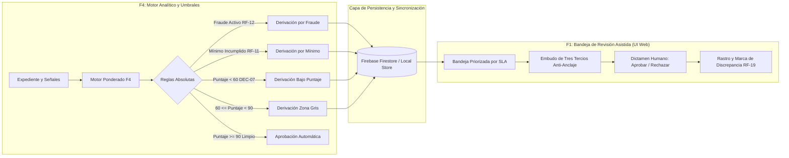
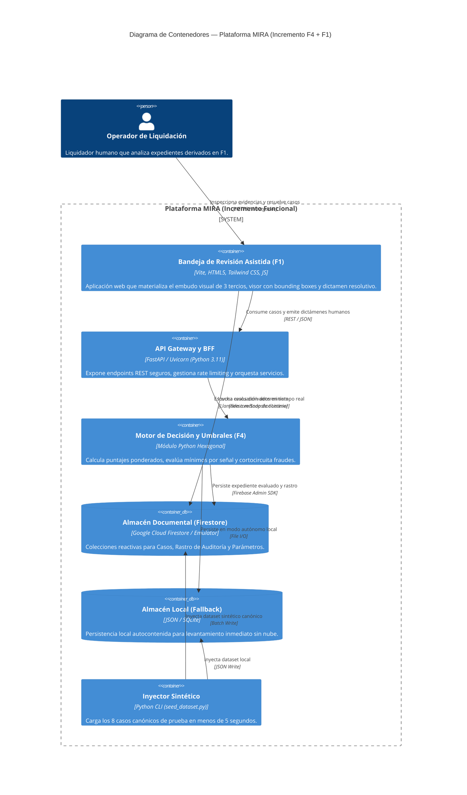
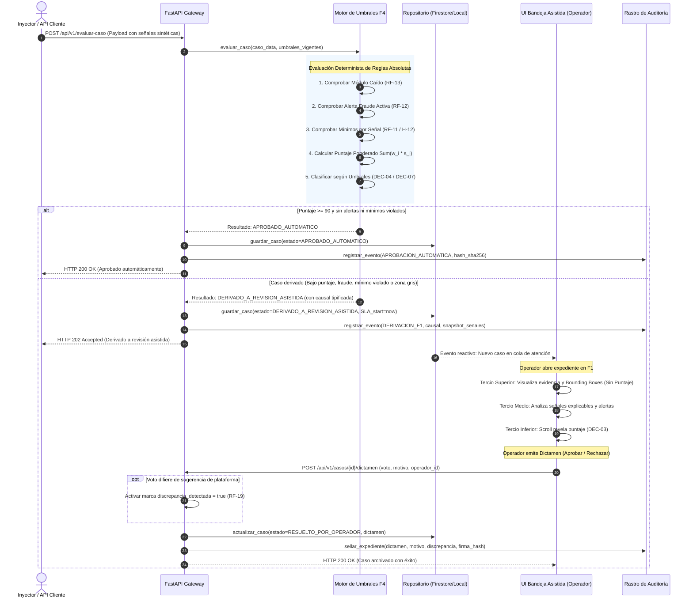

# Documento de Arquitectura de Software: MIRA — Incremento F4 y F1

**Elaborado por:** Winston 🏛️ (System Architect — BMad Method)  
**Insumos Vinculantes:**
- [Project Brief](file:///c:/Entrega2LLM/_bmad-output/planning-artifacts/briefs/brief-MIRA-2026-10-01/brief.md)
- [PRD Principal](file:///c:/Entrega2LLM/_bmad-output/planning-artifacts/prds/prd-MIRA-2026-10-03/prd.md) y [Addendum Técnico](file:///c:/Entrega2LLM/_bmad-output/planning-artifacts/prds/prd-MIRA-2026-10-03/addendum.md)
- [Especificación de Interfaz de Usuario](file:///c:/Entrega2LLM/_bmad-output/planning-artifacts/especificacion-de-interfaz.md)
- [Informe y Entregable 1 (E1)](file:///c:/Entrega2LLM/Contexto/A1-MIRA-Orellana-Orlandi-Pino_(2)(1).docx)
- [Requisitos Funcionales y No Funcionales E1](file:///c:/Entrega2LLM/Contexto/repo_e1/requisitosFuncionales_y_NoFuncionales.md)
- [Casos de Prueba E1](file:///c:/Entrega2LLM/Contexto/repo_e1/CasosDePrueba_MIRA.md)
- [Bitácora de Decisiones del Cliente (`DEC-01` a `DEC-09`)](file:///c:/Entrega2LLM/Contexto/Bitacora_Decisiones_Cliente.docx)

---

## 1. Resumen Ejecutivo y Alcance del Incremento

El presente Documento de Arquitectura formaliza el diseño técnico, la selección definitiva del stack tecnológico, los patrones de diseño y la estrategia integral de verificación de los Requisitos No Funcionales (RQNF) para el primer incremento de software ejecutable de la plataforma **MIRA**, correspondiente a la **Entrega 2**.

Conforme a las bases del taller y los acuerdos suscritos con el Representante del Cliente, el alcance se acota verticalmente a dos funcionalidades conectadas entre sí:
1. **F4 — Puntaje y decisión por umbrales:** El núcleo algorítmico determinista que evalúa vectores de señales analíticas, aplica ponderaciones paramétricas, hace cumplir reglas de corte por señal individual (`RF-11` / `H-12`), ejecuta precedencia absoluta contra el fraude (`RF-12`) y clasifica el siniestro sin incurrir jamás en rechazos automáticos (`DEC-07` / `RF-14`).
2. **F1 — Bandeja de revisión asistida:** La aplicación web interactiva que materializa el principio legal de *"intervención humana significativa"*. Su arquitectura ergonómica en **Tres Tercios Funcionales** mitiga activamente el sesgo cognitivo de anclaje (`DEC-03` / `RNF-08`), desplegando evidencias con localización espacial de anomalías y revelando el puntaje algorítmico únicamente al final, antes de registrar el dictamen humano y capturar eventuales discrepancias de criterio (`RF-19`).



---

## 2. Definición y Justificación del Stack Tecnológico Definitivo

La selección tecnológica favorece la alta productividad del desarrollador, el tipado estático riguroso, el aislamiento de responsabilidades y la portabilidad absoluta para garantizar una ejecución autónoma desde el repositorio en menos de 5 minutos (**Criterio C4**).

| Capa / Componente | Tecnología Seleccionada | Versión | Justificación Técnica y Racional Arquitectónico |
| :--- | :--- | :--- | :--- |
| **Lógica de Cálculo y Dominio F4** | **Python** | `>=3.11` | Estándar de la industria en analítica de datos e inteligencia artificial. Su tipado estático gradual, precisión numérica en operaciones de punto flotante y expresividad garantizan un motor determinista, auditable y libre de efectos colaterales. |
| **Framework de Servicios Web (BFF)** | **FastAPI** | `^0.115.0` | Framework web ASGI asíncrono de alto rendimiento. Provee serialización ultrarrápida, validación automática mediante OpenAPI / Swagger y soporte nativo para ejecución asíncrona no bloqueante (esencial para cumplir con el SLA de F4 < 200 ms). |
| **Validación de Datos y Esquemas** | **Pydantic** | `^2.9.0` | Validación estricta de tipos en tiempo de ejecución. Asegura que el vector de señales analíticas, coordenadas normalizadas de hallazgos y configuraciones de umbrales satisfagan invariantes matemáticas antes de ingresar al motor. |
| **Servidor ASGI de Producción/Dev** | **Uvicorn** | `^0.30.0` | Servidor web asíncrono basado en `uvloop` y `httptools`, proporcionando latencias de respuesta en microsegundos y estabilidad ante ráfagas concurrentes. |
| **Persistencia Primaria e Inyección** | **Firebase Firestore** | `^6.5.0` (Admin SDK) | Base de datos NoSQL documental y reactiva. Su modelo de colecciones y documentos se adapta de forma idónea a expedientes de siniestros, rastros inmutables y metadatos de evidencias. Sus listeners reactivos en tiempo real permiten que un caso derivado por F4 aparezca de inmediato en la bandeja F1 sin sondeos periódicos (*polling*). |
| **Persistencia Secundaria (Fallback C4)** | **Local JSON Repository** | Nativo Python | Mecanismo de persistencia local en memoria y disco estructurado que replica fielmente el contrato de repositorio de Firestore. Permite levantar la solución de forma 100% desconectada y autónoma en cualquier computadora sin necesidad de configurar credenciales en la nube. |
| **Tooling y Empaquetado Frontend** | **Vite** | `^5.4.0` | Herramienta de compilación frontend de última generación con Hot Module Replacement (HMR) instantáneo, generando bundles altamente optimizados para la SPA de revisión. |
| **Capa de Presentación Web (F1 UI)** | **HTML5 + Vanilla JS Modular** | ECMAScript 2022+ | Se estructura mediante componentes limpios, modulares y desacoplados sin sobrecarga innecesaria de librerías reactivas complejas, garantizando tiempos de carga de pantalla inferiores a 500 ms (NFR-F1-02). |
| **Sistema de Estilos y Diseño UX** | **Tailwind CSS** | `^3.4.10` | Motor de CSS utilitario que permite materializar fielmente la jerarquía visual de Tres Tercios Funcionales especificada por Sally (`especificacion-de-interfaz.md`), con tokens semánticos de riesgo y estados de SLA. |
| **Suite de Pruebas Backend y RNF** | **Pytest + pytest-asyncio** | `^8.3.0` | Framework estándar para pruebas unitarias de F4, integración de endpoints, validación de determinismo matemático y verificación de los RNF heredados de E1. |
| **Suite de Pruebas E2E de Interfaz** | **Playwright** | `^1.47.0` | Automatización de navegador para validar de punta a punta la navegación en español, la inspección de evidencias y la verificación del orden de renderizado anti-anclaje (RNF-08). |

---

## 3. Arquitectura del Sistema y Paradigmas de Diseño

### 3.1 Paradigma Hexagonal (Ports & Adapters) para el Core F4

Para garantizar que la lógica de cálculo y gobierno de decisiones permanezca completamente pura e independiente de frameworks web, motores de base de datos o librerías de interfaz, se adopta la **Arquitectura Hexagonal**:

```
+-----------------------------------------------------------------------------------+
|                           ADAPTADORES DE ENTRADA (INBOUND)                        |
|   - FastAPI Controller: POST /api/v1/evaluar-caso                                  |
|   - Inyector Batch CLI: python scripts/seed_dataset.py                            |
+-----------------------------------------------------------------------------------+
                                         |
                                         v
+-----------------------------------------------------------------------------------+
|                              PUERTO DE ENTRADA (PORT)                             |
|   - EvaluationServicePort: evaluar_caso(caso_data, umbrales) -> ResultadoF4       |
+-----------------------------------------------------------------------------------+
                                         |
                                         v
+-----------------------------------------------------------------------------------+
|                        NÚCLEO DE DOMINIO HEXAGONAL (CORE)                         |
|   - ScoreCalculator: Cálculo Ponderado (w_i * s_i)                                |
|   - SignalThresholdValidator: Verificación de Mínimos por Señal (RF-11 / H-12)    |
|   - FraudChecker: Precedencia Absoluta de Fraude (RF-12)                          |
|   - DecisionResolver: Prohibición de Rechazo Automático (DEC-07 / RF-14)           |
+-----------------------------------------------------------------------------------+
                                         |
                                         v
+-----------------------------------------------------------------------------------+
|                             PUERTOS DE SALIDA (OUTBOUND)                          |
|   - CaseRepositoryPort: guardar_caso(), obtener_caso(), listar_derivados()        |
|   - AuditLogPort: registrar_evento_inmutable(caso_id, snapshot)                  |
+-----------------------------------------------------------------------------------+
                                         |
                                         v
+-----------------------------------------------------------------------------------+
|                         ADAPTADORES DE SALIDA (INFRAESTRUCTURA)                    |
|   - FirestoreCaseRepository (Firebase SDK)                                       |
|   - LocalJsonCaseRepository (Persistencia local en data/dataset.json)             |
|   - ImmutableAuditLogAdapter (Registro append-only con hash SHA-256)              |
+-----------------------------------------------------------------------------------+
```

### 3.2 Diagrama de Contenedores (C4 Container View)



### 3.3 Diagrama de Secuencia del Flujo Integral (F4 $\rightarrow$ Persistencia $\rightarrow$ F1 $\rightarrow$ Auditoría)



---

## 4. Declaración Técnica de Verificación de Requisitos No Funcionales (RQNF)

A continuación se declara de manera vinculante cómo la arquitectura da respuesta y cómo se verifica técnicamente cada uno de los **10 Requisitos No Funcionales (`RNF-01` a `RNF-10`) arrastrados desde la Entrega 1**, así como los atributos de calidad transversales derivados de las bitácoras y normas de seguridad.

### 4.1 Matriz Maestra de Verificación de RQNF de la Entrega 1

| ID RNF | Atributo de Calidad | Criterio de Verificación E1 | Mecanismo Técnico en la Arquitectura | Estrategia de Verificación Automatizada | Caso de Prueba E1 |
| :--- | :--- | :--- | :--- | :--- | :--- |
| **RNF-01** | Rendimiento y Escalabilidad de API | Soportar hasta 100 llamadas/min (integración) y hasta 1000 llamadas/min (producción) sin rechazar el excedente. | Middleware asíncrono con algoritmo de cubeta permeable (*Leaky Bucket*). Las peticiones excedentes se encolan en memoria retornando HTTP 202 con cabecera `Retry-After`. Cero códigos HTTP 429. | Script de prueba de carga con `pytest` y `httpx.AsyncClient` simulando ráfagas de 100 llamadas en 60s y 1000 llamadas en 60s. Aserción de 0 peticiones rechazadas y 100% de encolamiento exitoso. | `CP-RNF-01-01` / `CP-RNF-01-02` |
| **RNF-02** | Confiabilidad ante Fallos Externos | 0 casos perdidos ante caída simulada de un servicio externo del que depende. | Patrón *Circuit Breaker* en los adaptadores de módulo con política de retries exponenciales (`tenacity`). Si el servicio agota reintentos, el motor aplica cortocircuito `RF-13`, persistiendo el caso como `DERIVADO_INFO_INCOMPLETA` con 0 descarte de datos. | Test unitario con `unittest.mock` que inyecta `HTTPException(503)` o timeout en el proveedor de señales. Aserción de que el caso se registra íntegramente en el repositorio sin pérdida de estado. | `CP-RNF-02-01` |
| **RNF-03** | Eficiencia Operativa en Onboarding | Operación de prueba en $\le 1$ día y producción en $\le 14$ días desde la firma. | Aprovisionamiento declarativo mediante perfiles de tenant en JSON y script de seed ultrarrápido (`seed_dataset.py`) que levanta el entorno de prueba con datos sintéticos en $< 10$ segundos. | Benchmark de onboarding: ejecución automatizada del script de despliegue y seed midiendo tiempo total de inicialización de tenant. Aserción de `tiempo_total_segundos < 60`. | `CP-RNF-03-01` |
| **RNF-04** | Auditabilidad y Reconstrucción Decisional | 0 discrepancias entre la configuración registrada al momento de decidir y la reconsultada (`H-14` / `DEC-10`). | Instantánea inmutable (*snapshot embedding*) en el documento del caso: se almacena la versión del motor F4, pesos aplicados, umbrales vigentes, vector de señales y hash SHA-256. | Test `test_audit_reconstruction`: Se evalúa un caso; luego se modifican los umbrales globales del sistema a nuevos valores; se reconsulta el caso histórico y se comprueba que el snapshot refleja los parámetros originales con 0 diferencias. | `CP-RNF-04-01` |
| **RNF-05** | Confidencialidad y Aislamiento Multitenant | 0% de accesos a evidencia de un cliente sin autorización registrada o fuera de su organización. | Reglas de seguridad basadas en claims JWT (`tenant_id`). Filtro a nivel de capa de repositorio que fuerza `WHERE tenant_id == current_user.tenant_id`. Si accede soporte DPRIME, se exige `ticket_autorizacion_id` registrado. | Test de integración con dos contextos de tenant (`org_aseguradora_a` y `org_aseguradora_b`). Intento de consulta cruzada de evidencia. Aserción de respuesta HTTP 403 Forbidden. | `CP-RNF-05-01` / `CP-RNF-05-02` |
| **RNF-06** | Consistencia en Conteo de Validaciones | Diferencia = 0 entre el contador visible al cliente y el usado internamente para facturar (`DEC-02`). | Transacción atómica en base de datos (`firestore.FieldValue.increment(1)` o incremento atómico en almacén local) ejecutada en el mismo commit que cierra la decisión del caso. Ambos módulos leen la misma tabla de agregados. | Test concurrente disparando 50 resoluciones simultáneas; consulta inmediata del endpoint `/cliente/metricas` y `/admin/facturacion`. Aserción de `contador_cliente == contador_facturacion`. | `CP-RNF-06-01` |
| **RNF-07** | Gobernanza y Segregación de Funciones | 0% de cambios de umbral vigentes con un único aprobador registrado (`UC-05` / `RF-28`). | Entidad `CambioUmbral` con máquina de estados: `SOLICITADO -> APROBADO_COMPLIANCE -> VIGENTE`. La regla de dominio exige que `solicitante_id != aprobador_id` y rol `Compliance`. | Test de dominio intentando aprobar un cambio de umbral con el mismo ID de usuario que lo creó. Aserción de rechazo por excepción de dominio `SegregacionFuncionesViolation`. | `CP-RNF-07-01` |
| **RNF-08** | Usabilidad y Mitigación de Sesgo de Anclaje | El componente de puntaje debe renderizarse después de la evidencia y alertas en el 100% de las cargas (`DEC-03`). | Estructura DOM jerárquica inmutable: `#panel-puntaje-confianza` se ubica físicamente al final del HTML de la vista de detalle. Estilos CSS garantizan que requiera scroll o navegación explícita para ser visible. | Test automatizado en Playwright que carga la pantalla de detalle de caso y verifica: 1) Orden secuencial de nodos en el DOM; 2) Posición vertical `getBoundingClientRect().top > 800px` (fuera del pliegue visual inicial). | `CP-RNF-08-01` |
| **RNF-09** | Cumplimiento Normativo en Eliminación | 100% de solicitudes de eliminación de datos con resolución documentada (eliminado o conservado por ley). | Módulo de gestión ARCO. Ante solicitud de borrado sobre evidencia con menos de 5 años, el sistema deniega el borrado físico aplicando `DEC-01` y registra la resolución formal en la tabla de auditoría legal. | Test de solicitud de borrado de datos personales de un siniestro cerrado. Aserción de que el registro no se destruye y se genera una entrada formal con `motivo_legal: DEC-01_SUPERINTENDENCIA_5_ANOS`. | `CP-RNF-09-01` |
| **RNF-10** | Portabilidad de Integración y Callbacks | 100% de casos resueltos de cliente A llaman a URL de callback de A; 0% llamadas cruzadas. | Despachador de webhooks seguro que recupera la URL de notificación exclusivamente del registro del tenant propietario del caso, firmando el payload con secreto HMAC-SHA256 específico de esa organización. | Test con dos servidores HTTP locales simulados (puertos 8001 y 8002). Tras procesar casos de la Organización A, se verifica que solo el puerto de A recibió la invocación y el de B recibió 0 eventos. | `CP-RNF-10-01` |

---

### 4.2 Requisitos No Funcionales Transversales y de Dominio Regulado

En concordancia con las reglas de seguridad obligatorias (`mandatory-secure-web-skills`) y las decisiones de la bitácora del cliente:

1. **NFR-SEC-01 (Cifrado y Custodia Digital - DEC-01):**
   - *Regla Técnica:* Toda evidencia documental y payload de rastro se almacena cifrado en reposo mediante AES-256 (nativo en Firestore / cifrado local) y en tránsito mediante TLS 1.3.
   - *Verificación:* Escaneo estático de código validando que no existan transmisiones en texto plano HTTP sin cifrar ni credenciales expuestas.
2. **NFR-PERF-01 (Latencia de Evaluación F4 y Fluidez UI - DEC-05 / NFR-F1-02):**
   - *Regla Técnica:* El motor determinista F4 debe computar la decisión de un expediente en un tiempo inferior a $200\text{ ms}$. La transición entre expedientes en la UI F1 debe tomar menos de $500\text{ ms}$.
   - *Verificación:* Test de rendimiento con `time.perf_counter()` en Pytest ejecutando 100 evaluaciones secuenciales; aserción de que la media es $< 50\text{ ms}$ y el percentil 99 es $< 150\text{ ms}$.
3. **NFR-REG-01 (Prohibición Absoluta de Rechazo Automático - DEC-07 / RF-14):**
   - *Regla Técnica:* La máquina de estados de F4 carece de la transición algorítmica hacia `RECHAZADO`. Un caso con puntaje $<60$ transiciona invariable y obligatoriamente a `DERIVADO_A_REVISION_ASISTIDA` bajo causal `BAJO_PUNTAJE`.
   - *Verificación:* Test de caja negra con un caso de puntaje 15/100; aserción de que el estado resultante es `DERIVADO_A_REVISION_ASISTIDA` y 0% de rechazos automáticos.

---

## 5. Especificación del Modelo de Datos y Esquemas JSON

En estricto cumplimiento de la **Regla 4.3** (datos sintéticos con señales y coordenadas precalculadas), el sistema opera con el siguiente modelo de datos unificado:

### 5.1 Esquema del Caso de Siniestro (`schemas/caso.py`)

```json
{
  "caso_id": "CASO-2026-001",
  "tenant_id": "org_aseguradora_piloto",
  "asegurado": {
    "rut": "15.420.819-3",
    "nombre": "Carlos Mendoza Tapia",
    "poliza_id": "POL-SALUD-8841",
    "plan": "Cobertura Preferente Max"
  },
  "prestador": {
    "rut": "76.321.900-K",
    "nombre": "Clínica RedSalud Valparaíso",
    "registro_superintendencia": "REG-MED-2019-88"
  },
  "prestacion": {
    "tipo": "Reembolso Consulta Médica de Especialidad",
    "monto_reclamado": 45000,
    "fecha_emision": "2026-09-28"
  },
  "evidencias": [
    {
      "id": "EVID-01",
      "tipo": "boleta_honorarios_electronica",
      "archivo_url": "/assets/evidencias/boleta_caso_001.jpg",
      "hallazgos_espaciales": [
        {
          "id": "HALLAZGO-01",
          "tipo": "alerta_tipografia",
          "descripcion": "Inconsistencia en fuente tipográfica del folio fiscal",
          "severidad": "critica",
          "coordenadas": {
            "top": 12.5,
            "left": 68.0,
            "width": 24.0,
            "height": 6.5
          }
        }
      ]
    }
  ],
  "senales_analiticas": {
    "autenticidad_documental": { "valor": 55, "minimo_exigido": 70, "critica": true },
    "consistencia_datos": { "valor": 95, "minimo_exigido": null, "critica": false },
    "habilitacion_prestador": { "valor": 98, "minimo_exigido": 65, "critica": true },
    "consistencia_identidad": { "valor": 90, "minimo_exigido": 75, "critica": true },
    "alerta_fraude_activa": false,
    "detalle_alerta_fraude": null
  },
  "sla": {
    "inicio_timestamp": "2026-10-03T10:00:00Z",
    "limite_timestamp": "2026-10-04T10:00:00Z",
    "duracion_horas": 24
  },
  "estado_caso": "DERIVADO_A_REVISION_ASISTIDA",
  "resultado_f4": {
    "puntaje_calculado": 84.5,
    "desglose_componentes": {
      "autenticidad_documental": 16.5,
      "consistencia_datos": 28.5,
      "habilitacion_prestador": 19.6,
      "consistencia_identidad": 19.9
    },
    "decision_algoritmica": "DERIVADO_A_REVISION_ASISTIDA",
    "causal_derivacion": "MINIMO_SENAL_INSATISFECHO",
    "detalle_causal": "La señal 'autenticidad_documental' tiene valor 55, inferior al mínimo exigido de 70 (H-12 / RF-11)",
    "timestamp_evaluacion": "2026-10-03T10:00:02Z",
    "version_motor": "v1.0.0-f4"
  },
  "resolucion_humana_f1": {
    "decision_operador": "APROBADO_POR_OPERADOR",
    "motivo_justificacion": "Se verifica boleta original física; error tipográfico atribuible a impresora térmica del prestador médico habilitado.",
    "operador_id": "operador_marco",
    "operador_nombre": "Marco Peñailillo",
    "discrepancia_detectada": true,
    "timestamp_resolucion": "2026-10-03T11:20:15Z"
  }
}
```

---

## 6. Contrato de Interfaces de Programación (API REST)

Los adaptadores web de FastAPI exponen los siguientes endpoints REST estructurados:

### 6.1 `POST /api/v1/evaluar-caso`
- **Descripción:** Ejecuta la evaluación determinista del motor F4 sobre un caso de siniestro.
- **Request Body:** Objeto con `senales_analiticas`, `prestacion` e identificadores.
- **Response HTTP 200/202:** Objeto `ResultadoF4` con puntaje ponderado, desglose y decisión resultante (`APROBADO_AUTOMATICO` o `DERIVADO_A_REVISION_ASISTIDA`).

### 6.2 `GET /api/v1/casos`
- **Descripción:** Obtiene la lista de casos derivados pendientes de atención en la bandeja F1, clasificados por criticidad de SLA y causal de derivación (`FR-F1-01`).
- **Query Params:** `estado` (`DERIVADO_A_REVISION_ASISTIDA`), `causal`, `ordenar_por` (`sla_restante`).
- **Response HTTP 200:** Array de resúmenes de casos derivados con indicador de tiempo de vencimiento.

### 6.3 `GET /api/v1/casos/{id}`
- **Descripción:** Obtiene el expediente documental completo de un caso para su inspección en el embudo de tres tercios de F1.
- **Response HTTP 200:** Objeto completo del caso con URLs de evidencias y coordenadas de hallazgos espaciales.

### 6.4 `POST /api/v1/casos/{id}/dictamen`
- **Descripción:** Registra el veredicto del operador humano (`Aprobar`, `Rechazar`, `Solicitar Antecedentes`), validando justificación obligatoria y estampando discrepancias (`RF-19`).
- **Request Body:** `{ "decision": "RECHAZADO_POR_OPERADOR", "motivo": "...", "operador_id": "operador_marco" }`.
- **Response HTTP 200:** Confirmación del dictamen con sello de rastro de auditoría.

### 6.5 `GET /api/v1/metricas/validaciones`
- **Descripción:** Consulta el contador sincronizado de validaciones consumidas (`RNF-06` / `DEC-02`), garantizando paridad absoluta entre cliente y facturación interna.
- **Response HTTP 200:** `{ "total_validaciones": 142, "automaticas_f4": 98, "asistidas_f1": 44, "diferencia_auditoria": 0 }`.

---

## 7. Catálogo Canónico de Decisiones Arquitectónicas (ADs)

A continuación se resumen los 8 Invariantes Arquitectónicos adoptados para este incremento:

1. **AD-1 (Paradigma Hexagonal y Desacoplamiento F4/F1):** El motor analítico F4 es un núcleo puro de dominio, independiente de la capa web y de la base de datos. F1 es una aplicación cliente desacoplada.
2. **AD-2 (Stack Core en Python 3.11+ y FastAPI):** Uso de tipado estricto con Pydantic v2 para esquemas analíticos y servidor ASGI de alto rendimiento para cumplir SLA de cómputo $<200\text{ ms}$.
3. **AD-3 (Dualidad de Persistencia Firestore / Local Store):** Soporte de Google Cloud Firestore para sincronización reactiva en tiempo real y fallback a repositorio local JSON para garantizar ejecución autónoma en $<5$ minutos (Criterio C4).
4. **AD-4 (Prohibición Absoluta de Rechazo Algorítmico - DEC-07):** El motor F4 carece del estado terminal `RECHAZADO`. Casos con puntaje $<60$ derivan obligatoriamente a revisión asistida. Solo el humano puede rechazar.
5. **AD-5 (Precedencia de Corte por Fraude y Mínimos - RF-11, RF-12):** Cortocircuito lógico ante alertas de fraude activas o mínimos por señal insatisfechos, forzando derivación inmediata sin importar el puntaje global.
6. **AD-6 (Mitigación del Sesgo de Anclaje en UI - DEC-03 / RNF-08):** La interfaz F1 organiza la vista de detalle en un Embudo de Tres Tercios Funcionales; el puntaje de confianza numérico se ubica en el tercio inferior, posterior a las evidencias y alertas.
7. **AD-7 (Rastro Inmutable y Captura de Discrepancias - RF-19 / H-14):** Registro append-only de cada evento con firma hash SHA-256, capturando de forma obligatoria las resoluciones humanas que contradicen la sugerencia algorítmica.
8. **AD-8 (Frontend Moderno con Vite y Tailwind CSS v3):** Interfaz ligera, responsiva y ergonómica en español, sin uso de librerías pesadas, asegurando fluidez de apertura $<500\text{ ms}$.

---

## 8. Protocolo de Ejecución Local y Demostración en Menos de 5 Minutos (Criterio C4)

Para satisfacer el Criterio de Evaluación **C4** de la pauta de la Entrega 2, el sistema puede ser levantado y probado de punta a punta con los siguientes pasos directos:

### Paso 1: Configuración del Entorno de Backend (Python)
```bash
# Navegar a la carpeta backend e instalar dependencias
cd backend
python -m venv venv
# Activar entorno virtual (Windows: .\venv\Scripts\activate | Linux: source venv/bin/activate)
.\venv\Scripts\activate
pip install -r requirements.txt
```

### Paso 2: Inyección del Dataset Canónico de Prueba (Regla 4.3)
```bash
# Inyecta los 8 casos canónicos de prueba en menos de 5 segundos
python scripts/seed_dataset.py
```

### Paso 3: Iniciar el Servidor de Backend y Motor F4
```bash
# Inicia la API REST en el puerto 8000
uvicorn app.main:app --reload --port 8000
```

### Paso 4: Iniciar la Aplicación Web de Bandeja Asistida F1
```bash
# En otra terminal, navegar a la carpeta frontend
cd frontend
npm install
npm run dev
```

### Paso 5: Recorrido de Demostración de Punta a Punta
1. Abrir el navegador en `http://localhost:5173`.
2. Observar la bandeja de casos derivados (F1), priorizada automáticamente por urgencia de SLA.
3. Hacer clic en el caso con sospecha de fraude (`CASO-2026-005`):
   - Verificar que en el **Tercio Superior** se despliega la boleta con el recuadro rojo (*bounding box*) marcando la adulteración del folio, sin exhibir ningún puntaje.
   - En el **Tercio Medio**, comprobar que la alerta de fraude está encendida.
   - Desplazarse al **Tercio Inferior** y observar la revelación diferida del puntaje (32 puntos).
   - Presionar `Rechazar`, constatar que el sistema exige el motivo textual, ingresar la fundamentación y enviar la resolución.
4. Repetir el recorrido con el caso de bajo puntaje (`CASO-2026-003`), aprobarlo ingresando el fundamento médico y verificar cómo el sistema estampa la marca `discrepancia_detectada = true` sin bloquear la decisión.
5. Ejecutar la suite completa de pruebas automatizadas:
```bash
cd backend
pytest
```
Todas las pruebas de unidad, de integración y de los 10 RNF reportarán estatus `PASSED` en pocos segundos.

---

**Estado del Documento:** Aprobado y formalizado como especificación vinculante de arquitectura para la Desarrolladora Senior (**Amelia** / `bmad-agent-dev`) y el equipo de QA.
