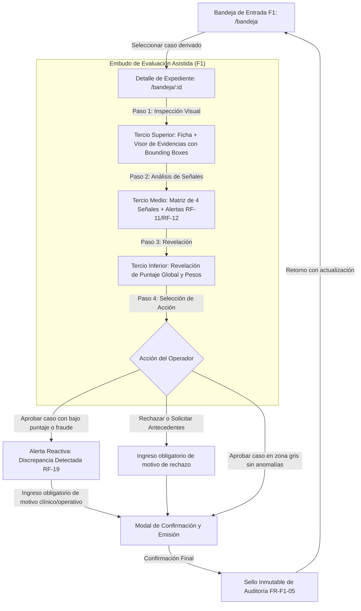

# Especificación de Interfaz: Bandeja de Revisión Asistida (F1)

> **Autor:** Sally — UX Designer (`bmad-agent-ux-designer`)  
> **Insumos Vinculantes:** [project-brief.md](file:///c:/Entrega2LLM/_bmad-output/planning-artifacts/project-brief.md), [prd.md](file:///c:/Entrega2LLM/_bmad-output/planning-artifacts/prds/prd-MIRA-2026-10-03/prd.md) y [addendum.md](file:///c:/Entrega2LLM/_bmad-output/planning-artifacts/prds/prd-MIRA-2026-10-03/addendum.md).  
> **Propósito:** Definir la arquitectura de información, la jerarquía visual anti-sesgo cognitivo, los flujos interactivos y la componentización modular estilizada con **Tailwind CSS** para construir la interfaz de usuario de la **Bandeja de Revisión Asistida (F1)** de MIRA.

---

## 1. Fundamentos y Filosofía de Diseño Centrado en el Humano

La interfaz de la **Bandeja de Revisión Asistida (F1)** no es un simple formulario de aprobación burocrática ni un tablero de monitoreo pasivo: es la **última línea de defensa legal, ética y patrimonial** de la aseguradora. 

Inspirada en los principios de diseño centrado en el ser humano de Don Norman y la disciplina de diseño de personajes de Alan Cooper, esta especificación busca resolver la tensión crítica entre la velocidad del procesamiento masivo y la rigurosidad del juicio humano soberano:

1. **Principio de Intervención Humana Significativa (`DEC-07` / `H-04`):**  
   El sistema algorítmico (F4) tiene prohibición terminante de emitir rechazos automáticos. Cuando un caso presenta bajo puntaje ($<60$), sospecha de fraude o inconsistencia, **el sistema se detiene y somete el expediente a la evaluación de un liquidador humano**. La interfaz de F1 debe empoderar al operador para dictaminar con soberanía y fundamentar su resolución.
2. **Mitigación Radical del Sesgo de Anclaje Cognitivo (`DEC-03` / `H-09` / `SM-3`):**  
   Estudios empíricos demuestran que cuando un revisor observa un puntaje de "35/100" al abrir un expediente, su cerebro busca instintivamente motivos para justificar el rechazo, anulando el valor del peritaje humano. F1 resuelve esto mediante una **jerarquía visual de revelación progresiva y diferida**: la evidencia física y las señales analíticas se analizan primero; el puntaje algorítmico se revela únicamente al final del recorrido visual.
3. **Claridad Inmediata en el Manejo de Tiempos Operacionales (`DEC-05` / `FR-F1-01`):**  
   Para evitar siniestros no atendidos dentro del SLA de 24 horas hábiles, la interfaz implementa una semaforización cromática no estresante pero inequívoca, permitiendo clasificar y despachar casos con riesgo de vencimiento.
4. **Captura Friccional Positiva en Discrepancias (`RF-19`):**  
   Si el operador decide revocar la recomendación algorítmica (ej. aprobar un caso con bajo puntaje debido a circunstancias médicas de urgencia), la UI no bloquea al usuario, pero introduce una pequeña "fricción deliberada" exigiendo justificar el motivo para enriquecer la bitácora de auditoría y calibración.

---

## 2. Mapa de Personas de Usuario y Casos de Uso (JTBD)

### 2.1 Persona Principal: Marco Peñailillo — Liquidador Senior de Siniestros
- **Arquetipo:** Analista meticuloso, 8 años evaluando reembolsos de salud complejos. Valora la rapidez pero teme aprobar fraudes o rechazar siniestros legítimos por fallas del sistema OCR.
- **Pain Point Clave:** Fatiga visual por sistemas rígidos con múltiples ventanas flotantes y formularios saturados de números sin contexto visual de la boleta o receta.
- **Necesidad en F1:** Un visor integrado donde pueda ver el documento original, con la zona sospechosa marcada en un recuadro claro, y tomar la decisión sin distracciones.

### 2.2 Persona Secundaria: Andrea Muñoz — Revisora Médica Especialista
- **Arquetipo:** Médica auditora encargada de revisar casos de alto valor o excepciones clínicas (urgencias vitales, prestaciones no nomencladas).
- **Pain Point Clave:** Modelos analíticos que penalizan documentos por fotos movidas o timbres borrosos en situaciones reales de emergencia.
- **Necesidad en F1:** Capacidad de dictaminar en contra del puntaje algorítmico (`Aprobar` un caso de 45 puntos) ingresando de forma fluida su fundamento clínico.

### 2.3 Persona de Supervisión: Rodrigo Valenzuela — Supervisor de Operaciones
- **Arquetipo:** Responsable de cumplimiento de SLA y distribución de carga en la mesa de revisión.
- **Necesidad en F1:** Una bandeja ordenada cronológicamente por criticidad de SLA, identificando visualmente qué casos expiran en menos de 1 hora.

---

## 3. Jerarquía Visual Inflexible: El Embudo de Tres Tercios (Three-Tier Funnel)

Para dar estricto cumplimiento al mandato `DEC-03` y asegurar el indicador `SM-3` (100% de cumplimiento en pruebas de usabilidad anti-anclaje), la pantalla de detalle del expediente (`/bandeja/:id`) se organiza en una estructura vertical de **Tres Tercios Funcionales**:

```
+---------------------------------------------------------------------------------------------------+
|  TERCIO SUPERIOR (Primer Viewport - Inspección Factual y Evidencia Documental)                     |
|  - Cabecera: ID Caso, Causal de Derivación (Badge), Contador SLA regresivo [SIN PUNTAJE]           |
|  - Split View: Ficha de Reclamación (Izquierda) + Visor de Documentos con Bounding Boxes (Derecha) |
+---------------------------------------------------------------------------------------------------+
                                                  | (Desplazamiento / Scroll Consciente)
                                                  v
+---------------------------------------------------------------------------------------------------+
|  TERCIO MEDIO (Segundo Bloque - Desglose de Señales Analíticas Explicables)                       |
|  - Matriz de Señales: Autenticidad Documental, Consistencia de Datos, Prestador, Identidad         |
|  - Verificación de Mínimos por Señal Individual (RF-11) y Alerta de Fraude Prevalente (RF-12)    |
|  - Estado de Módulos Analíticos (RF-13)                                                           |
+---------------------------------------------------------------------------------------------------+
                                                  | (Desplazamiento al Bloque Resolutivo)
                                                  v
+---------------------------------------------------------------------------------------------------+
|  TERCIO INFERIOR (Tercer Bloque - Revelación Algorítmica Diferida y Dictamen Soberano)             |
|  - Revelación del Puntaje de Confianza Ponderado (0-100) y desglose de pesos (DEC-03)             |
|  - Panel Resolutivo Humano: Acciones [ Aprobar ] [ Rechazar ] [ Solicitar Antecedentes ]           |
|  - Campo Obligatorio de Fundamento de Resolución + Banner Reactivo de Discrepancia (RF-19)        |
+---------------------------------------------------------------------------------------------------+
```

---

## 4. Arquitectura de Información y Navegación

### 4.1 Diagrama de Estados y Flujos de Pantalla (Mermaid)



---

## 5. Especificación Detallada de Pantallas y Wireframes

### 5.1 Pantalla 1: Bandeja General de Casos Derivados (`/bandeja`)

#### 5.1.1 Propósito
Listar, priorizar y filtrar todos los siniestros derivados por F4. Su ordenamiento nativo coloca en la cima aquellos casos con riesgo inminente de vencer el SLA de 24 horas y aquellos con alerta crítica de fraude.

#### 5.1.2 Wireframe Textual / Layout
```
+----------------------------------------------------------------------------------------------------------+
| [MIRA Logo] Plataforma de Inteligencia Multimodal    Bandeja F1   | Rol: Operador (Marco) [Simular Rol v]|
+----------------------------------------------------------------------------------------------------------+
|  KPIs RÁPIDOS:                                                                                           |
|  [ 12 Casos Pendientes ]   [ 2 SLA Crítico (<1h) ]   [ 1 Alerta de Fraude ]   [ 3 Discrepancias Hoy ]    |
+----------------------------------------------------------------------------------------------------------+
|  BARRA DE HERRAMIENTAS Y FILTROS:                                                                        |
|  [ Buscar por ID, RUT o Asegurado...      ]  [ Filtro Causal: Todas v ]  [ Filtro SLA: Todos v ]  [Limpiar]|
+----------------------------------------------------------------------------------------------------------+
|  TABLA DE CASOS DERIVADOS                                                                                |
|  ID Caso        Asegurado / Prestador           Causal de Derivación         Tiempo SLA      Acción      |
|  ------------------------------------------------------------------------------------------------------  |
|  CASO-2026-005  Rosa Oyarzún / Farmacia Central Alerta Crítica Fraude [RF-12]  18h 40m         [Revisar >] |
|  CASO-2026-008  Elena Morales / C. Valparaíso   Zona Gris (SLA Inminente)    25m Restante (R)[Revisar >] |
|  CASO-2026-003  Juan Pablo Soto / Radiología    Bajo Puntaje (<60) [DEC-07]  14h 15m (A)     [Revisar >] |
|  CASO-2026-004  Matías Bravo / Lab Clínico      Mínimo Violado: Prestador    21h 00m (V)     [Revisar >] |
|  CASO-2026-006  Beatriz Pino / Hosp. del Mar    Módulo Incompleto [RF-13]    22h 30m (V)     [Revisar >] |
|  CASO-2026-002  Claudio Lara / C. RedSalud      Zona Gris / Intermedio       19h 10m (V)     [Revisar >] |
+----------------------------------------------------------------------------------------------------------+
|  Demostrador Rápido: Cargar Caso Canónico -> [ CP-01 ] [ CP-02 ] [ CP-03 ] [ CP-04 ] [ CP-05 ] ...      |
+----------------------------------------------------------------------------------------------------------+
```

---

### 5.2 Pantalla 2: Estación de Revisión Asistida (`/bandeja/:id`)

#### 5.2.1 Cabecera de Caso (Sticky Header)
- **Elementos:** 
  - Botón interactivo: `← Volver a la Bandeja`.
  - Folio del caso: `CASO-2026-003` (con chip de copiado rápido).
  - Badge de Causal de Derivación: ej. `Bajo Puntaje (<60) — Mandato DEC-07`.
  - Badge de SLA con temporizador regresivo: ej. `SLA: 14h 15m restantes` (con color semántico verde, ámbar o rojo pulsante).
  - **REGLA ESTRICTA:** ¡Prohibido mostrar cualquier número de puntaje global en esta cabecera!

#### 5.2.2 Tercio Superior: Ficha del Reclamo y Visor de Evidencias (Split View)
- **Columna Izquierda (40% de ancho): Ficha del Expediente**
  - Tarjeta con metadatos del Asegurado (RUT enmascarado parcialmente para cumplimiento normativo, Nombre, Póliza, Plan de Salud).
  - Tarjeta del Prestador de Salud (RUT institucional, Razón Social, N° de Registro en la Superintendencia de Salud).
  - Tarjeta de la Prestación (Tipo de acto médico, Fecha de emisión, Monto reclamado formateado en moneda local `$45.000 CLP`).
- **Columna Derecha (60% de ancho): Visor de Evidencias Interactivo (`EvidenceViewer`)**
  - Selector de documentos adjuntos (pestañas o miniaturas: `Boleta Honorarios`, `Receta Médica`, `Orden de Examen`).
  - Lienzo documental con soporte de pan & zoom (`scale`, `translate`).
  - **Capas de Hallazgos Espaciales (`BoundingBoxOverlay`):** Cajas rectangulares coloreadas semánticamente proyectadas sobre las coordenadas `(top, left, width, height)` normalizadas en porcentaje.
  - Al posar el ratón (`hover`) o pulsar sobre una caja delimitadora, se despliega una tarjeta flotante (*Popover/Tooltip*) indicando:
    * ID del hallazgo (ej. `HALLAZGO-01`).
    * Tipo de hallazgo (ej. `Alerta Tipográfica / Inconsistencia de Fuente`).
    * Nivel de severidad (Crítica, Moderada, Leve).
    * Explicación pericial comprensible.

#### 5.2.3 Tercio Medio: Desglose de Señales Analíticas Explicables
- **Estructura:** Matriz de 4 tarjetas comparativas distribuidas en grid responsive:
  1. **Autenticidad Documental (Peso: 35%):**
     - Muestra el valor de señal (ej. `55 / 100`).
     - Alerta de cumplimiento de mínimo (`RF-11`): Mínimo exigido `70`. Estado: `NO CUMPLE` (Badge rojo).
  2. **Consistencia de Datos Clínicos y Montos (Peso: 25%):**
     - Muestra valor (ej. `95 / 100`). Sin mínimo individual configurado. Estado: `ÓPTIMO` (Badge verde).
  3. **Habilitación y Reputación del Prestador (Peso: 20%):**
     - Muestra valor (ej. `98 / 100`). Mínimo exigido `65`. Estado: `CUMPLE` (Badge verde).
  4. **Validación de Identidad y Cobertura (Peso: 20%):**
     - Muestra valor (ej. `90 / 100`). Mínimo exigido `75`. Estado: `CUMPLE` (Badge verde).
- **Banner de Alerta Crítica de Fraude (`RF-12`):**
  - Si `alerta_fraude_activa: true`, se inserta un banner prominente de ancho completo en rojo carmesí con icono de alerta:
    > **ALERTA CRÍTICA DE FRAUDE DETECTADA:** Duplicidad de folio detectada en sistema interconectado. Esta señal posee prevalencia absoluta sobre el puntaje numérico conforme a la regla `RF-12`. Requiere revisión pericial exhaustiva.
- **Banner de Módulo Incompleto (`RF-13`):**
  - Si una señal es `null`, la tarjeta muestra badge gris: `MÓDULO NO DISPONIBLE (Timeout de lectura)`.

#### 5.2.4 Tercio Inferior: Revelación Algorítmica Diferida y Panel Resolutivo

##### A. Widget de Puntaje Diferido (`DeferredScoreWidget`)
- Separador visual explícito:  
  *`─── Paso 3: Revelación de Ponderación Algorítmica y Dictamen ───`*
- Caja contenedora destacada:
  - Círculo de progreso visual o barra de score mostrando el puntaje global ponderado (ej. `48.2 / 100`).
  - Rango sugerido por F4: `Derivado a Revisión Asistida (Bajo Puntaje)`.
  - Explicación de la fórmula aplicada:  
    $$S = (0.35 \times 55) + (0.25 \times 95) + (0.20 \times 98) + (0.20 \times 90) = 60.65 \dots$$
  - Mensaje ético para el operador:  
    *"Este puntaje es un insumo referencial. Su criterio humano profesional como liquidador es la única autoridad con validez legal para emitir la resolución."*

##### B. Panel Resolutivo y Dictamen Humano (`DecisionPanel`)
- **Grupo de Acciones Principales (Botones tipo Segmented Control / Radio Cards):**
  - `Aprobar` (Borde verde / fondo esmeralda al seleccionar).
  - `Rechazar` (Borde rojo / fondo carmesí al seleccionar).
  - `Solicitar Antecedentes` (Borde ámbar / fondo ámbar al seleccionar).
- **Banner Reactivo de Discrepancia (`DiscrepancyNotice` - `RF-19`):**
  - Si el operador selecciona `Aprobar` en un caso derivado por bajo puntaje ($<60$) o fraude activo:
    > **DISCREPANCIA DETECTADA CON EL CRITERIO DEL SISTEMA (`RF-19`):**  
    > Su decisión de Aprobar contradice la causal algorítmica de derivación. El sistema estampará la marca `discrepancia_detectada: true`. Debe ingresar obligatoriamente una justificación técnica o médica detallada en el campo inferior.
- **Campo de Justificación de la Resolución (`JustificationInput`):**
  - Área de texto (`textarea`) con contador dinámico de caracteres (mínimo recomendado: 20 caracteres).
  - Indicador dinámico:
    * Si la acción es `Rechazar`, `Solicitar Antecedentes` o existe `Discrepancia`: **Obligatorio** (borde rojo si se intenta enviar vacío, con mensaje de validación: *"La justificación escrita es mandatoria para este dictamen"*).
    * Si la acción es `Aprobar` sin discrepancia: Opcional.
- **Botón de Envío:**
  - `[ Emitir Dictamen Vinculante ]` (con estado deshabilitado si no se cumple la obligatoriedad de la justificación).

---

## 6. Catálogo de Componentes Modulares para Tailwind CSS

A continuación se definen los componentes modulares reutilizables. Cada especificación incluye su propósito funcional, sus propiedades de datos y el conjunto de clases utilitarias de Tailwind CSS para su maquetación inmediata por el equipo de desarrollo.

### 6.1 Componente `HeaderNav`
- **Propósito:** Barra superior persistente que provee identidad de marca, navegación de retorno y selector de rol de usuario simulado.
- **Clases Tailwind recomendadas:**
  ```html
  <header class="w-full bg-slate-900 border-b border-slate-800 text-white px-6 py-3 flex items-center justify-between shadow-md sticky top-0 z-50">
    <div class="flex items-center space-x-4">
      <div class="flex items-center space-x-2">
        <span class="w-8 h-8 rounded-lg bg-indigo-600 flex items-center justify-center font-bold text-lg text-white shadow-inner">M</span>
        <span class="font-bold text-lg tracking-tight text-slate-100">MIRA</span>
      </div>
      <span class="text-xs px-2 py-0.5 rounded-full bg-slate-800 text-slate-400 border border-slate-700">F1: Bandeja Asistida</span>
    </div>
    <div class="flex items-center space-x-4">
      <div class="flex items-center space-x-2 text-sm text-slate-300">
        <span class="text-xs text-slate-400">Rol activo:</span>
        <select class="bg-slate-800 border border-slate-700 rounded-md px-2 py-1 text-xs text-slate-200 focus:ring-2 focus:ring-indigo-500 focus:outline-none">
          <option value="operador">Operador (Marco Peñailillo)</option>
          <option value="medico">Revisora Médica (Andrea Muñoz)</option>
          <option value="supervisor">Supervisor (Rodrigo Valenzuela)</option>
        </select>
      </div>
    </div>
  </header>
  ```

---

### 6.2 Componente `SlaBadge`
- **Propósito:** Indicador semántico de tiempo restante para el cumplimiento del SLA de 24 horas (`DEC-05`).
- **Comportamiento Reactivo:**
  - $> 4$ horas restantes: Verde esmeralda.
  - $1$ a $4$ horas restantes: Ámbar de advertencia.
  - $< 1$ hora restante o vencido: Rojo carmesí con pulso sutil (`animate-pulse`).
- **Clases Tailwind recomendadas:**
  ```html
  <!-- Variante Normal (> 4h) -->
  <span class="inline-flex items-center px-2.5 py-1 rounded-full text-xs font-semibold bg-emerald-50 text-emerald-700 border border-emerald-200">
    <svg class="w-3.5 h-3.5 mr-1 text-emerald-500" fill="currentColor" viewBox="0 0 20 20">...</svg>
    SLA: 18h 40m restantes
  </span>

  <!-- Variante Advertencia (1h a 4h) -->
  <span class="inline-flex items-center px-2.5 py-1 rounded-full text-xs font-semibold bg-amber-50 text-amber-800 border border-amber-300">
    <svg class="w-3.5 h-3.5 mr-1 text-amber-500" fill="currentColor" viewBox="0 0 20 20">...</svg>
    SLA: 2h 15m restantes
  </span>

  <!-- Variante Crítica (< 1h o Vencido) con pulso -->
  <span class="inline-flex items-center px-2.5 py-1 rounded-full text-xs font-bold bg-rose-100 text-rose-700 border border-rose-300 animate-pulse">
    <svg class="w-3.5 h-3.5 mr-1 text-rose-600" fill="currentColor" viewBox="0 0 20 20">...</svg>
    SLA Crítico: 25m restantes
  </span>
  ```

---

### 6.3 Componente `EvidenceViewer` (Visor Documental con Coordenadas Espaciales)
- **Propósito:** Visualizar la imagen o PDF del comprobante, garantizando zoom, pan y superposición precisa de anomalías marcadas.
- **Clases Tailwind recomendadas:**
  ```html
  <div class="bg-white rounded-xl border border-slate-200 shadow-sm overflow-hidden flex flex-col h-full">
    <!-- Barra superior del visor -->
    <div class="bg-slate-50 border-b border-slate-200 px-4 py-2.5 flex items-center justify-between">
      <div class="flex items-center space-x-2">
        <span class="text-xs font-semibold uppercase tracking-wider text-slate-500">Evidencia N° 1</span>
        <span class="text-xs text-slate-700 font-medium bg-slate-200 px-2 py-0.5 rounded">Boleta_Honorarios_001.jpg</span>
      </div>
      <div class="flex items-center space-x-1.5">
        <button class="p-1 rounded text-slate-500 hover:text-slate-800 hover:bg-slate-200 transition" title="Acercar">+</button>
        <button class="p-1 rounded text-slate-500 hover:text-slate-800 hover:bg-slate-200 transition" title="Alejar">-</button>
        <button class="p-1 rounded text-slate-500 hover:text-slate-800 hover:bg-slate-200 transition" title="Restablecer">100%</button>
      </div>
    </div>
    
    <!-- Contenedor del documento con posición relativa para proyecciones -->
    <div class="relative w-full h-[480px] bg-slate-100 overflow-auto flex items-center justify-center p-4">
      <div class="relative inline-block border border-slate-300 rounded shadow-md bg-white">
        <!-- Imagen del documento -->
        
        
        <!-- BoundingBoxOverlay inyectado dinámicamente -->
        <div style="top: 12.5%; left: 68.0%; width: 24.0%; height: 6.5%;"
             class="absolute border-2 border-rose-500 bg-rose-500/20 rounded cursor-pointer transition-all duration-200 hover:bg-rose-500/40 hover:scale-105 group"
             title="Ver hallazgo">
          <span class="absolute -top-3 -right-2 bg-rose-600 text-white text-[10px] font-bold px-1.5 py-0.2 rounded-full shadow">!</span>
          
          <!-- Tooltip flotante al hacer hover -->
          <div class="invisible group-hover:visible absolute left-1/2 -translate-x-1/2 bottom-full mb-2 w-64 p-2.5 bg-slate-900 text-white text-xs rounded-lg shadow-xl z-30 pointer-events-none">
            <div class="font-bold text-rose-300 mb-0.5">Alerta Tipográfica (Crítica)</div>
            <p class="text-slate-200 text-[11px] leading-tight">Inconsistencia en fuente tipográfica del folio fiscal.</p>
          </div>
        </div>
      </div>
    </div>
  </div>
  ```

---

### 6.4 Componente `SignalCard` (Tarjeta de Señal Analítica)
- **Propósito:** Mostrar el valor alcanzado por cada una de las 4 señales analíticas, comparándolo de forma transparente contra su umbral mínimo obligatorio (`RF-11`).
- **Clases Tailwind recomendadas:**
  ```html
  <div class="bg-white p-4 rounded-xl border border-slate-200 shadow-sm flex flex-col justify-between hover:border-slate-300 transition">
    <div>
      <div class="flex items-center justify-between mb-2">
        <span class="text-xs font-bold text-slate-700 uppercase tracking-wide">Autenticidad Documental</span>
        <!-- Badge de Mínimo RF-11 -->
        <span class="text-[10px] font-bold px-2 py-0.5 rounded-full bg-rose-100 text-rose-700 border border-rose-200">
          Mínimo: 70 (No Cumple)
        </span>
      </div>
      <div class="flex items-baseline space-x-2">
        <span class="text-2xl font-black text-rose-600">55</span>
        <span class="text-xs text-slate-400">/ 100 pts</span>
        <span class="text-xs text-slate-500 font-medium ml-auto">Ponderación: 35%</span>
      </div>
    </div>
    
    <!-- Barra de progreso con línea de umbral -->
    <div class="mt-3">
      <div class="relative w-full bg-slate-100 h-2.5 rounded-full overflow-hidden">
        <div class="bg-rose-500 h-2.5 rounded-full" style="width: 55%"></div>
      </div>
      <p class="text-[11px] text-slate-500 mt-1.5">Análisis OCR arrojó alteración visual en folio fiscal.</p>
    </div>
  </div>
  ```

---

### 6.5 Componente `DeferredScoreWidget` (Puntaje Algorítmico Anti-Anclaje)
- **Propósito:** Alojar la revelación del puntaje global y los pesos en el tercio inferior, bloqueando la exposición prematura antes de que el revisor examine las pruebas.
- **Clases Tailwind recomendadas:**
  ```html
  <section class="mt-8 pt-6 border-t-2 border-dashed border-slate-200">
    <div class="bg-gradient-to-r from-slate-900 to-indigo-950 text-white rounded-2xl p-6 shadow-xl relative overflow-hidden">
      <!-- Decoración de fondo -->
      <div class="absolute -right-10 -bottom-10 w-48 h-48 bg-indigo-500/10 rounded-full blur-2xl pointer-events-none"></div>

      <div class="flex flex-col md:flex-row items-center justify-between gap-6">
        <div class="flex items-center space-x-6">
          <!-- Círculo de score -->
          <div class="relative w-24 h-24 rounded-full bg-slate-800 border-4 border-amber-500 flex flex-col items-center justify-center shadow-lg">
            <span class="text-3xl font-black text-amber-400">48.2</span>
            <span class="text-[10px] text-slate-400 font-bold uppercase tracking-wider">Puntos</span>
          </div>
          <div>
            <div class="flex items-center space-x-2">
              <span class="text-xs px-2.5 py-0.5 rounded-full bg-amber-500/20 text-amber-300 font-semibold border border-amber-400/30">
                Sugerencia F4: Derivado a Revisión Asistida
              </span>
            </div>
            <h4 class="text-lg font-bold text-white mt-1">Evaluación Ponderada de Confianza Multimodal</h4>
            <p class="text-xs text-slate-300 max-w-lg mt-0.5">
              Cálculo resultante de la combinación lineal de señales precalculadas. Recuerde: el sistema prohíbe el rechazo automático. Su decisión humana prevalece.
            </p>
          </div>
        </div>

        <!-- Desglose de pesos -->
        <div class="bg-white/5 backdrop-blur-sm border border-white/10 rounded-xl p-3.5 text-xs text-slate-300 min-w-[240px]">
          <div class="font-semibold text-slate-200 mb-1.5 text-[11px] uppercase tracking-wider">Fórmula Aplicada:</div>
          <div class="space-y-1 text-[11px]">
            <div class="flex justify-between"><span>Autenticidad (35%):</span> <span class="font-mono text-white">19.25</span></div>
            <div class="flex justify-between"><span>Consistencia (25%):</span> <span class="font-mono text-white">12.50</span></div>
            <div class="flex justify-between"><span>Prestador (20%):</span> <span class="font-mono text-white">8.00</span></div>
            <div class="flex justify-between"><span>Identidad (20%):</span> <span class="font-mono text-white">12.00</span></div>
          </div>
        </div>
      </div>
    </div>
  </section>
  ```

---

### 6.6 Componente `DecisionPanel` y `DiscrepancyNotice`
- **Propósito:** Alojar los tres botones de decisión excluyentes (`Aprobar`, `Rechazar`, `Solicitar Antecedentes`), la detección reactiva de discrepancia (`RF-19`) y el campo obligatorio de justificación.
- **Clases Tailwind recomendadas:**
  ```html
  <div class="mt-6 bg-white rounded-2xl border border-slate-200 p-6 shadow-sm">
    <h3 class="text-base font-bold text-slate-800 mb-4 flex items-center space-x-2">
      <span class="w-6 h-6 rounded-full bg-indigo-100 text-indigo-700 flex items-center justify-center text-xs font-black">3</span>
      <span>Resolución Vinculante del Operador (Human-in-the-Loop)</span>
    </h3>

    <!-- Grupo de Botones de Decisión (Radio Cards) -->
    <div class="grid grid-cols-1 md:grid-cols-3 gap-4 mb-5">
      <!-- Opción Aprobar -->
      <label class="cursor-pointer border-2 border-slate-200 hover:border-emerald-500 rounded-xl p-4 flex items-center space-x-3 transition has-[:checked]:border-emerald-600 has-[:checked]:bg-emerald-50/40">
        <input type="radio" name="decision" value="APROBAR" class="w-4 h-4 text-emerald-600 focus:ring-emerald-500" />
        <div>
          <div class="font-bold text-sm text-slate-800">Aprobar Siniestro</div>
          <div class="text-xs text-slate-500">Liquidar reembolso al asegurado</div>
        </div>
      </label>

      <!-- Opción Rechazar -->
      <label class="cursor-pointer border-2 border-slate-200 hover:border-rose-500 rounded-xl p-4 flex items-center space-x-3 transition has-[:checked]:border-rose-600 has-[:checked]:bg-rose-50/40">
        <input type="radio" name="decision" value="RECHAZAR" class="w-4 h-4 text-rose-600 focus:ring-rose-500" />
        <div>
          <div class="font-bold text-sm text-slate-800">Rechazar Siniestro</div>
          <div class="text-xs text-slate-500">Denegar cobertura con motivo legal</div>
        </div>
      </label>

      <!-- Opción Solicitar Antecedentes -->
      <label class="cursor-pointer border-2 border-slate-200 hover:border-amber-500 rounded-xl p-4 flex items-center space-x-3 transition has-[:checked]:border-amber-500 has-[:checked]:bg-amber-50/40">
        <input type="radio" name="decision" value="SOLICITAR_ANTECEDENTES" class="w-4 h-4 text-amber-600 focus:ring-amber-500" />
        <div>
          <div class="font-bold text-sm text-slate-800">Solicitar Antecedentes</div>
          <div class="text-xs text-slate-500">Suspender SLA y pedir recaudos</div>
        </div>
      </label>
    </div>

    <!-- Banner Reactivo de Discrepancia (Aparece condicionalmente según RF-19) -->
    <div class="mb-4 bg-amber-50 border-l-4 border-amber-500 p-4 rounded-r-xl">
      <div class="flex items-start">
        <svg class="w-5 h-5 text-amber-600 mt-0.5 mr-3 flex-shrink-0" fill="currentColor" viewBox="0 0 20 20">...</svg>
        <div>
          <h4 class="text-sm font-bold text-amber-900">Marca de Discrepancia de Criterio Activa (RF-19)</h4>
          <p class="text-xs text-amber-800 mt-0.5">
            Ha seleccionado Aprobar un siniestro con puntaje algorítmico deficiente (&lt;60). Su dictamen es soberano y será respetado, pero el sistema registrará una marca formal de auditoría y exigirá la justificación médica/técnica a continuación.
          </p>
        </div>
      </div>
    </div>

    <!-- Campo de Justificación Obligatoria -->
    <div class="mb-5">
      <label class="block text-xs font-bold text-slate-700 uppercase tracking-wider mb-1.5">
        Fundamentación Escrita del Dictamen <span class="text-rose-500">* (Obligatorio)</span>
      </label>
      <textarea rows="3"
                placeholder="Especifique con precisión las razones probatorias, médicas o administrativas que justifican su resolución..."
                class="w-full text-sm rounded-xl border border-slate-300 p-3 focus:ring-2 focus:ring-indigo-500 focus:border-indigo-500 placeholder-slate-400"></textarea>
      <div class="flex justify-between items-center mt-1 text-[11px] text-slate-400">
        <span>Carácter auditable conforme a Superintendencia de Salud y DEC-01.</span>
        <span>Mínimo 20 caracteres</span>
      </div>
    </div>

    <!-- Botón de Confirmación -->
    <div class="flex justify-end space-x-3">
      <button class="px-5 py-2.5 rounded-xl border border-slate-300 text-sm font-semibold text-slate-700 hover:bg-slate-50 transition">
        Cancelar
      </button>
      <button class="px-6 py-2.5 rounded-xl bg-indigo-600 hover:bg-indigo-700 text-white text-sm font-bold shadow-md hover:shadow-lg transition">
        Confirmar y Emitir Dictamen Vinculante
      </button>
    </div>
  </div>
  ```

---

## 7. Sistema de Tokens y Configuración para Tailwind CSS

Para garantizar la armonía estética y la máxima velocidad de maquetación, se definen los siguientes tokens corporativos:

### 7.1 Paleta Semántica
- **Brand / Interfaz Principal:**
  - Fondo de lienzo: `bg-slate-50` (`#F8FAFC`).
  - Superficie de tarjetas: `bg-white` (`#FFFFFF`).
  - Bordes neutros: `border-slate-200` (`#E2E8F0`).
  - Texto de alto contraste: `text-slate-900` (`#0F172A`).
  - Acento funcional: `indigo-600` (`#4F46E5`).
- **Estados Semánticos (WCAG 2.1 AA):**
  - **Aprobado / Conforme:** `emerald-600` (`#10B981`), `emerald-50` para fondos, contraste $> 4.5:1$ con texto blanco o verde oscuro.
  - **Advertencia / Zona Gris / SLA Medio:** `amber-500` (`#F59E0B`), `amber-50` para contenedores.
  - **Alerta Crítica / Fraude / SLA Vencido:** `rose-600` (`#E11D48`), `rose-50` para llamados de atención.

### 7.2 Tipografía y Espaciado
- **Fuente Principal:** Inter / System UI Font Stack (`font-sans`).
- **Jerarquía:**
  - Encabezados principales: `text-xl` / `text-2xl` con `font-black` o `font-bold`.
  - Títulos de sección: `text-base` / `text-lg` con `font-bold`.
  - Metadatos y etiquetas: `text-xs` / `text-[11px]` con `font-semibold` y `uppercase tracking-wider`.
- **Radios de Borde:** `rounded-xl` (12px) para componentes de tarjeta; `rounded-2xl` (16px) para contenedores destacados; `rounded-full` para badges.

---

## 8. Matriz de Comportamiento de la UI frente a los 8 Casos Canónicos

La siguiente matriz detalla cómo reacciona visualmente cada componente de F1 al recibir los casos de prueba del dataset sintético:

| Caso | Escenario | Causal Mostrada en Cabecera de F1 | Visor de Evidencias | Señales Críticas | Widget de Puntaje Diferido | Comportamiento del Panel de Decisión |
| :--- | :--- | :--- | :--- | :--- | :--- | :--- |
| **CP-01** | Aprobación Automática Limpia | *No aparece en F1 (Aprobado directo por F4).* | N/A | Todas $> 90$. | $95.9$ pts. | N/A. |
| **CP-02** | Zona Gris (75.9 pts) | `Zona Gris / Puntuación Intermedia` (Badge Ámbar). | Documento normal sin bounding boxes críticas. | Todas entre $70$ y $80$. | $75.9$ pts revelado al final. | Permite `Aprobar` sin marcar discrepancia. |
| **CP-03** | Bajo Puntaje (<60) (DEC-07) | `Bajo Puntaje (<60) — Prohibición de Rechazo Automático` (Badge Violeta). | Muestra documento fotografiado con baja iluminación. | Autenticidad $45$ (falla). | $48.2$ pts revelado al final. | Si el operador pulsa `Aprobar`, **se activa advertencia RF-19 de discrepancia** y se exige motivo. |
| **CP-04** | Mínimo Violado (RF-11 / H-12) | `Incumplimiento de Mínimo: Habilitación de Prestador` (Badge Rojo). | Documento nítido. | Prestador: $40$ (Mínimo: $65$). Autenticidad: $98$. | $87.3$ pts (global alto pero bloqueado). | Recomendado `Solicitar Antecedentes` del prestador. |
| **CP-05** | Alerta de Fraude Prevalente (RF-12) | `Alerta Crítica de Fraude: Prevalencia sobre Puntaje` (Badge Rojo Carmesí con pulso). | **Bounding box roja** destacando el folio duplicado. | Señal de fraude: `true`. Puntaje base alto. | $98.9$ pts (con advertencia de anulación por fraude). | Operador ejecuta `Rechazar` con justificación obligatoria. Si aprueba $\rightarrow$ Discrepancia crítica. |
| **CP-06** | Módulo Incompleto (RF-13) | `Información Incompleta por Falla de Módulo` (Badge Gris). | Documento sin procesar. | Autenticidad: `null` (Timeout OCR). | Puntaje no calculado (truncado). | Operador selecciona `Solicitar Antecedentes` o deriva a mesa manual. |
| **CP-07** | Prueba de Discrepancia (RF-19) | `Bajo Puntaje (<60) — Revisión Médica de Urgencia` | Imagen de comprobante de urgencia vital. | Puntaje global: $48.2$. | $48.2$ pts. | Operador pulsa `Aprobar` $\rightarrow$ Dialogo de discrepancia $\rightarrow$ Ingresa justificación médica $\rightarrow$ Sella `discrepancia: true`. |
| **CP-08** | Alerta de SLA Inminente (DEC-05) | `Zona Gris — Vencimiento Inminente de SLA` (Badge Rojo parpadeante). | Boleta estándar. | Señales promedio. | $74.0$ pts. | Ordenado en la posición #1 de la bandeja con badge de tiempo restante: `25m (Crítico)`. |

---

## 9. Requisitos de Accesibilidad (WCAG 2.1 AA) y Microinteracciones

1. **Ratios de Contraste Cromático:**  
   Todo texto principal cumple con una relación de contraste mínima de $4.5:1$ sobre su fondo. Para textos en badges se utiliza una relación de $7:1$ (ej. texto `text-emerald-800` sobre `bg-emerald-100`).
2. **Navegación Total por Teclado:**  
   - Tecla `Tab` recorre los campos en estricto orden visual del embudo.
   - Teclas de flecha permiten alternar entre las opciones de decisión (`Aprobar`, `Rechazar`, `Solicitar Antecedentes`).
   - Tecla `Esc` cierra cualquier popover o modal de auditoría.
   - Anillos de foco visibles: `focus:ring-2 focus:ring-indigo-500 focus:outline-none`.
3. **Soporte para Lectores de Pantalla (ARIA):**  
   - Los bounding boxes poseen `role="region"` y `aria-label="Hallazgo de anomalía: Inconsistencia tipográfica"`.
   - La alerta reactiva de discrepancia posee `role="alert"` y `aria-live="polite"`.
4. **Microcopia Profesional y Empática:**  
   No se emplean códigos de error crudos de programación (`NullPointerException`, `HTTP 500`). Todo texto está escrito en español formal propio del ámbito asegurador chileno (RUT, Bono Fonasa, Boleta de Honorarios Electrónica, Siniestro, Cobertura, Superintendencia).

---

## 10. Directrices de Handoff Técnico para Arquitectura y Desarrollo

1. **Estructura de Componentes para Amelia (`bmad-agent-dev`):**  
   Se recomienda estructurar los componentes en una carpeta `src/components/f1/` conteniendo:
   - `HeaderNav.tsx`
   - `CaseQueueTable.tsx`
   - `SlaIndicator.tsx`
   - `EvidenceCanvas.tsx`
   - `BoundingBoxOverlay.tsx`
   - `SignalsMatrix.tsx`
   - `DeferredScoreWidget.tsx`
   - `DecisionPanel.tsx`
   - `AuditReceiptModal.tsx`
2. **Alimentación de Datos Sintéticos (`dataset.json`):**  
   El estado de la aplicación debe consumir directamente el esquema definido en el PRD Addendum (§2), garantizando que los 8 casos canónicos se carguen en memoria local y permitan una navegación fluida e interactiva sin dependencias de backend complejas.
3. **Verificación de Criterios de Aceptación:**  
   La interfaz debe permitir demostrar en vivo el ciclo completo:
   - Visualización de la cola ordenada por SLA.
   - Apertura de caso con hallazgo espacial.
   - Comprobación de que el puntaje no se ve arriba.
   - Registro forzado de justificación ante rechazo o discrepancia.
   - Generación del comprobante sellado de auditoría.

---
*Fin de la Especificación de Interfaz F1 — Aprobado por Sally (UX Expert).*
