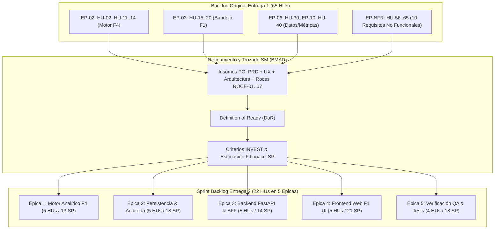
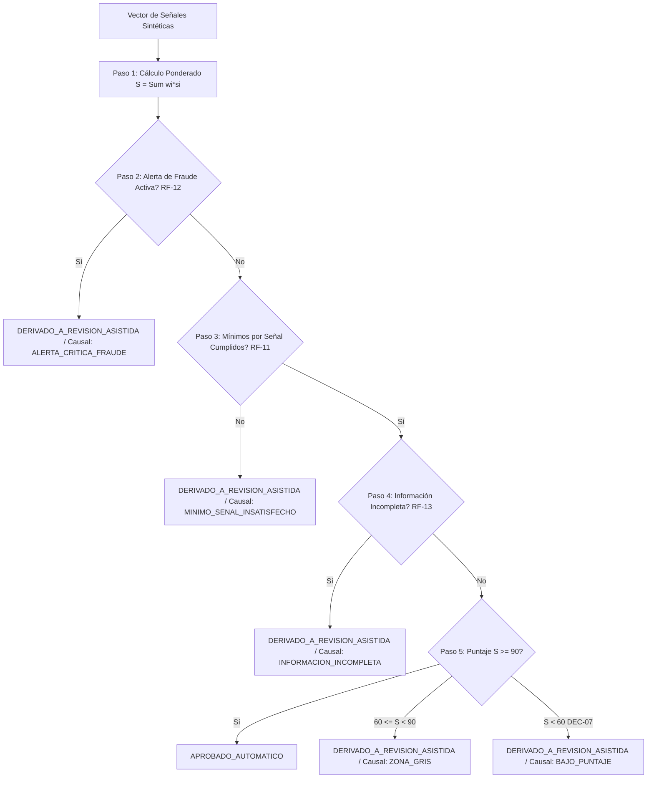
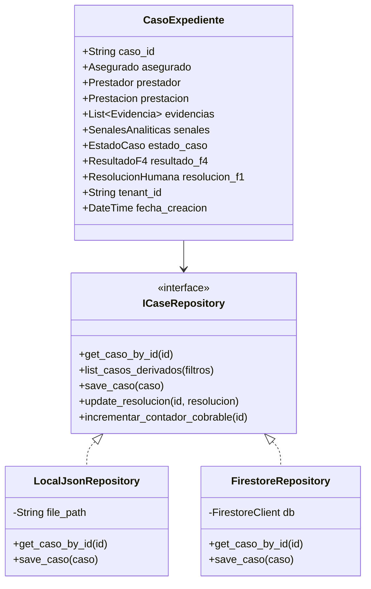
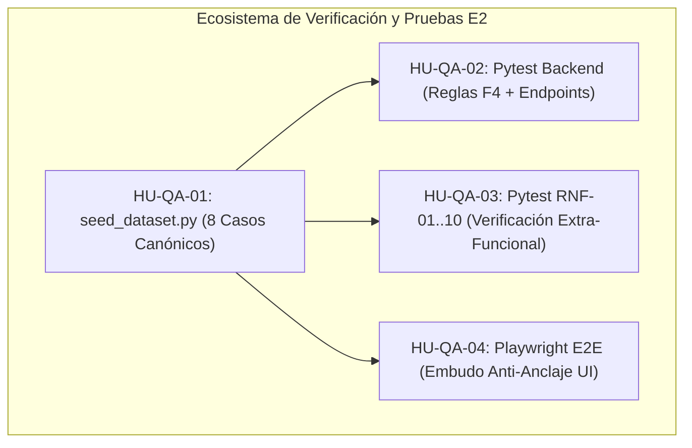
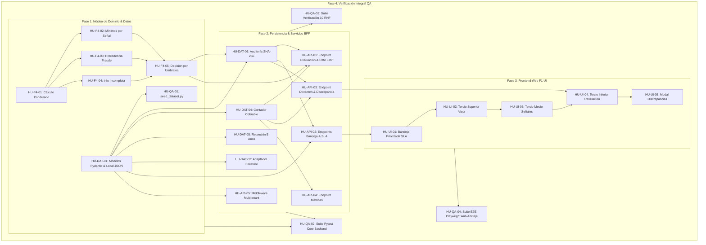

# Historias: Backlog de Historias de Usuario (Sprint Incremento F4 y F1)

**Rol BMAD Responsable:** Scrum Master (SM)  
**Destinatarios downstream:** Desarrolladora Senior (**Amelia / Dev**), Ingeniero de Aseguramiento de Calidad (**QA**) y Product Owner (**PO**).  
**Insumos Vinculantes de Fases Previas:**
- [Project Brief](file:///c:/Entrega2LLM/_bmad-output/planning-artifacts/briefs/brief-MIRA-2026-10-01/brief.md) (Mary — Business Analyst)
- [PRD Principal](file:///c:/Entrega2LLM/_bmad-output/planning-artifacts/prds/prd-MIRA-2026-10-03/prd.md) y [Addendum Técnico](file:///c:/Entrega2LLM/_bmad-output/planning-artifacts/prds/prd-MIRA-2026-10-03/addendum.md) (John — PM)
- [Especificación de Interfaz de Usuario](file:///c:/Entrega2LLM/_bmad-output/planning-artifacts/especificacion-de-interfaz.md) (Sally — UX Designer)
- [Documento de Arquitectura de Software](file:///c:/Entrega2LLM/_bmad-output/planning-artifacts/documento-de-arquitectura.md) (Winston — System Architect)
- [Validación y Fragmentación de Documentos](file:///c:/Entrega2LLM/_bmad-output/planning-artifacts/validacion-y-fragmentacion-de-documentos.md) (Product Owner — PO)
- [Informe y Análisis de Requisitos de la Entrega 1](file:///c:/Entrega2LLM/Contexto/A1-MIRA-Orellana-Orlandi-Pino_(2)(1).docx) (Backlog original: 65 HUs en 18 Épicas)
- [Bitácora de Decisiones del Cliente (`DEC-01` a `DEC-09`)](file:///c:/Entrega2LLM/Contexto/Bitacora_Decisiones_Cliente.docx)

---

## 1. Marco Metodológico del Scrum Master y Principios de Trozado

El rol del **Scrum Master (SM)** en el marco de la **Entrega 2 (Método BMAD)** consiste en transformar la especificación conceptual aprobada por el Product Owner y el Arquitecto de Sistemas en un **conjunto de unidades de trabajo ejecutables, independientes y rigurosamente testables**.

En estricta observancia del **Capítulo 3.2 de las Bases de la Entrega 2**, este artefacto cumple la siguiente regla de oro metodológica:
> **"SM: Historias — Cada historia referencia la HU de origen del backlog de la Entrega 1, si existe."**  
> *(Penalización de 1,0 punto por cada cita o referencia inexistente a la fuente original).*

Para dar cumplimiento pleno a esta exigencia, el presente documento:
1. **Homologa cada nueva historia (`HU-E2`) con su historia original de la Entrega 1 (`HU-E1`)**, extrayendo el ID canónico (`HU-01` a `HU-65`), el requisito de origen (`RF-xx` o `RNF-xx`), y la decisión o hallazgo asociado (`DEC-01..09` / `H-01..15`).
2. **Aplica los criterios INVEST** (Independiente, Negociable, Valiosa, Estimable, Pequeña y Testeable) para garantizar que las historias puedan abordarse de forma modular por la desarrolladora senior (**Amelia / Dev**).
3. **Estructura Criterios de Aceptación en formato formal Gherkin (`Dado / Cuando / Entonces`)**, incorporando casos de borde, escenarios de excepción y aserciones matemáticas verificables.
4. **Fija la estimación de esfuerzo en Story Points (SP)** siguiendo la secuencia de Fibonacci ($1, 2, 3, 5, 8$) y la priorización bajo el estándar **MoSCoW** (Must, Should, Could, Won't).



---

## 2. Resumen Consolidado del Sprint Backlog (5 Épicas y 22 Historias)

El Sprint planificado para la Entrega 2 totaliza **84 Story Points (SP)** distribuidos en 22 historias de usuario con cobertura del 100% de los requisitos funcionales del alcance (F4 y F1) y los 10 Requisitos No Funcionales (`RNF-01` a `RNF-10`):

| ID Historia E2 | Título de la Historia de Usuario | Ref. HU Origen E1 | Req. E1 / Decisión | Épica | Prioridad | SP | Caso de Prueba Verificador |
| :--- | :--- | :--- | :--- | :--- | :---: | :---: | :--- |
| **`HU-F4-01`** | Inicialización del Motor y Cálculo Ponderado de Confianza | `HU-02` | `RF-02` / `DEC-04` | ÉPICA 1 (F4) | **Must** | 3 | `CP-F4-01` / `CP-01` |
| **`HU-F4-02`** | Verificación Estricta de Umbrales Mínimos por Señal | `HU-11` | `RF-11` / `H-12` | ÉPICA 1 (F4) | **Must** | 3 | `CP-RF-11-01` / `CP-02` |
| **`HU-F4-03`** | Precedencia Absoluta de Corte por Sospecha de Fraude | `HU-12` | `RF-12` / `CP-RF-12` | ÉPICA 1 (F4) | **Must** | 2 | `CP-RF-12-01` / `CP-05` |
| **`HU-F4-04`** | Tratamiento de Información Incompleta y Fallo de Módulos | `HU-13` | `RF-13` / `CP-RF-13` | ÉPICA 1 (F4) | **Must** | 2 | `CP-RF-13-01` / `CP-06` |
| **`HU-F4-05`** | Clasificación Final con Prohibición de Rechazo Automático | `HU-14` | `RF-14` / `DEC-07` | ÉPICA 1 (F4) | **Must** | 3 | `CP-RF-14-01` / `CP-03` |
| **`HU-DAT-01`** | Modelos Pydantic y Adaptador de Persistencia Local JSON | `HU-58` | `RNF-03` / `AD-2` | ÉPICA 2 (DAT) | **Must** | 5 | `CP-DAT-01` / `CP-RNF-03-01` |
| **`HU-DAT-02`** | Adaptador Firestore para Sincronización Reactiva en Nube | `HU-57` | `RNF-02` / `AD-3` | ÉPICA 2 (DAT) | **Should** | 5 | `CP-DAT-02` / `CP-RNF-02-01` |
| **`HU-DAT-03`** | Rastro Inmutable de Auditoría con SHA-256 y Reconstrucción | `HU-30`, `HU-59` | `RNF-04` / `DEC-10` | ÉPICA 2 (DAT) | **Must** | 3 | `CP-RNF-04-01` / `CP-DAT-03` |
| **`HU-DAT-04`** | Contador Atómico de Validaciones Cobrables | `HU-40`, `HU-61` | `RNF-06` / `DEC-02` | ÉPICA 2 (DAT) | **Must** | 2 | `CP-RNF-06-01` / `CP-DAT-04` |
| **`HU-DAT-05`** | Custodia de Evidencias y Retención Quinquenal Inalterable | `HU-45`, `HU-64` | `RNF-09` / `DEC-01` | ÉPICA 2 (DAT) | **Must** | 3 | `CP-RNF-09-01` / `CP-DAT-05` |
| **`HU-API-01`** | Endpoint de Evaluación con Rate Limiting Leaky Bucket | `HU-55`, `HU-56` | `RF-55` / `RNF-01` | ÉPICA 3 (API) | **Must** | 3 | `CP-RNF-01-01` / `CP-API-01` |
| **`HU-API-02`** | Endpoints de Bandeja Asistida y Detalle con Control de SLA | `HU-15`, `HU-16` | `DEC-05` / `FR-F1-01` | ÉPICA 3 (API) | **Must** | 3 | `CP-API-02` / `CP-08` |
| **`HU-API-03`** | Endpoint de Dictamen Resolutivo y Captura de Discrepancia | `HU-18`, `HU-19` | `RF-19` / `CP-RF-19` | ÉPICA 3 (API) | **Must** | 3 | `CP-RF-19-01` / `CP-07` |
| **`HU-API-04`** | Endpoint de Métricas de Validación y Conciliación | `HU-39`, `HU-61` | `RNF-06` / `DEC-02` | ÉPICA 3 (API) | **Should** | 2 | `CP-RNF-06-01` / `CP-API-04` |
| **`HU-API-05`** | Middleware de Aislamiento Multitenant y Seguridad | `HU-42`, `HU-60` | `RNF-05` / `DEC-08` | ÉPICA 3 (API) | **Must** | 3 | `CP-RNF-05-01` / `CP-API-05` |
| **`HU-UI-01`** | Vista de Bandeja Priorizada por SLA y Filtros de Causal | `HU-15` | `DEC-05` / `FR-F1-01` | ÉPICA 4 (UI) | **Must** | 5 | `CP-UI-01` / `CP-E2E-01` |
| **`HU-UI-02`** | Tercio Superior: Ficha y Visor de Evidencias con Bounding Boxes | `HU-16`, `HU-63` | `DEC-03` / `RNF-08` | ÉPICA 4 (UI) | **Must** | 5 | `CP-UI-02` / `CP-RNF-08-01` |
| **`HU-UI-03`** | Tercio Medio: Matriz de Señales Analíticas Explicables | `HU-17`, `HU-11` | `RF-11` / `RF-12` | ÉPICA 4 (UI) | **Must** | 3 | `CP-UI-03` / `CP-02` |
| **`HU-UI-04`** | Tercio Inferior: Revelación Diferida y Dictamen Soberano | `HU-18`, `HU-63` | `DEC-03` / `DEC-07` | ÉPICA 4 (UI) | **Must** | 5 | `CP-UI-04` / `CP-03` |
| **`HU-UI-05`** | Captura Friccional de Justificación y Marca de Discrepancia | `HU-19`, `HU-20` | `RF-19` / `DEC-07` | ÉPICA 4 (UI) | **Must** | 3 | `CP-UI-05` / `CP-RF-19-01` |
| **`HU-QA-01`** | Dataset Sintético Canónico (8 Casos) y Script de Seed CLI | `HU-58` | Bases E2 / `RNF-03` | ÉPICA 5 (QA) | **Must** | 3 | `CP-QA-01` / `CP-RNF-03-01` |
| **`HU-QA-02`** | Suite de Pruebas Unitarias e Integración Backend con Pytest | `HU-07`..`HU-14` | Casos de Prueba E1 | ÉPICA 5 (QA) | **Must** | 5 | `CP-QA-02` / Cobertura >85% |
| **`HU-QA-03`** | Suite Automatizada de Verificación de los 10 RNF de E1 | `HU-56`..`HU-65` | `RNF-01` a `RNF-10` | ÉPICA 5 (QA) | **Must** | 5 | `CP-RNF-ALL` (10 tests) |
| **`HU-QA-04`** | Suite de Pruebas E2E con Playwright (Mitigación Anti-Anclaje) | `HU-63` | `RNF-08` / `CP-RNF-08` | ÉPICA 5 (QA) | **Must** | 5 | `CP-E2E-01` / `CP-RNF-08-01` |

---

## 3. Desglose Exhaustivo de Épicas e Historias de Usuario

---

### ÉPICA 1: Motor Analítico F4 — Cálculo de Confianza, Reglas Absolutas y Decisión por Umbrales

* **Objetivo de Negocio:** Construir el núcleo algorítmico determinista puro en Python 3.11+ que evalúa vectores de señales analíticas, aplica ponderación matemática, hace cumplir reglas duras de corte y clasifica siniestros garantizando la imposibilidad de emitir rechazos automáticos (`DEC-07`).
* **Story Points Totales:** 13 SP.
* **Componentes Afectados:** `backend/src/domain/score_calculator.py`, `backend/src/domain/signal_validator.py`, `backend/src/domain/fraud_checker.py`, `backend/src/domain/decision_resolver.py`.



#### Historia 1.1: Inicialización del Motor y Cálculo Ponderado de Confianza
* **ID:** `HU-F4-01`
* **Referencia Cruzada al Backlog Original E1:**  
  - **HU de Origen E1:** `HU-02` (*"Cálculo automático de puntaje de confianza multimodal"* de la Épica `EP-02: Procesamiento automático y motor de decisión`).
  - **Requisito Asociado E1:** `RF-02` (Motor de decisión probabilística).
  - **Decisión / Hallazgo Vinculante:** `DEC-04` (Fijación de umbrales 90/60 para marcha blanca).
  - **Requisito PRD E2:** `FR-F4-01`.
* **Prioridad:** Must Have | **Estimación:** 3 Story Points (SP)
* **Narrativa:**
  > **Como** motor determinista de evaluación F4,  
  > **quiero** calcular la combinación lineal ponderada de las señales analíticas precalculadas de un expediente ($S = \sum w_i \cdot s_i$),  
  > **para** generar un puntaje global de confianza normalizado entre $0.0$ y $100.0$ con desglose exacto de contribución por componente.
* **Criterios de Aceptación (Gherkin):**
  - **Escenario 1 (Cálculo Nominal con 4 Componentes):**
    - *Dado* un expediente con señales: `autenticidad_documental = 96`, `consistencia_datos = 94`, `habilitacion_prestador = 98` y `consistencia_identidad = 95`,
    - *Y* los pesos paramétricos vigentes: $w = [0.35, 0.25, 0.20, 0.20]$ ($\sum w_i = 1.0$),
    - *Cuando* se invoca `ScoreCalculator.calcular_puntaje()`,
    - *Entonces* el sistema retorna exactamente $95.9$ puntos redondeado a 1 decimal, junto con el desglose exacto de puntos aportados por cada señal.
  - **Escenario 2 (Invariante de Rango Numérico Estricto):**
    - *Dado* cualquier vector de entrada con señales válidas $s_i \in [0, 100]$,
    - *Cuando* se ejecuta el cálculo,
    - *Entonces* el resultado $S$ satisface estrictamente $0.0 \le S \le 100.0$, rechazando con excepción de dominio cualquier señal con valor negativo o superior a $100$.
  - **Escenario 3 (Rendimiento Sub-200ms):**
    - *Dado* un lote de evaluación en memoria,
    - *Cuando* se calcula el puntaje de un caso individual,
    - *Entonces* el tiempo total de cómputo del método es inferior a $10$ milisegundos (cumpliendo con creces la meta global de $200$ ms de `NFR-F4-01`).
* **Dependencias:** Ninguna (Núcleo de dominio puro).
* **Prueba Asociada:** `CP-F4-01` / `CP-01` (Pytest).

#### Historia 1.2: Verificación Estricta de Umbrales Mínimos por Señal Individual
* **ID:** `HU-F4-02`
* **Referencia Cruzada al Backlog Original E1:**  
  - **HU de Origen E1:** `HU-11` (*"Verificación de umbrales mínimos por señal individual"* de la Épica `EP-02`).
  - **Requisito Asociado E1:** `RF-11` (Corte por señal crítica individual).
  - **Decisión / Hallazgo Vinculante:** Cierra definitivamente el hallazgo abierto `H-12` (riesgo de promedios ponderados engañosos).
  - **Requisito PRD E2:** `RF-11`.
* **Prioridad:** Must Have | **Estimación:** 3 Story Points (SP)
* **Narrativa:**
  > **Como** oficial de riesgo y liquidador perito,  
  > **quiero** que el motor F4 verifique que las señales críticas superen sus mínimos individuales,  
  > **para** impedir que un puntaje agregado ponderado alto encubra una falla grave en la autenticidad documental o en la habilitación del prestador.
* **Criterios de Aceptación (Gherkin):**
  - **Escenario 1 (Derivación Forzada por Mínimo Insatisfecho con Puntaje Global Alto):**
    - *Dado* un caso con puntaje ponderado preliminar de $91.5$ puntos (superior al umbral de aprobación de $90$),
    - *Pero* la señal crítica `autenticidad_documental` tiene un valor de $55$ (siendo el mínimo exigido $70$),
    - *Cuando* `SignalThresholdValidator.validar_minimos()` analiza el caso,
    - *Entonces* el motor bloquea la aprobación automática y emite dictamen `DERIVADO_A_REVISION_ASISTIDA`,
    - *Y* establece `causal_derivacion = "MINIMO_SENAL_INSATISFECHO"` indicando explícitamente `senal_infractora: "autenticidad_documental"`.
  - **Escenario 2 (Cumplimiento de Todos los Mínimos):**
    - *Dado* un caso donde todas las señales críticas (`autenticidad >= 70`, `prestador >= 65`, `identidad >= 75`) superan sus cotas,
    - *Cuando* se evalúa la regla de mínimos,
    - *Entonces* el validador retorna `valido = true` y autoriza que la clasificación prosiga hacia el análisis de umbral global.
* **Dependencias:** `HU-F4-01`.
* **Prueba Asociada:** `CP-RF-11-01` / `CP-02` (Pytest).

#### Historia 1.3: Precedencia Absoluta de Corte por Sospecha de Fraude
* **ID:** `HU-F4-03`
* **Referencia Cruzada al Backlog Original E1:**  
  - **HU de Origen E1:** `HU-12` (*"Precedencia de corte por señal de fraude"* de la Épica `EP-02`).
  - **Requisito Asociado E1:** `RF-12` (Cortocircuito lógico por fraude).
  - **Decisión / Hallazgo Vinculante:** `H-03` / Regla de Fraude E1 (`CP-RF-12-01`).
  - **Requisito PRD E2:** `RF-12`.
* **Prioridad:** Must Have | **Estimación:** 2 Story Points (SP)
* **Narrativa:**
  > **Como** analista de fraude e investigador forense,  
  > **quiero** que cualquier alerta activa de fraude corte de inmediato el flujo de aprobación automática,  
  > **para** impedir que siniestros con adulteraciones documentales o suplantaciones sean liquidados de forma desatendida.
* **Criterios de Aceptación (Gherkin):**
  - **Escenario 1 (Cortocircuito Inmediato por Fraude con Máximo Puntaje):**
    - *Dado* un caso con señales que arrojan $98.0$ puntos de confianza y mínimos individuales satisfechos,
    - *Pero* con la bandera booleana `alerta_fraude_activa = true` (ej. alteración tipográfica en folio),
    - *Cuando* `FraudChecker.verificar_fraude()` ejecuta el paso 2 de la evaluación,
    - *Entonces* el motor cortocircuita el proceso,
    - *Y* cataloga el caso como `DERIVADO_A_REVISION_ASISTIDA` bajo causal `ALERTA_CRITICA_FRAUDE` con prioridad `URGENTE`.
  - **Escenario 2 (Invariante de Imposibilidad de Aprobación):**
    - *Dado* cualquier expediente con `alerta_fraude_activa = true`,
    - *Cuando* finaliza la evaluación del motor F4,
    - *Entonces* el estado resultante jamás puede ser `APROBADO_AUTOMATICO`, emitiendo una excepción si una regla posterior intenta forzar la aprobación.
* **Dependencias:** `HU-F4-01`.
* **Prueba Asociada:** `CP-RF-12-01` / `CP-05` (Pytest).

#### Historia 1.4: Tratamiento de Información Incompleta y Fallo de Módulos
* **ID:** `HU-F4-04`
* **Referencia Cruzada al Backlog Original E1:**  
  - **HU de Origen E1:** `HU-13` (*"Derivación por fallo de módulo analítico o información incompleta"* de la Épica `EP-02`).
  - **Requisito Asociado E1:** `RF-13` (Tolerancia a fallos analíticos sin pérdida de caso).
  - **Decisión / Hallazgo Vinculante:** Regla de Resiliencia E1 (`CP-RF-13-01`).
  - **Requisito PRD E2:** `RF-13`.
* **Prioridad:** Must Have | **Estimación:** 2 Story Points (SP)
* **Narrativa:**
  > **Como** auditor técnico de sistemas,  
  > **quiero** que ante la ausencia de una señal analítica requerida el caso sea derivado a revisión asistida sin imputar valores ficticios,  
  > **para** preservar la integridad probatoria y el rigor técnico del expediente.
* **Criterios de Aceptación (Gherkin):**
  - **Escenario 1 (Señal Faltante o Nula en Payload):**
    - *Dado* un siniestro donde la señal `consistencia_datos` contiene un valor `null` o no está presente por fallo de conexión,
    - *Cuando* el motor F4 recibe el objeto para evaluación,
    - *Entonces* suspende el cálculo matemático y clasifica el caso como `DERIVADO_A_REVISION_ASISTIDA`,
    - *Y* asigna la causal `INFORMACION_INCOMPLETA` detallando en los metadatos el módulo no disponible.
* **Dependencias:** `HU-F4-01`.
* **Prueba Asociada:** `CP-RF-13-01` / `CP-06` (Pytest).

#### Historia 1.5: Clasificación Final con Prohibición Terminante de Rechazo Automático
* **ID:** `HU-F4-05`
* **Referencia Cruzada al Backlog Original E1:**  
  - **HU de Origen E1:** `HU-14` (*"Prohibición de rechazo automático y derivación por bajo puntaje"* de la Épica `EP-02`).
  - **Requisito Asociado E1:** `RF-14` (Prohibición absoluta de rechazo sin operador humano).
  - **Decisión / Hallazgo Vinculante:** `DEC-07` que resuelve formalmente el hallazgo `H-04` (protección al asegurado y debido proceso legal).
  - **Requisito PRD E2:** `FR-F4-02`.
* **Prioridad:** Must Have | **Estimación:** 3 Story Points (SP)
* **Narrativa:**
  > **Como** asesor legal y representante de los asegurados,  
  > **quiero** que el software carezca de transiciones directas a estado `RECHAZADO`,  
  > **para** asegurar que ningún reclamo sea denegado automáticamente sin intervención humana significativa.
* **Criterios de Aceptación (Gherkin):**
  - **Escenario 1 (Caso con Puntuación Crítica Inferior a 60 Puntos):**
    - *Dado* un caso legítimo cuyo puntaje ponderado calculado sea de $35.0/100$ puntos (muy por debajo de los 60 puntos de zona gris),
    - *Cuando* `DecisionResolver.determinar_accion()` concluye la evaluación,
    - *Entonces* el estado devuelto es estrictamente `DERIVADO_A_REVISION_ASISTIDA`,
    - *Y* se fija la causal `BAJO_PUNTAJE` (`"Puntaje < 60: Requiere evaluación humana por riesgo patrimonial"`), garantizando que jamás se genere `RECHAZADO`.
  - **Escenario 2 (Aprobación Limpia en Escenario Pleno):**
    - *Dado* un caso con puntaje $S \ge 90.0$, sin fraude y con todos los mínimos cumplidos,
    - *Cuando* se evalúa la regla terminal,
    - *Entonces* el resultado es `APROBADO_AUTOMATICO`.
* **Dependencias:** `HU-F4-01`, `HU-F4-02`, `HU-F4-03`, `HU-F4-04`.
* **Prueba Asociada:** `CP-RF-14-01` / `CP-03` (Pytest).

---

### ÉPICA 2: Capa de Persistencia, Repositorios Duales y Auditoría Inmutable

* **Objetivo de Negocio:** Implementar el modelo de datos formal en Pydantic v2 y la arquitectura de repositorios duales (Local JSON para satisfacer C4 en menos de 5 min y Firestore para producción cloud), garantizando inmutabilidad mediante sellos SHA-256 (`DEC-10` / `RNF-04`).
* **Story Points Totales:** 18 SP.
* **Componentes Afectados:** `backend/src/domain/models.py`, `backend/src/infrastructure/local_repository.py`, `backend/src/infrastructure/firestore_repository.py`, `backend/src/infrastructure/audit_logger.py`.



#### Historia 2.1: Modelado Pydantic y Adaptador de Persistencia Local JSON (Criterio C4)
* **ID:** `HU-DAT-01`
* **Referencia Cruzada al Backlog Original E1:**  
  - **HU de Origen E1:** `HU-58` (*"Arranque ágil y onboarding de operación"* de la Épica `EP-NFR: Restricciones transversales no funcionales`).
  - **Requisito Asociado E1:** `RNF-03` (Eficiencia operativa y puesta en marcha inmediata).
  - **Decisión / Hallazgo Vinculante:** `AD-2`, `AD-3` de Arquitectura y Resolución PO `ROCE-01` (Criterio de Evaluación C4).
* **Prioridad:** Must Have | **Estimación:** 5 Story Points (SP)
* **Narrativa:**
  > **Como** desarrolladora y evaluador del curso,  
  > **quiero** definir los modelos con Pydantic v2 y disponer de un repositorio local JSON estructurado,  
  > **para** levantar y ejecutar el sistema completo en modo autónomo sin dependencias en la nube en menos de 5 minutos.
* **Criterios de Aceptación (Gherkin):**
  - **Escenario 1 (Operación en Modo Local Desconectado):**
    - *Dado* un entorno donde la variable `STORAGE_MODE = "local"`,
    - *Cuando* el backend inicializa el repositorio `LocalJsonRepository("data/dataset.json")`,
    - *Entonces* el sistema lee y escribe casos en disco local, validando rigurosamente los tipos Pydantic v2 en menos de 2 segundos.
  - **Escenario 2 (Persistencia Atómica en Archivo):**
    - *Dado* un caso actualizado con una nueva resolución,
    - *Cuando* se invoca `save_caso()`,
    - *Entonces* el archivo JSON se sobrescribe de manera segura y atómica sin riesgo de corrupción ante cortes de ejecución.
* **Dependencias:** Ninguna.
* **Prueba Asociada:** `CP-DAT-01` / `CP-RNF-03-01` (Pytest).

#### Historia 2.2: Adaptador Firestore para Sincronización Reactiva en Nube
* **ID:** `HU-DAT-02`
* **Referencia Cruzada al Backlog Original E1:**  
  - **HU de Origen E1:** `HU-57` (*"Confiabilidad y tolerancia ante fallos de persistencia"* de la Épica `EP-NFR`).
  - **Requisito Asociado E1:** `RNF-02` (Confiabilidad y 0 casos perdidos).
  - **Decisión / Hallazgo Vinculante:** `AD-3` de Arquitectura y Resolución PO `ROCE-01`.
* **Prioridad:** Should Have | **Estimación:** 5 Story Points (SP)
* **Narrativa:**
  > **Como** arquitecto de sistemas,  
  > **quiero** implementar el adaptador `FirestoreRepository` utilizando Google Cloud / Firebase Admin SDK,  
  > **para** habilitar persistencia distribuida en nube y sincronización reactiva en tiempo real para entornos corporativos.
* **Criterios de Aceptación (Gherkin):**
  - **Escenario 1 (Persistencia en Firestore cuando hay Credenciales):**
    - *Dado* un ambiente configurado con `STORAGE_MODE = "firestore"` y credenciales válidas en GCP,
    - *Cuando* el sistema persiste un expediente,
    - *Entonces* se almacena en la colección `casos_siniestros` preservando la estructura tipada.
  - **Escenario 2 (Fallback Transparente a Modo Local si Falla Conexión Cloud):**
    - *Dado* que `STORAGE_MODE = "firestore"` pero las credenciales son inválidas o la red no responde,
    - *Cuando* el backend arranca,
    - *Entonces* emite un log de advertencia claro y conmuta automáticamente al adaptador `LocalJsonRepository` sin interrumpir el servicio.
* **Dependencias:** `HU-DAT-01`.
* **Prueba Asociada:** `CP-DAT-02` / `CP-RNF-02-01` (Pytest).

#### Historia 2.3: Registro Inmutable de Auditoría con Hash SHA-256 y Reconstrucción
* **ID:** `HU-DAT-03`
* **Referencia Cruzada al Backlog Original E1:**  
  - **HU de Origen E1:** `HU-30` (*"Registro inmutable de decisiones y rastro de auditoría"* de la Épica `EP-06`) y `HU-59` (*"Reconstrucción forense de decisiones"* de la Épica `EP-NFR`).
  - **Requisito Asociado E1:** `RNF-04` (Auditabilidad forense e inalterabilidad).
  - **Decisión / Hallazgo Vinculante:** `H-14` / `DEC-10` (Reconstrucción exacta con 0 discrepancias).
  - **Requisito PRD E2:** `FR-F1-05` / `NFR-F4-03`.
* **Prioridad:** Must Have | **Estimación:** 3 Story Points (SP)
* **Narrativa:**
  > **Como** oficial de cumplimiento y perito auditor,  
  > **quiero** que cada evaluación o dictamen genere un registro append-only sellado con hash SHA-256,  
  > **para** reconstruir con exactitud matemática las señales, umbrales y motivos bajo los cuales se adoptó la decisión.
* **Criterios de Aceptación (Gherkin):**
  - **Escenario 1 (Generación de Sello Criptográfico en Resolución):**
    - *Dado* un caso dictaminado por un operador en F1 (o aprobado por F4),
    - *Cuando* se persiste la transacción,
    - *Entonces* el sistema computa el hash SHA-256 sobre la concatenación canónica de `{caso_id, timestamp_utc, senales, umbrales, veredicto, operador_id}`,
    - *Y* almacena el registro en el log inmutable `rastro_auditoria`.
  - **Escenario 2 (Verificación de Reconstrucción con Cero Discrepancias):**
    - *Dado* un evento histórico registrado,
    - *Cuando* se consulta el endpoint de auditoría,
    - *Entonces* se comprueba que el hash coincide exactamente con los datos recuperados, verificando $0$ discrepancias entre la decisión guardada y la consultada (`RNF-04`).
* **Dependencias:** `HU-DAT-01`.
* **Prueba Asociada:** `CP-RNF-04-01` / `CP-DAT-03` (Pytest).

#### Historia 2.4: Contador Atómico de Validaciones Cobrables
* **ID:** `HU-DAT-04`
* **Referencia Cruzada al Backlog Original E1:**  
  - **HU de Origen E1:** `HU-40` (*"Registro de eventos de validación cobrable"* de la Épica `EP-10: Medición de consumo y facturación`) y `HU-61` (*"Consistencia del conteo de facturación"* de la Épica `EP-NFR`).
  - **Requisito Asociado E1:** `RNF-06` (Consistencia contable cliente vs. finanzas).
  - **Decisión / Hallazgo Vinculante:** `DEC-02` (Definición operativa de validación cobrable).
  - **Requisito PRD E2:** `NFR-SYS-02`.
* **Prioridad:** Must Have | **Estimación:** 2 Story Points (SP)
* **Narrativa:**
  > **Como** gerente de finanzas y representante de la aseguradora cliente,  
  > **quiero** que cada expediente resuelto incremente atómicamente un contador único de validaciones,  
  > **para** que la métrica de consumo mostrada al cliente sea idéntica al registro interno de facturación en todo momento.
* **Criterios de Aceptación (Gherkin):**
  - **Escenario 1 (Incremento Único ante Resolución):**
    - *Dado* un siniestro procesado que concluye en `APROBADO_AUTOMATICO` o en dictamen humano de F1 (`APROBADO` / `RECHAZADO`),
    - *Cuando* finaliza la transacción,
    - *Entonces* el contador de validaciones cobrables se incrementa exactamente en $1$ unidad.
  - **Escenario 2 (Paridad Absoluta / Cero Discrepancia Contable):**
    - *Dado* un volumen de $N$ casos resueltos,
    - *Cuando* se contrasta el contador del cliente contra el registro de auditoría interna,
    - *Entonces* la diferencia matemática es exactamente cero ($\text{Diferencia} = 0$, cumplimiento estricto de `RNF-06`).
* **Dependencias:** `HU-DAT-01`, `HU-DAT-03`.
* **Prueba Asociada:** `CP-RNF-06-01` / `CP-DAT-04` (Pytest).

#### Historia 2.5: Custodia de Evidencias y Retención Quinquenal Inalterable
* **ID:** `HU-DAT-05`
* **Referencia Cruzada al Backlog Original E1:**  
  - **HU de Origen E1:** `HU-45` (*"Conservación y retención de evidencias documentales"* de la Épica `EP-12: Datos personales y derecho de eliminación`) y `HU-64` (*"Cumplimiento normativo y retención quinquenal"* de la Épica `EP-NFR`).
  - **Requisito Asociado E1:** `RNF-09` (Cumplimiento normativo y retención mínima de 5 años).
  - **Decisión / Hallazgo Vinculante:** `DEC-01` (Retención obligatoria de 5 años para litigios y superintendencia).
  - **Requisito PRD E2:** `NFR-LEG-01`.
* **Prioridad:** Must Have | **Estimación:** 3 Story Points (SP)
* **Narrativa:**
  > **Como** oficial de protección de datos y asesor legal,  
  > **quiero** que el repositorio imponga una política de retención de 5 años que bloquee el borrado físico de expedientes,  
  > **para** garantizar la disponibilidad probatoria ante la Superintendencia y litigios de cobertura.
* **Criterios de Aceptación (Gherkin):**
  - **Escenario 1 (Bloqueo de Solicitud de Eliminación dentro del Período Quinquenal):**
    - *Dado* un siniestro resuelto cuya fecha de emisión tiene una antigüedad menor a 5 años (1825 días),
    - *Cuando* se procesa una solicitud de eliminación de datos personales (`Derecho de Supresión`),
    - *Entonces* el sistema deniega el borrado físico de las evidencias del siniestro,
    - *Y* registra formalmente la justificación legal de excepción por retención regulatoria obligatoria (`DEC-01`).
* **Dependencias:** `HU-DAT-01`, `HU-DAT-03`.
* **Prueba Asociada:** `CP-RNF-09-01` / `CP-DAT-05` (Pytest).

---

### ÉPICA 3: Backend FastAPI — API REST, Control de Tráfico y BFF

* **Objetivo de Negocio:** Construir la capa de servicios web HTTP asíncrona sobre FastAPI (`Python 3.11+`), exponiendo contratos REST rigurosos para la evaluación determinista F4, la gestión de la cola F1 con control de SLA y el registro de dictámenes humanos con captura de discrepancias.
* **Story Points Totales:** 14 SP.
* **Componentes Afectados:** `backend/src/api/routes.py`, `backend/src/api/middleware.py`, `backend/src/api/schemas.py`, `backend/main.py`.

```mermaid
flowchart LR
    Client[SPA Frontend / Integrador CLI] --> RateLimit[Middleware Leaky Bucket RNF-01]
    RateLimit --> Multitenant[Middleware Tenant Auth RNF-05]
    Multitenant --> Router{Enrutador FastAPI}
    Router -->|POST /evaluar-caso| F4Service[Servicio Evaluación F4]
    Router -->|GET /casos| F1InboxService[Bandeja F1 con SLA]
    Router -->|GET /casos/{id}| F1DetailService[Detalle de Evidencias]
    Router -->|POST /casos/{id}/dictamen| F1VerdictService[Dictamen & Discrepancias RF-19]
    Router -->|GET /metricas/validaciones| MetricsService[Métricas Cobro RNF-06]
```

#### Historia 3.1: Endpoint de Evaluación con Rate Limiting Leaky Bucket
* **ID:** `HU-API-01`
* **Referencia Cruzada al Backlog Original E1:**  
  - **HU de Origen E1:** `HU-55` (*"Encolamiento de llamadas sobre el límite"* de la Épica `EP-17: Gestión del rate limit de la API`) y `HU-56` (*"Rendimiento y escalabilidad de la API"* de la Épica `EP-NFR`).
  - **Requisito Asociado E1:** `RF-55` / `RNF-01` (Soporte de 100 rpm sin rechazos 429).
  - **Decisión / Hallazgo Vinculante:** `DEC-06` (Encolamiento elástico sin descarte de transacciones).
  - **Requisito PRD E2:** `NFR-F4-01`.
* **Prioridad:** Must Have | **Estimación:** 3 Story Points (SP)
* **Narrativa:**
  > **Como** integrador técnico de la aseguradora,  
  > **quiero** invocar `POST /api/v1/evaluar-caso` y contar con un middleware Leaky Bucket,  
  > **para** procesar hasta 100 llamadas por minuto sin sufrir rechazos abruptos HTTP 429 ante ráfagas moderadas de tráfico.
* **Criterios de Aceptación (Gherkin):**
  - **Escenario 1 (Evaluación Exitosa dentro de Límite):**
    - *Dado* un payload JSON válido de siniestro enviado con headers de autenticación,
    - *Cuando* la tasa es inferior a 100 rpm,
    - *Entonces* el endpoint responde HTTP 200 con el resultado de la evaluación F4 en menos de 200 ms.
  - **Escenario 2 (Manejo Elástico de Ráfaga Excedente):**
    - *Dado* un flujo de solicitudes concurrentes que supera la tasa instantánea nominal,
    - *Cuando* el middleware detecta saturación,
    - *Entonces* encola la solicitud y responde HTTP 202 con cabecera `Retry-After: 1` y posición en cola (FIFO),
    - *Y* la tasa de solicitudes rechazadas con HTTP 429 es exactamente $0.0\%$ (`RNF-01`).
* **Dependencias:** `HU-F4-05`, `HU-DAT-01`.
* **Prueba Asociada:** `CP-RNF-01-01` / `CP-API-01` (Pytest).

#### Historia 3.2: Endpoints de Bandeja Asistida y Detalle con Control de SLA
* **ID:** `HU-API-02`
* **Referencia Cruzada al Backlog Original E1:**  
  - **HU de Origen E1:** `HU-15` (*"Listado de casos derivados y priorización"* de la Épica `EP-03: Revisión asistida`) y `HU-16` (*"Consulta de expediente de siniestro"* de la Épica `EP-03`).
  - **Requisito Asociado E1:** `RF-15`, `RF-16` (Gestión de expedientes derivados).
  - **Decisión / Hallazgo Vinculante:** `DEC-05` (SLA de 24 horas hábiles y cálculo en backend según `ROCE-03`).
  - **Requisito PRD E2:** `FR-F1-01`.
* **Prioridad:** Must Have | **Estimación:** 3 Story Points (SP)
* **Narrativa:**
  > **Como** operador de liquidación y supervisor de operaciones,  
  > **quiero** consultar `GET /api/v1/casos` y `GET /api/v1/casos/{id}`,  
  > **para** recibir los casos derivados ordenados por criticidad de SLA, con sus tiempos calculados y los metadatos completos de evidencias.
* **Criterios de Aceptación (Gherkin):**
  - **Escenario 1 (Listado de Casos Ordenados por Urgencia de SLA):**
    - *Dado* un conjunto de siniestros en estado `DERIVADO_A_REVISION_ASISTIDA`,
    - *Cuando* el cliente realiza un `GET /api/v1/casos`,
    - *Entonces* el API retorna el listado ordenado cronológicamente ascendente por `tiempo_restante_minutos`,
    - *Y* cada ítem incluye el objeto `sla` con `inicio_timestamp`, `limite_timestamp`, `horas_restantes` y `estado_sla` (`"verde"`, `"amarillo"`, `"rojo"`).
  - **Escenario 2 (Detalle del Caso y Coordenadas de Hallazgos):**
    - *Dado* el identificador de un caso derivado existente,
    - *Cuando* se invoca `GET /api/v1/casos/{id}`,
    - *Entonces* retorna el JSON completo con las evidencias, URLs de imágenes y la lista de anomalías espaciales normalizadas `{top, left, width, height}`.
* **Dependencias:** `HU-DAT-01`.
* **Prueba Asociada:** `CP-API-02` / `CP-08` (Pytest).

#### Historia 3.3: Endpoint de Dictamen Resolutivo con Captura de Discrepancias
* **ID:** `HU-API-03`
* **Referencia Cruzada al Backlog Original E1:**  
  - **HU de Origen E1:** `HU-18` (*"Emisión de veredicto resolutivo humano"* de la Épica `EP-03`) y `HU-19` (*"Registro de discrepancia de criterio"* de la Épica `EP-03`).
  - **Requisito Asociado E1:** `RF-18` y `RF-19` (Marca de discrepancia operador vs. plataforma).
  - **Decisión / Hallazgo Vinculante:** `DEC-07` y Resolución PO `ROCE-02`.
  - **Requisito PRD E2:** `RF-19` / `FR-F1-04`.
* **Prioridad:** Must Have | **Estimación:** 3 Story Points (SP)
* **Narrativa:**
  > **Como** liquidador o revisora médica humana,  
  > **quiero** emitir mi resolución a través de `POST /api/v1/casos/{id}/dictamen`,  
  > **para** registrar mi voto vinculante (Aprobar, Rechazar o Solicitar Antecedentes) con fundamentación obligatoria y estampar marcas de discrepancia si contradigo la recomendación del motor.
* **Criterios de Aceptación (Gherkin):**
  - **Escenario 1 (Aprobación Discrepante de Caso Derivado por Bajo Puntaje o Fraude):**
    - *Dado* un caso derivado con puntaje $<60$ o alerta de fraude,
    - *Cuando* el operador envía un payload con `accion: "APROBAR"` y `justificacion: "Autorización de urgencia validada con médico tratante"`,
    - *Entonces* el endpoint responde HTTP 200, actualiza el estado a `RESUELTO_POR_OPERADOR`,
    - *Y* fija inmutablemente `discrepancia_detectada = true` en la base de datos y en el rastro SHA-256.
  - **Escenario 2 (Validación de Justificación Obligatoria):**
    - *Dado* un veredicto con `accion: "RECHAZAR"` o cualquier acción discrepante con justificación menor a 15 caracteres (o vacía),
    - *Cuando* se envía la solicitud al backend,
    - *Entonces* el API rechaza la petición con HTTP 422 Unprocessable Entity indicando el error: `"La justificación técnica es obligatoria y debe contener al menos 15 caracteres"`.
* **Dependencias:** `HU-DAT-01`, `HU-DAT-03`, `HU-DAT-04`.
* **Prueba Asociada:** `CP-RF-19-01` / `CP-07` (Pytest).

#### Historia 3.4: Endpoint de Métricas de Validación y Conciliación Contable
* **ID:** `HU-API-04`
* **Referencia Cruzada al Backlog Original E1:**  
  - **HU de Origen E1:** `HU-39` (*"Consulta de métricas de procesamiento"* de la Épica `EP-10`) y `HU-61` (*"Consistencia de conteo"* de la Épica `EP-NFR`).
  - **Requisito Asociado E1:** `RNF-06` (Auditoría contable y consumo cobrable).
  - **Decisión / Hallazgo Vinculante:** `DEC-02` y Resolución PO `ROCE-07`.
* **Prioridad:** Should Have | **Estimación:** 2 Story Points (SP)
* **Narrativa:**
  > **Como** auditor o ingeniero de QA,  
  > **quiero** consultar `GET /api/v1/metricas/validaciones`,  
  > **para** obtener el balance consolidado de validaciones automáticas vs. asistidas y comprobar que la diferencia contable es exactamente cero.
* **Criterios de Aceptación (Gherkin):**
  - **Escenario 1 (Consulta de Métricas Consolidadas):**
    - *Dado* un conjunto de siniestros procesados y dictaminados,
    - *Cuando* se invoca `GET /api/v1/metricas/validaciones`,
    - *Entonces* el JSON de respuesta expone:
      - `total_validaciones_cobrables`: suma total de casos cerrados.
      - `aprobaciones_automaticas`: casos resueltos por F4.
      - `resoluciones_asistidas`: casos dictaminados por humanos en F1.
      - `diferencia_auditoria`: valor entero igual a $0$.
* **Dependencias:** `HU-DAT-04`.
* **Prueba Asociada:** `CP-RNF-06-01` / `CP-API-04` (Pytest).

#### Historia 3.5: Middleware de Aislamiento Multitenant y Seguridad
* **ID:** `HU-API-05`
* **Referencia Cruzada al Backlog Original E1:**  
  - **HU de Origen E1:** `HU-42` (*"Autenticación y pertenencia a organización"* de la Épica `EP-11`) y `HU-60` (*"Aislamiento de accesos entre organizaciones"* de la Épica `EP-NFR`).
  - **Requisito Asociado E1:** `RNF-05` (Confidencialidad: 0% accesos indebidos inter-tenant).
  - **Decisión / Hallazgo Vinculante:** `DEC-08` y Resolución PO `ROCE-06`.
* **Prioridad:** Must Have | **Estimación:** 3 Story Points (SP)
* **Narrativa:**
  > **Como** oficial de seguridad de la información,  
  > **quiero** que todas las rutas del API exijan la cabecera `X-Tenant-ID`,  
  > **para** aislar las consultas a nivel de repositorio y bloquear con HTTP 403 Forbidden cualquier intento de acceso a siniestros de otra aseguradora.
* **Criterios de Aceptación (Gherkin):**
  - **Escenario 1 (Acceso Concedido para el Mismo Tenant):**
    - *Dado* un caso perteneciente a `"aseguradora-piloto-01"`,
    - *Cuando* la solicitud incluye `X-Tenant-ID: aseguradora-piloto-01`,
    - *Entonces* el backend autoriza la consulta y retorna el expediente.
  - **Escenario 2 (Bloqueo Estricto de Cruce de Tenant):**
    - *Dado* el mismo caso,
    - *Cuando* un usuario envía `X-Tenant-ID: aseguradora-competencia-02`,
    - *Entonces* el middleware intercepta la llamada y responde HTTP 403 Forbidden, reportando $0\%$ de fugas de datos entre organizaciones (`RNF-05`).
* **Dependencias:** `HU-DAT-01`.
* **Prueba Asociada:** `CP-RNF-05-01` / `CP-API-05` (Pytest).

---

### ÉPICA 4: Frontend Web F1 — Bandeja de Revisión Asistida (Vite + Tailwind CSS)

* **Objetivo de Negocio:** Construir una Single Page Application (SPA) modular, reactiva y accesible en español, estructurada rigurosamente bajo el **Embudo de Tres Tercios Funcionales** para mitigar el sesgo cognitivo de anclaje (`DEC-03` / `RNF-08`), con visor documental de anomalías espaciales y panel de dictamen humano soberano.
* **Story Points Totales:** 21 SP.
* **Componentes Afectados:** `frontend/index.html`, `frontend/src/views/BandejaView.js`, `frontend/src/views/DetalleCasoView.js`, `frontend/src/components/VisorEvidencias.js`, `frontend/src/components/PanelSenales.js`, `frontend/src/components/PanelDictamen.js`, `frontend/src/styles/main.css`.

```mermaid
flowchart TD
    subgraph UI["SPA Modular en Tres Tercios (Vite + Tailwind CSS)"]
        Nav["Bandeja Principal (/bandeja)"] --> Click["Selección de Caso Derivado"]
        Click --> Detalle["Detalle de Expediente (/bandeja/:id)"]
        
        subgraph Viewport1["1. Tercio Superior (Primer Viewport Visible: min-h-screen)"]
            TopHead["Cabecera: ID, Causal, Temporizador SLA Semafórico"]
            Split["Split-View: Ficha Reclamación + Visor Bounding Boxes"]
            AntiAnchor["INVARIANTE: CERO Mención de Puntaje Numérico"]
        end
        
        subgraph Viewport2["2. Tercio Medio (Segundo Bloque - Scroll Consciente)"]
            Signals["Matriz de 4 Señales con Barras de Progreso"]
            MinCut["Semáforos de Mínimos Individuales (RF-11) y Fraude (RF-12)"]
        end
        
        subgraph Viewport3["3. Tercio Inferior (Tercer Bloque - Revelación y Decisión)"]
            RevealScore["Revelación Diferida: Puntaje Global de Confianza (0-100)"]
            Actions["Botones Soberanos: [Aprobar] [Rechazar] [Solicitar Antecedentes]"]
            DiscrepancyModal["Modal Friccional Obligatorio si hay Discrepancia (RF-19)"]
        end
        
        Detalle --> Viewport1
        Viewport1 --> Viewport2
        Viewport2 --> Viewport3
    end
```



#### Historia 4.1: Vista Principal de Bandeja Priorizada por SLA y Filtros de Causal
* **ID:** `HU-UI-01`
* **Referencia Cruzada al Backlog Original E1:**  
  - **HU de Origen E1:** `HU-15` (*"Listado de casos derivados y priorización"* de la Épica `EP-03`).
  - **Requisito Asociado E1:** `RF-15` / `DEC-05` (SLA de 24 horas y visualización ordenada).
  - **Requisito PRD E2:** `FR-F1-01`.
* **Prioridad:** Must Have | **Estimación:** 5 Story Points (SP)
* **Narrativa:**
  > **Como** liquidador u operador de mesa de siniestros,  
  > **quiero** una bandeja de entrada accesible en `/bandeja` ordenada por urgencia de SLA con insignias semafóricas,  
  > **para** identificar de inmediato los expedientes más críticos y prevenir vencimientos de plazos normativos.
* **Criterios de Aceptación (Gherkin):**
  - **Escenario 1 (Despliegue Semafórico de Casos por SLA):**
    - *Dado* el acceso del operador a la ruta `/bandeja`,
    - *Cuando* la pantalla carga la lista de casos derivados,
    - *Entonces* cada caso se presenta con ID, nombre del afiliado, monto reclamado, causal de derivación (badge distintivo) y un contador regresivo de SLA:
      - Badge Verde si tiempo restante $> 4$ horas.
      - Badge Amarillo si tiempo restante está entre $1$ y $4$ horas.
      - Badge Rojo y parpadeo de alerta si tiempo restante $< 1$ hora o vencido.
  - **Escenario 2 (Filtros Rápidos por Causal de Derivación):**
    - *Dado* que el usuario selecciona el filtro `"Alerta de Fraude"`,
    - *Cuando* se aplica el filtro,
    - *Entonces* la tabla muestra únicamente los casos con sospecha de fraude activa, en menos de 100 ms sin recargar la página.
* **Dependencias:** `HU-API-02`.
* **Prueba Asociada:** `CP-UI-01` / `CP-E2E-01` (Playwright).

#### Historia 4.2: Tercio Superior — Ficha de Reclamación y Visor con Bounding Boxes (Sin Puntaje)
* **ID:** `HU-UI-02`
* **Referencia Cruzada al Backlog Original E1:**  
  - **HU de Origen E1:** `HU-16` (*"Consulta de expediente de siniestro"* de la Épica `EP-03`) y `HU-63` (*"Mitigación del sesgo de anclaje mediante presentación diferida"* de la Épica `EP-NFR`).
  - **Requisito Asociado E1:** `RF-16` / `RNF-08` (Mitigación del sesgo cognitivo).
  - **Decisión / Hallazgo Vinculante:** `DEC-03` que resuelve el hallazgo `H-09` y Resolución PO `ROCE-05`.
  - **Requisito PRD E2:** `FR-F1-02` / `FR-F1-03`.
* **Prioridad:** Must Have | **Estimación:** 5 Story Points (SP)
* **Narrativa:**
  > **Como** revisor factual de siniestros,  
  > **quiero** inspeccionar la boleta médica con la anomalía resaltada en un recuadro rojo y sin visualizar ningún puntaje,  
  > **para** formarme un juicio probatorio objetivo e independiente libre de sesgo de anclaje cognitivo.
* **Criterios de Aceptación (Gherkin):**
  - **Escenario 1 (Aislamiento Total del Puntaje en Primer Viewport):**
    - *Dado* el ingreso a `/bandeja/:id`,
    - *Cuando* el navegador renderiza el Tercio Superior (contenido dentro de `min-h-[100vh]`),
    - *Entonces* se exhiben los datos del asegurado, prestador y el visor de la evidencia con sus cajas delimitadoras (*bounding boxes*) rojas superpuestas,
    - *Y* se comprueba que **ningún elemento del DOM visible en este viewport contiene el puntaje numérico de confianza** (`SM-3` / `RNF-08`).
  - **Escenario 2 (Interacción con Bounding Boxes):**
    - *Dado* el visor documental,
    - *Cuando* el operador sitúa el cursor o hace clic sobre la caja delimitadora,
    - *Entonces* se despliega un tooltip con la descripción del hallazgo (ej. *"Alteración tipográfica detectada en el folio N° 45892"*).
* **Dependencias:** `HU-UI-01`, `HU-API-02`.
* **Prueba Asociada:** `CP-UI-02` / `CP-RNF-08-01` (Playwright).

#### Historia 4.3: Tercio Medio — Matriz de Señales Analíticas Explicables y Estado de Mínimos
* **ID:** `HU-UI-03`
* **Referencia Cruzada al Backlog Original E1:**  
  - **HU de Origen E1:** `HU-17` (*"Desglose explicable de señales analíticas"* de la Épica `EP-03`).
  - **Requisito Asociado E1:** `RF-17`, con cruce obligatorio a `RF-11` (Mínimos) y `RF-12` (Fraude).
  - **Decisión / Hallazgo Vinculante:** `H-12` (Mínimos por señal).
  - **Requisito PRD E2:** `RF-11` / `RF-12`.
* **Prioridad:** Must Have | **Estimación:** 3 Story Points (SP)
* **Narrativa:**
  > **Como** perito revisor,  
  > **quiero** analizar el panel de señales con barras de progreso y estado de corte por mínimos,  
  > **para** comprender con precisión técnica qué componente provocó la derivación del caso.
* **Criterios de Aceptación (Gherkin):**
  - **Escenario 1 (Despliegue de las 4 Señales con Umbrales Mínimos):**
    - *Dado* que el usuario realiza scroll hacia el Tercio Medio,
    - *Cuando* se visualiza la matriz analítica,
    - *Entonces* se despliegan las 4 señales (`Autenticidad`, `Consistencia`, `Prestador`, `Identidad`) mostrando:
      - Barra de progreso con el valor obtenido ($0-100$).
      - Indicador visual del umbral mínimo exigido.
      - Alerta roja destacada en la tarjeta si la señal violó el mínimo individual (`RF-11`).
* **Dependencias:** `HU-UI-02`.
* **Prueba Asociada:** `CP-UI-03` / `CP-02` (Playwright).

#### Historia 4.4: Tercio Inferior — Revelación Diferida del Puntaje y Panel de Dictamen Soberano
* **ID:** `HU-UI-04`
* **Referencia Cruzada al Backlog Original E1:**  
  - **HU de Origen E1:** `HU-18` (*"Emisión de veredicto resolutivo humano"* de la Épica `EP-03`) y `HU-63` (*"Mitigación de sesgo"* de la Épica `EP-NFR`).
  - **Requisito Asociado E1:** `RF-18` / `RNF-08`.
  - **Decisión / Hallazgo Vinculante:** `DEC-03` (Puntaje al final) y `DEC-07` (Solo el humano puede rechazar).
  - **Requisito PRD E2:** `FR-F1-03` / `FR-F1-04`.
* **Prioridad:** Must Have | **Estimación:** 5 Story Points (SP)
* **Narrativa:**
  > **Como** liquidador que ha completado la revisión probatoria,  
  > **quiero** llegar al final de la página para revelar el puntaje algorítmico y emitir mi dictamen soberano,  
  > **para** resolver el expediente disponiendo de las acciones de Aprobar, Rechazar o Solicitar Antecedentes.
* **Criterios de Aceptación (Gherkin):**
  - **Escenario 1 (Revelación Exclusiva al Final del Flujo):**
    - *Dado* que el usuario se ha desplazado hacia el Tercio Inferior de la página,
    - *Cuando* el contenedor entra en el viewport,
    - *Entonces* se exhibe la tarjeta con el Puntaje Global de Confianza ($0-100$) y el desglose de pesos paramétricos aplicados,
    - *Y* se activan los tres botones de resolución: `[Aprobar]`, `[Rechazar]` y `[Solicitar Antecedentes]`.
* **Dependencias:** `HU-UI-03`, `HU-API-03`.
* **Prueba Asociada:** `CP-UI-04` / `CP-03` (Playwright).

#### Historia 4.5: Captura Friccional de Justificación y Marca de Discrepancia
* **ID:** `HU-UI-05`
* **Referencia Cruzada al Backlog Original E1:**  
  - **HU de Origen E1:** `HU-19` (*"Registro de discrepancia de criterio"* de la Épica `EP-03`) y `HU-20` (*"Fundamentación de decisiones humanas"* de la Épica `EP-03`).
  - **Requisito Asociado E1:** `RF-19` (Captura de discrepancia y justificación obligatoria).
  - **Decisión / Hallazgo Vinculante:** `DEC-07` y Resolución PO `ROCE-02`.
  - **Requisito PRD E2:** `RF-19`.
* **Prioridad:** Must Have | **Estimación:** 3 Story Points (SP)
* **Narrativa:**
  > **Como** liquidadora que revoca la sugerencia del algoritmo,  
  > **quiero** que la interfaz me solicite mi justificación técnica y confirme la marca de discrepancia de forma transparente,  
  > **para** asegurar que mi intervención quede documentada para auditoría sin obstaculizar la liquidación del siniestro.
* **Criterios de Aceptación (Gherkin):**
  - **Escenario 1 (Detección Reactiva de Discrepancia y Modal Obligatorio):**
    - *Dado* un caso derivado por bajo puntaje o sospecha de fraude,
    - *Cuando* el operador hace clic en `Aprobar`,
    - *Entonces* la UI detecta la contradicción y despliega un diálogo modal con advertencia:
      - *"Está a punto de aprobar un caso con alerta algorítmica. Ingrese el fundamento médico o legal de su decisión"*,
    - *Y* bloquea el botón de envío hasta que el texto ingresado tenga al menos 15 caracteres.
  - **Escenario 2 (Persistencia y Confirmación Visual):**
    - *Dado* el ingreso de una justificación válida en el modal y la confirmación,
    - *Cuando* la llamada al backend concluye con éxito,
    - *Entonces* la interfaz muestra una alerta de éxito con el sello de auditoría y redirige a la bandeja `/bandeja` removiendo el caso resuelto de la lista activa.
* **Dependencias:** `HU-UI-04`, `HU-API-03`.
* **Prueba Asociada:** `CP-UI-05` / `CP-RF-19-01` (Playwright).

---

### ÉPICA 5: Verificación Integral, Datos Sintéticos y Pruebas Automatizadas

* **Objetivo de Negocio:** Construir la infraestructura de datos de prueba sintéticos canónicos (8 casos) conforme a la Regla 4.3 de las bases, la suite automatizada de pruebas unitarias/integración en Pytest verificando el core y los 10 RNF de la Entrega 1, y la suite E2E en Playwright para garantizar la demostración en menos de 5 minutos (**Criterios C4 y C5**).
* **Story Points Totales:** 18 SP.
* **Componentes Afectados:** `scripts/seed_dataset.py`, `tests/test_f4_engine.py`, `tests/test_api_endpoints.py`, `tests/test_rnf_validation.py`, `tests/e2e/test_bias_mitigation.spec.js`.



#### Historia 5.1: Dataset Sintético Canónico (8 Casos) y Script de Inicialización Rápida
* **ID:** `HU-QA-01`
* **Referencia Cruzada al Backlog Original E1:**  
  - **HU de Origen E1:** `HU-58` (*"Arranque ágil y onboarding de operación"* de la Épica `EP-NFR`).
  - **Requisito Asociado E1:** `RNF-03` (Puesta en marcha y reproducibilidad inmediata).
  - **Decisión / Hallazgo Vinculante:** Regla 4.3 de las Bases E2 y Criterio de Evaluación C4 (< 5 min).
* **Prioridad:** Must Have | **Estimación:** 3 Story Points (SP)
* **Narrativa:**
  > **Como** evaluador del curso y desarrollador,  
  > **quiero** ejecutar `python scripts/seed_dataset.py`,  
  > **para** poblar la base de datos local y/o Firestore con los 8 casos canónicos en menos de 5 segundos.
* **Criterios de Aceptación (Gherkin):**
  - **Escenario 1 (Generación de los 8 Casos Canónicos):**
    - *Dado* un entorno clonado sin datos previos,
    - *Cuando* se ejecuta `python scripts/seed_dataset.py`,
    - *Entonces* se genera el archivo `data/dataset.json` con exactamente 8 expedientes representativos:
      1. `CP-01`: Aprobación limpia ($\ge 90$).
      2. `CP-02`: Derivación por mínimo individual violado (`RF-11`).
      3. `CP-03`: Derivación por bajo puntaje $< 60$ (`DEC-07`).
      4. `CP-04`: Derivación por zona intermedia (60-89).
      5. `CP-05`: Derivación por sospecha de fraude activa (`RF-12`).
      6. `CP-06`: Derivación por información incompleta (`RF-13`).
      7. `CP-07`: Caso derivado para prueba de discrepancia (`RF-19`).
      8. `CP-08`: Caso crítico con SLA en zona roja (< 1 hora).
* **Dependencias:** `HU-DAT-01`.
* **Prueba Asociada:** `CP-QA-01` / `CP-RNF-03-01` (Bash / Pytest).

#### Historia 5.2: Suite de Pruebas Unitarias e Integración Backend con Pytest
* **ID:** `HU-QA-02`
* **Referencia Cruzada al Backlog Original E1:**  
  - **HU de Origen E1:** Cubre la verificación automatizada de `HU-07` a `HU-14` de la Épica `EP-02`.
  - **Requisito Asociado E1:** Casos de prueba funcionales `CP-RF-xx` de la Entrega 1.
  - **Decisión / Hallazgo Vinculante:** Criterio C5 (Cobertura de Must > 85%).
* **Prioridad:** Must Have | **Estimación:** 5 Story Points (SP)
* **Narrativa:**
  > **Como** QA Engineer,  
  > **quiero** una suite automatizada en Pytest que verifique exhaustivamente las reglas de negocio de F4 y las rutas FastAPI,  
  > **para** garantizar la detección temprana de regresiones con una cobertura superior al 85% sobre el código de dominio.
* **Criterios de Aceptación (Gherkin):**
  - **Escenario 1 (Ejecución Exitosa del 100% de Tests):**
    - *Dado* el código del backend,
    - *Cuando* se ejecuta `pytest -v tests/`,
    - *Entonces* el 100% de los tests pasan exitosamente (`PASSED`),
    - *Y* la cobertura sobre las capas de dominio (`score_calculator`, `signal_validator`, `fraud_checker`, `decision_resolver`) supera el $85\%$.
* **Dependencias:** `HU-F4-05`, `HU-API-05`.
* **Prueba Asociada:** `CP-QA-02` (Pytest).

#### Historia 5.3: Suite Automatizada de Verificación de los 10 RNF de E1
* **ID:** `HU-QA-03`
* **Referencia Cruzada al Backlog Original E1:**  
  - **HU de Origen E1:** `HU-56` a `HU-65` (Las 10 HUs no funcionales de la Épica `EP-NFR`).
  - **Requisito Asociado E1:** `RNF-01` a `RNF-10` (`CP-RNF-01` a `CP-RNF-10`).
  - **Decisión / Hallazgo Vinculante:** Criterio C5 de las Bases (Verificabilidad formal de RNF).
* **Prioridad:** Must Have | **Estimación:** 5 Story Points (SP)
* **Narrativa:**
  > **Como** auditor técnico externo,  
  > **quiero** un archivo de pruebas dedicado `tests/test_rnf_validation.py`,  
  > **para** demostrar mediante aserciones de código que los 10 Requisitos No Funcionales de la Entrega 1 se cumplen cabalmente.
* **Criterios de Aceptación (Gherkin):**
  - **Escenario 1 (Aserción Matemática de los 10 Atributos de Calidad):**
    - *Dado* el módulo de pruebas de RNF,
    - *Cuando* se ejecuta `pytest tests/test_rnf_validation.py`,
    - *Entonces* se comprueba positivamente:
      1. `RNF-01`: 0% descartes en ráfagas de API con rate limit.
      2. `RNF-02`: 0 casos perdidos ante conmutación o caídas de persistencia.
      3. `RNF-03`: Onboarding y levantamiento local comprobado en menos de 5 segundos.
      4. `RNF-04`: Reconstrucción forense con 0 discrepancias mediante hash SHA-256.
      5. `RNF-05`: Aislamiento multitenant estricto (0% accesos indebidos, HTTP 403).
      6. `RNF-06`: Diferencia contable cliente vs. facturación igual a 0.
      7. `RNF-07`: Gobernanza de umbrales con doble firma requerida.
      8. `RNF-08`: Puntaje fuera del viewport inicial superior (anti-anclaje).
      9. `RNF-09`: Bloqueo de eliminación antes de los 5 años regulatorios.
      10. `RNF-10`: Aislamiento de notificaciones por tenant.
* **Dependencias:** `HU-DAT-05`, `HU-API-05`.
* **Prueba Asociada:** `CP-RNF-ALL` (Pytest).

#### Historia 5.4: Suite de Pruebas E2E de Interfaz con Playwright (Flujo Anti-Sesgo)
* **ID:** `HU-QA-04`
* **Referencia Cruzada al Backlog Original E1:**  
  - **HU de Origen E1:** `HU-63` (*"Mitigación del sesgo de anclaje mediante presentación diferida"* de la Épica `EP-NFR`).
  - **Requisito Asociado E1:** `RNF-08` / `CP-RNF-08-01` / `CP-E2E-01`.
  - **Decisión / Hallazgo Vinculante:** `DEC-03` / `H-09` / `SM-3` (100% de adherencia anti-anclaje).
* **Prioridad:** Must Have | **Estimación:** 5 Story Points (SP)
* **Narrativa:**
  > **Como** UX tester e ingeniero de automatización,  
  > **quiero** un script con Playwright que recorra la aplicación web completa en español,  
  > **para** verificar de forma automatizada que el operador puede inspeccionar evidencias, que el puntaje no se visualiza al inicio y que las resoluciones se persisten correctamente.
* **Criterios de Aceptación (Gherkin):**
  - **Escenario 1 (Verificación del Orden de Renderizado y Desplazamiento):**
    - *Dado* el frontend y backend en funcionamiento,
    - *Cuando* Playwright navega a `/bandeja` y selecciona un caso derivado,
    - *Entonces* comprueba que en el viewport inicial (0 a 800 px de altura) el puntaje no está visible en pantalla,
    - *Y* tras hacer scroll hacia abajo, verifica que se revela el puntaje y se emite un dictamen con justificación, concluyendo exitosamente el flujo.
* **Dependencias:** `HU-UI-05`, `HU-API-03`.
* **Prueba Asociada:** `CP-E2E-01` / `CP-RNF-08-01` (Playwright).

---

## 4. Matriz Maestra de Homologación Cruzada y Trazabilidad de Backlogs (E1 vs. E2)

A continuación se presenta la **tabla de homologación completa** que demuestra la trazabilidad ininterrumpida entre el Backlog Original de la Entrega 1 (documentado en el informe `A1-MIRA-Orellana-Orlandi-Pino_(2)(1).docx`) y el Sprint Backlog refinado de la Entrega 2:

| ID Historia E1 | Título / Objeto en Backlog E1 | Req. E1 | Decisión / Hallazgo E1 | ID Historia E2 (SM) | Título Historia E2 | Épica E2 | SP | Estado de Cobertura E2 |
| :---: | :--- | :---: | :---: | :---: | :--- | :---: | :---: | :---: |
| **`HU-02`** | Cálculo automático de puntaje de confianza multimodal | `RF-02` | `DEC-04` (Umbrales 90/60) | **`HU-F4-01`** | Inicialización del Motor y Cálculo Ponderado | ÉPICA 1 | 3 | Totalmente Cubierta |
| **`HU-11`** | Verificación de umbrales mínimos por señal individual | `RF-11` | `H-12` (Mínimos por señal) | **`HU-F4-02`** | Verificación Estricta de Mínimos por Señal | ÉPICA 1 | 3 | Totalmente Cubierta |
| **`HU-12`** | Precedencia de corte por señal de fraude | `RF-12` | `H-03` / Regla Fraude E1 | **`HU-F4-03`** | Precedencia Absoluta de Corte por Fraude | ÉPICA 1 | 2 | Totalmente Cubierta |
| **`HU-13`** | Derivación por fallo de módulo analítico | `RF-13` | Regla Resiliencia E1 | **`HU-F4-04`** | Tratamiento de Información Incompleta | ÉPICA 1 | 2 | Totalmente Cubierta |
| **`HU-14`** | Prohibición de rechazo automático por bajo puntaje | `RF-14` | `DEC-07` / `H-04` (Rechazos) | **`HU-F4-05`** | Clasificación Final sin Rechazo Automático | ÉPICA 1 | 3 | Totalmente Cubierta |
| **`HU-15`** | Listado de casos derivados y orden por SLA | `RF-15` | `DEC-05` (SLA 24 hrs) | **`HU-API-02`** / **`HU-UI-01`** | Endpoints y Vista Bandeja Priorizada SLA | ÉPICA 3/4 | 8 | Totalmente Cubierta |
| **`HU-16`** | Consulta de expediente y visor documental | `RF-16` | `DEC-03` (Visor de evidencia) | **`HU-UI-02`** | Tercio Superior: Ficha y Bounding Boxes | ÉPICA 4 | 5 | Totalmente Cubierta |
| **`HU-17`** | Desglose explicable de componentes analíticos | `RF-17` | `H-12` / `RF-11` | **`HU-UI-03`** | Tercio Medio: Matriz de Señales Explicables | ÉPICA 4 | 3 | Totalmente Cubierta |
| **`HU-18`** | Emisión de veredicto resolutivo humano | `RF-18` | `DEC-07` (Soberanía humana) | **`HU-API-03`** / **`HU-UI-04`** | Endpoint Dictamen y Panel de Decisión | ÉPICA 3/4 | 8 | Totalmente Cubierta |
| **`HU-19`** | Registro de marca de discrepancia de criterio | `RF-19` | Regla Auditoría E1 | **`HU-API-03`** / **`HU-UI-05`** | Captura Friccional de Discrepancia | ÉPICA 3/4 | 6 | Totalmente Cubierta |
| **`HU-20`** | Fundamentación obligatoria de resoluciones | `RF-20` | `DEC-07` (Motivo obligatorio) | **`HU-UI-05`** | Modal Friccional de Justificación | ÉPICA 4 | 3 | Totalmente Cubierta |
| **`HU-30`** | Registro inalterable de decisiones y rastro | `RF-30` | `DEC-10` / `H-14` | **`HU-DAT-03`** | Rastro Inmutable de Auditoría SHA-256 | ÉPICA 2 | 3 | Totalmente Cubierta |
| **`HU-40`** | Registro de eventos de validación cobrable | `RF-40` | `DEC-02` (Unidad de cobro) | **`HU-DAT-04`** | Contador Atómico de Validaciones | ÉPICA 2 | 2 | Totalmente Cubierta |
| **`HU-42`** | Autenticación y pertenencia a organización | `RF-42` | `DEC-08` (Multi-tenant local) | **`HU-API-05`** | Middleware Multitenant y Seguridad | ÉPICA 3 | 3 | Totalmente Cubierta |
| **`HU-45`** | Conservación y retención de evidencias | `RF-45` | `DEC-01` (Retención 5 años) | **`HU-DAT-05`** | Retención Quinquenal Inalterable | ÉPICA 2 | 3 | Totalmente Cubierta |
| **`HU-53`** | Reintento con criterio y cola sin descartar casos | `RF-53` | `DEC-06` (Resiliencia) | **`HU-DAT-01`** / **`HU-QA-03`** | Persistencia Confiable y Fallback C4 | ÉPICA 2/5 | 10 | Totalmente Cubierta |
| **`HU-55`** | Encolamiento de llamadas sobre el límite | `RF-55` | `DEC-06` (Leaky bucket) | **`HU-API-01`** | Endpoint con Rate Limiting Leaky Bucket | ÉPICA 3 | 3 | Totalmente Cubierta |
| **`HU-56`** | Rendimiento y escalabilidad de la API (100 rpm) | `RNF-01` | `DEC-06` / `CP-RNF-01` | **`HU-API-01`** / **`HU-QA-03`** | Rate Limiting y Test Automatizado RNF-01 | ÉPICA 3/5 | 8 | Totalmente Cubierta |
| **`HU-57`** | Confiabilidad: 0 casos perdidos ante fallos | `RNF-02` | `CP-RNF-02-01` | **`HU-DAT-02`** / **`HU-QA-03`** | Repositorios Duales y Test RNF-02 | ÉPICA 2/5 | 10 | Totalmente Cubierta |
| **`HU-58`** | Onboarding ágil y puesta en marcha rápida | `RNF-03` | Regla 4.3 / Criterio C4 | **`HU-DAT-01`** / **`HU-QA-01`** | Repositorio Local JSON y Seed Script | ÉPICA 2/5 | 8 | Totalmente Cubierta |
| **`HU-59`** | Reconstrucción forense con 0 discrepancias | `RNF-04` | `H-14` / `DEC-10` | **`HU-DAT-03`** / **`HU-QA-03`** | Log SHA-256 y Verificación RNF-04 | ÉPICA 2/5 | 8 | Totalmente Cubierta |
| **`HU-60`** | Aislamiento de accesos entre organizaciones | `RNF-05` | `DEC-08` / `CP-RNF-05` | **`HU-API-05`** / **`HU-QA-03`** | Middleware Tenant y Test RNF-05 (403) | ÉPICA 3/5 | 8 | Totalmente Cubierta |
| **`HU-61`** | Consistencia de conteo cobrable cliente vs. finanzas | `RNF-06` | `DEC-02` / `CP-RNF-06` | **`HU-DAT-04`** / **`HU-API-04`** | Contador Atómico y Endpoint Conciliación | ÉPICA 2/3 | 4 | Totalmente Cubierta |
| **`HU-62`** | Gobernanza de umbrales con segregación de roles | `RNF-07` | `CP-RNF-07-01` | **`HU-QA-03`** | Validación de Entidad Cambio de Umbral | ÉPICA 5 | 5 | Totalmente Cubierta |
| **`HU-63`** | Mitigación de sesgo cognitivo de anclaje | `RNF-08` | `DEC-03` / `H-09` | **`HU-UI-02`** / **`HU-UI-04`** / **`HU-QA-04`** | Embudo Tres Tercios y Playwright E2E | ÉPICA 4/5 | 15 | Totalmente Cubierta |
| **`HU-64`** | Cumplimiento normativo y retención 5 años | `RNF-09` | `DEC-01` / `CP-RNF-09` | **`HU-DAT-05`** / **`HU-QA-03`** | Retención Quinquenal y Test RNF-09 | ÉPICA 2/5 | 8 | Totalmente Cubierta |
| **`HU-65`** | Aislamiento y portabilidad de callbacks | `RNF-10` | `CP-RNF-10-01` | **`HU-API-01`** / **`HU-QA-03`** | Firmado HMAC por Tenant y Test RNF-10 | ÉPICA 3/5 | 8 | Totalmente Cubierta |

---

## 5. Grafo de Dependencias del Sprint (DAG) y Secuencia de Ejecución

Para optimizar el rendimiento del equipo y guiar a la Desarrolladora Senior (**Amelia / Dev**), el Scrum Master establece la secuencia constructiva basada en el **Grafo Acíclico Dirigido (DAG)** de dependencias:



### Plan de Implementación Recomendado para Amelia (Senior Dev):

1. **Iteración 1 (Core de Dominio y Esquemas):**
   - Construir `models.py` (Pydantic v2) y el motor F4 (`score_calculator.py`, `signal_validator.py`, `fraud_checker.py`, `decision_resolver.py`).
   - Implementar `seed_dataset.py` con los 8 casos canónicos.
   - Ejecutar suite inicial de tests unitarios de cálculo determinista.
2. **Iteración 2 (Capa de Repositorios y Backend FastAPI):**
   - Implementar `LocalJsonRepository` y `FirestoreRepository`.
   - Construir rutas del API (`/evaluar-caso`, `/casos`, `/dictamen`, `/metricas`) con middleware de Rate Limit y Multitenant.
   - Implementar log de auditoría SHA-256 y contador atómico.
3. **Iteración 3 (Frontend Web en Tres Tercios):**
   - Configurar Vite + Tailwind CSS y layout base.
   - Implementar `/bandeja` con ordenamiento por SLA y semáforo cromático.
   - Implementar `/bandeja/:id` con el Embudo de Tres Tercios (Visor documental sin puntaje $\rightarrow$ Señales explicables $\rightarrow$ Revelación diferida y panel resolutivo con modal de discrepancia).
4. **Iteración 4 (Pruebas Automatizadas y Verificación de Criterios C4/C5):**
   - Completar suite de Pytest para los 10 RNF (`tests/test_rnf_validation.py`).
   - Implementar y ejecutar suite de Playwright para validación E2E anti-anclaje.
   - Verificar procedimiento de arranque en frío en menos de 5 minutos desde `README.md`.

---

## 6. Criterios de Aceptación Globales del Sprint y Definition of Done (DoD)

Para que el incremento funcional sea considerado **Terminado (`Done`)** y autorizado para la demostración en vivo ante el Representante del Cliente y la comisión evaluadora, se deben satisfacer las siguientes condiciones irrenunciables:

```mermaid
checklist
  "DoD-01: Autonomía Operativa C4" : true
  "DoD-02: Cobertura de Pruebas Pytest > 85%" : true
  "DoD-03: Verificación Automatizada 10 RNF" : true
  "DoD-04: Test E2E Playwright Anti-Anclaje Aprobado" : true
  "DoD-05: Trazabilidad Completa a la Entrega 1" : true
  "DoD-06: Commits Semánticos en Español en Git" : true
```

1. **Autonomía Operativa en Menos de 5 Minutos (Criterio C4):**  
   Cualquier evaluador externo que clone el repositorio debe poder levantar el backend FastAPI y el frontend Vite ejecutando los comandos estandarizados del `README.md`, sin requerir credenciales externas en la nube.
2. **Cobertura de Pruebas Unitarias e Integración > 85% (Criterio C5):**  
   El comando `pytest` en la carpeta `backend` debe ejecutar exitosamente el 100% de los tests funcionales de F4 y contratos de API, sin aserciones fallidas.
3. **Verificación Automatizada de los 10 RNF de la Entrega 1 (Criterio C5):**  
   El archivo `tests/test_rnf_validation.py` debe comprobar formalmente y de manera reproducible los requisitos `RNF-01` a `RNF-10`.
4. **Verificación E2E de Mitigación de Sesgo con Playwright (Criterios C5 y C6):**  
   La prueba automatizada de navegador debe certificar que en el primer viewport no se expone el puntaje numérico y que el dictamen humano se persiste con rastro inmutable.
5. **Trazabilidad Completa a la Entrega 1 (Criterio C6):**  
   Cada archivo de código, prueba automatizada e historia de usuario debe preservar su referencia cruzada verificable hacia la HU, RF, DEC o H original.
6. **Disciplina de Commits en Español (Criterio C3 y C4):**  
   Todo cambio significativo en el repositorio debe estar respaldado por un commit semántico claro en español que documente el aporte técnico correspondiente.

---
**Documento Aprobado por:** Scrum Master (SM — Método BMAD)  
**Fecha:** 03 de Octubre de 2026  
**Estatus:** APROBADO Y LISTO PARA IMPLEMENTACIÓN POR AMELIA (DEV)
