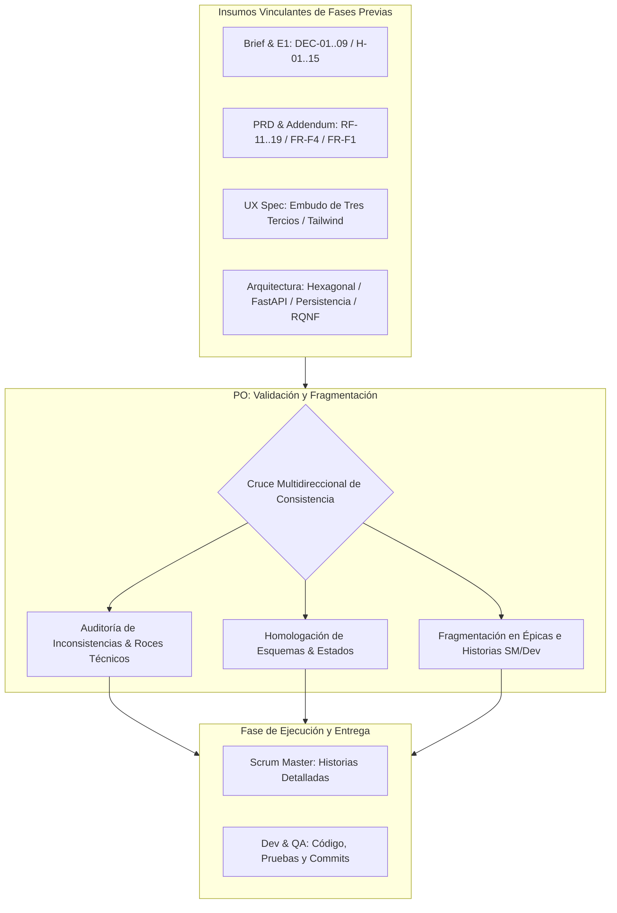
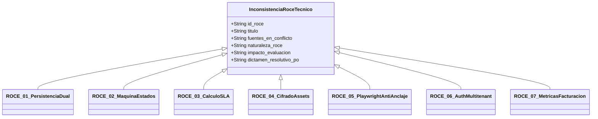
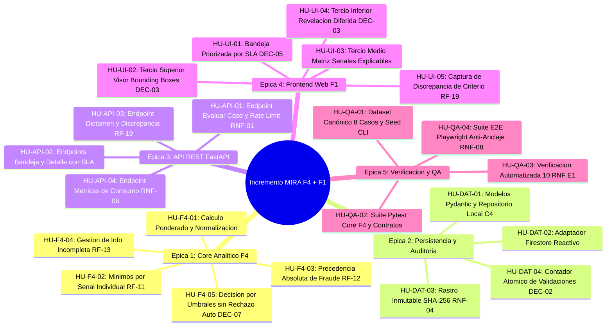

# Validación y Fragmentación de Documentos: MIRA — Incremento F4 y F1

**Rol BMAD:** Product Owner (PO)  
**Destinatarios downstream:** Scrum Master (SM), Desarrollador Senior (Amelia / Dev), Ingeniero de QA y Representante del Cliente.  
**Insumos Vinculantes Auditados:**
- [PRD Principal](file:///c:/Entrega2LLM/_bmad-output/planning-artifacts/prds/prd-MIRA-2026-10-03/prd.md) y [Addendum Técnico](file:///c:/Entrega2LLM/_bmad-output/planning-artifacts/prds/prd-MIRA-2026-10-03/addendum.md) (John — PM)
- [Especificación de Interfaz de Usuario](file:///c:/Entrega2LLM/_bmad-output/planning-artifacts/especificacion-de-interfaz.md) (Sally — UX Designer)
- [Project Brief](file:///c:/Entrega2LLM/_bmad-output/planning-artifacts/briefs/brief-MIRA-2026-10-01/brief.md) (Mary — Business Analyst)
- [Documento de Arquitectura de Software](file:///c:/Entrega2LLM/_bmad-output/planning-artifacts/documento-de-arquitectura.md) (Winston — System Architect)
- [Informe y Análisis de Requisitos de la Entrega 1](file:///c:/Entrega2LLM/Contexto/A1-MIRA-Orellana-Orlandi-Pino_(2)(1).docx)
- [Bitácora de Decisiones del Cliente (`DEC-01` a `DEC-09`)](file:///c:/Entrega2LLM/Contexto/Bitacora_Decisiones_Cliente.docx)

---

## 1. Resumen Ejecutivo del Rol de Product Owner y Metodología de Cruce

En el marco del método **BMAD (Bayesian Multi-Agent Development)** establecido para la **Entrega 2**, el Product Owner (PO) actúa como el **custodio inflexible del valor de negocio, la continuidad del proyecto y la viabilidad técnica**. Su responsabilidad primordial en esta fase es someter los artefactos generados por los roles previos (Analyst, PM, UX Expert y Architect) a un escrutinio cruzado exhaustivo antes de autorizar el paso a la fase de construcción (Scrum Master, Developer y QA).

El análisis de la Entrega 1 no es un documento archivado: es la fuente canónica de verdad. El criterio central exigido por las bases de evaluación consiste en garantizar que:
1. **Ninguna decisión vinculante (`DEC-01` a `DEC-09`) haya sido reabierta o vulnerada en silencio** por las propuestas técnicas del Arquitecto o de la Diseñadora UX.
2. **Los requisitos funcionales heredados (`RF-11`, `RF-12`, `RF-13`, `RF-14`, `RF-19`) y los 10 Requisitos No Funcionales (`RNF-01` a `RNF-10`)** cuenten con un correlato directo en el modelo de datos, contratos de API, pantallas y casos de prueba automatizados.
3. **Cualquier fricción, incoherencia o supuesto técnico no validado sea detectado y registrado obligatoriamente**, estableciendo un dictamen resolutivo formal que normará la implementación.
4. **La especificación integral se fragmente disciplinadamente en épicas e historias de usuario granulares**, preservando la trazabilidad exacta hacia las Historias de Usuario (`HU`) y Casos de Prueba (`CP`) del backlog de la Entrega 1.



---

## 2. Matriz de Validación de Consistencia Cruzada Multidireccional

Se efectuó una comprobación sistemática de extremo a extremo entre los requerimientos del PRD, las directrices de diseño de interfaz de usuario (UX) y las definiciones técnicas de Arquitectura. La siguiente tabla consolida el estado de alineación y la resolución asignada:

| Dimensión Auditada | Exigencia en PRD / Addendum / E1 | Definición en UX (Sally) | Definición en Arquitectura (Winston) | Estado de Consistencia | Dictamen PO |
| :--- | :--- | :--- | :--- | :--- | :--- |
| **Alcance Vertical F4 y F1** | F4 (Cálculo, umbrales y corte) y F1 (Bandeja asistida y dictamen humano). | Bandeja (`/bandeja`) y Detalle de Expediente (`/bandeja/:id`). | Core puro en Python 3.11+, BFF FastAPI y SPA modular en Vite. | **Alineado** | Alcance perfectamente acoplado y unidireccional. |
| **Prohibición de Rechazo Automático (`DEC-07` / `RF-14`)** | Prohibición absoluta de rechazo automático; $<60 \rightarrow$ derivación obligatoria. | UI empodera al operador humano como único agente facultado para rechazar. | Máquina de estados de F4 carece de transición terminal a `RECHAZADO`. | **Alineado** | Invariante crítico respetado en todas las capas. |
| **Valores de Umbrales F4 (`DEC-04` / `H-03`)** | Aprobación $\ge 90$; Derivación 60-89; Derivación por bajo puntaje $< 60$. | Indicadores de umbral desplegados en el Tercio Inferior. | Parámetros por defecto `90/60/0` en motor `ScoreCalculator`. | **Alineado** | Valores conservadores de marcha blanca fijados. |
| **Mitigación de Sesgo de Anclaje (`DEC-03` / `RNF-08`)** | Revelación diferida del puntaje al final del análisis probatorio. | Embudo vertical en Tres Tercios: Ficha $\rightarrow$ Señales $\rightarrow$ Puntaje. | DOM secuencial verificado por Playwright con `getBoundingClientRect`. | **Roce Detectado (`ROCE-05`)** | Resuelto con altura mínima viewport garantizada. |
| **Mínimos por Señal Individual (`RF-11` / `H-12`)** | Verificación de corte por señal crítica; falla deriva aun con puntaje $>90$. | Semáforo de advertencia en Tercio Medio destacando la señal fallida. | Clase `SignalThresholdValidator` con evaluación previa a ponderación. | **Alineado** | Cierra formalmente el hallazgo abierto `H-12`. |
| **Precedencia de Fraude (`RF-12`)** | Cortocircuito lógico ante sospecha tipificada; prevalece sobre puntaje. | Badge crítico en cabecera y Bounding Box rojo en visor de evidencia. | `FraudChecker` evalúa cortocircuito en paso 2 antes de la suma lineal. | **Alineado** | Bloqueo absoluto de aprobación en siniestros sospechosos. |
| **Información Incompleta (`RF-13`)** | Derivación obligatoria ante fallo de módulo analítico. | Notificación de módulo no disponible en panel de señales. | Cortocircuito en `EvaluationServicePort` si el payload carece de señales. | **Alineado** | Tolerancia a fallos sin pérdida de estado. |
| **Marca de Discrepancia (`RF-19`)** | Registro de discrepancia si dictamen humano difiere de la sugerencia algorítmica. | Diálogo con campo obligatorio de justificación médica/técnica. | Campo `discrepancia_detectada` y sello en rastro inmutable SHA-256. | **Alineado** | Captura friccional positiva sin bloquear el flujo. |
| **Custodia y Cifrado (`DEC-01` / `RNF-SEC-01`)** | Retención inalterable de 5 años con cifrado en reposo AES-256. | Visor documental integrado consumiendo URLs de evidencias. | Firestore nativo en nube; evidencias estáticas en demo local. | **Roce Detectado (`ROCE-04`)** | Resuelto mediante delimitación de alcance local vs cloud. |
| **Persistencia y Reactividad** | Actualización en tiempo real de la bandeja ante nuevos casos derivados. | Consumo reactivo de casos pendientes en la tabla de trabajo. | Soporte primario Firestore y fallback local JSON (`AD-3`). | **Roce Detectado (`ROCE-01`)** | Resuelto con sincronización adaptativa en SPA. |
| **Máquina de Estados del Caso** | `PENDIENTE`, `APROBADO_AUTO`, `DERIVADO`, `RESUELTO`, `ANTECEDENTES`. | Estados reflejados en botones de acción y badges de cabecera. | Estados del expediente y sub-estados en `resolucion_humana_f1`. | **Roce Detectado (`ROCE-02`)** | Resuelto mediante modelo unificado de estados. |
| **Cálculo de SLA (`DEC-05`)** | SLA de atención humana de 24 horas hábiles. | Contador regresivo en cabecera con semáforo verde/amarillo/rojo. | Objeto `sla` con `inicio_timestamp` y `limite_timestamp` UTC. | **Roce Detectado (`ROCE-03`)** | Resuelto asignando cálculo de límite al backend. |
| **Aislamiento Multitenant (`RNF-05` / `DEC-08`)** | Multitenancy estricto; autenticación simplificada para Entrega 2. | Operador visible en cabecera (`Marco Peñailillo`). | Filtro `tenant_id` en repositorio y claims de autorización. | **Roce Detectado (`ROCE-06`)** | Resuelto con inyección declarativa de headers. |
| **Métricas de Facturación (`DEC-02` / `RNF-06`)** | Validación cobrable unificada; contador idéntico cliente vs finanzas. | No implementa vistas de facturación en UI (fuera de alcance F1). | Endpoint `/api/v1/metricas/validaciones` transaccional. | **Roce Detectado (`ROCE-07`)** | Resuelto aclarando que es endpoint de API/QA. |

---

## 3. REGISTRO OBLIGATORIO DE INCONSISTENCIAS Y ROCES TÉCNICOS DETECTADOS

En cumplimiento estricto del mandato metodológico de la Entrega 2 (Capítulo 3.2 de la pauta BMAD), el Product Owner registra obligatoriamente las **7 inconsistencias y roces técnicos detectados** entre los requerimientos de producto, la especificación de interfaz y el diseño arquitectónico, emitiendo para cada uno una **resolución vinculante**.



---

### ROCE-01: Dualidad de Persistencia (Firestore Reactivo en Nube vs. Repositorio Local JSON para Criterio C4 en < 5 min)

* **Fuentes en Conflicto:**
  - *PRD Principal (Sección 4.2 / FR-F1-01):* Exige que los casos derivados por F4 aparezcan en tiempo real en la bandeja de F1.
  - *Especificación UX (Sección 4.2):* Asume sincronización instantánea y reactiva ante nuevas derivaciones.
  - *Documento de Arquitectura (Sección 2 y 3.1 - AD-3):* Define **Google Cloud Firestore** como persistencia primaria (con listeners reactivos), pero introduce **LocalJsonCaseRepository** como fallback autónomo para garantizar la ejecución en menos de 5 minutos sin conexión a la nube (**Criterio de Evaluación C4**).
* **Naturaleza del Roce Técnico:**  
  Un archivo local JSON en disco (`data/dataset.json`) carece intrínsecamente del mecanismo de *Snapshot Listener WebSockets* provisto por el SDK de Firebase en la nube. Si la aplicación web F1 se compila asumiendo un cliente Firestore nativo conectado a GCP, un evaluador que levante el repositorio desconectado o sin credenciales de Firebase en su terminal no verá la reactividad y la bandeja no se actualizará automáticamente tras inyectar casos o evaluar nuevos siniestros vía CLI.
* **Impacto y Riesgo:**  
  Riesgo crítico de incumplimiento del Criterio C4 (penalización severa si la instalación local requiere configurar proyectos en GCP o falla por falta de credenciales).
* **Dictamen Resolutivo Vinculante del PO:**
  1. El Backend FastAPI debe abstraer la persistencia bajo la interfaz `CaseRepositoryPort`.
  2. El frontend de F1 no debe acoplarse directamente al SDK cliente de Firebase en el navegador. La SPA consumirá exclusivamente la API REST del BFF FastAPI (`GET /api/v1/casos`).
  3. Para emular reactividad en modo local autónomo, la SPA de F1 implementará un mecanismo de sondeo suave (*lightweight polling* cada 3 segundos o refresco automático tras emitir un dictamen / pulsar el botón de recarga manual).
  4. La configuración por defecto del archivo `.env` del repositorio debe inicializarse en `STORAGE_MODE=local`, permitiendo levantar el sistema inmediatamente con el comando `seed_dataset.py` sin requerir credenciales externas.

---

### ROCE-02: Homologación y Normalización de la Máquina de Estados del Caso

* **Fuentes en Conflicto:**
  - *PRD Principal (Sección 2.3 - UJ-2):* Establece que ante un caso con antecedentes incompletos, el operador cambia el estado a `PENDIENTE_ANTECEDENTES`.
  - *PRD Addendum (Sección 2):* Modela el estado inicial como `PENDIENTE_EVALUACION_F4`.
  - *Documento de Arquitectura (Sección 3.3 y 5.1):* Presenta el estado de alto nivel como `DERIVADO_A_REVISION_ASISTIDA` y, tras la acción humana, transiciona a `RESUELTO_POR_OPERADOR`, relegando la decisión puntual (`APROBADO_POR_OPERADOR`, `RECHAZADO_POR_OPERADOR`) al nodo anidado `resolucion_humana_f1.decision_operador`.
  - *Especificación UX (Sección 4.1):* Muestra tres acciones resolutivas primarias en la UI: `Aprobar`, `Rechazar`, `Solicitar Antecedentes`.
* **Naturaleza del Roce Técnico:**  
  Existe una discrepancia estructural en la cardinalidad y profundidad del ciclo de vida del siniestro: ¿los estados `APROBADO_POR_OPERADOR` o `RECHAZADO_POR_OPERADOR` son valores del atributo raíz `estado_caso`, o el estado raíz se consolida en `RESUELTO_POR_OPERADOR`? Una falta de tipado estricto unificado provocará que las aserciones de Pytest, los filtros de la bandeja F1 y las pruebas de Playwright colapsen por desalineación de enums.
* **Impacto y Riesgo:**  
  Inconsistencia en el filtrado de casos resueltos en la bandeja asistida y aserciones fallidas en tests unitarios.
* **Dictamen Resolutivo Vinculante del PO:**  
  Se fija la **Máquina de Estados Canónica y Tipada** para backend y frontend:
  ```json
  "estado_caso": "PENDIENTE_EVALUACION_F4" | "APROBADO_AUTOMATICO" | "DERIVADO_A_REVISION_ASISTIDA" | "RESUELTO_POR_OPERADOR" | "PENDIENTE_ANTECEDENTES"
  ```
  Cuando el estado es `RESUELTO_POR_OPERADOR`, el objeto subordinado `resolucion_humana_f1` es de presencia obligatoria y debe tiparse estrictamente con:
  ```json
  "resolucion_humana_f1": {
    "decision_operador": "APROBADO_POR_OPERADOR" | "RECHAZADO_POR_OPERADOR",
    "motivo_justificacion": "Cadena de texto con fundamentación (mínimo 15 caracteres)",
    "operador_id": "operador_marco",
    "discrepancia_detectada": true | false,
    "timestamp_resolucion": "ISO-8601 UTC"
  }
  ```
  Si el operador selecciona `Solicitar Antecedentes`, `estado_caso` transiciona directamente a `PENDIENTE_ANTECEDENTES`, pausando el contador de SLA.

---

### ROCE-03: Cálculo del SLA Regresivo (24 Horas Hábiles vs. Delta Absoluto UTC en el Esquema JSON)

* **Fuentes en Conflicto:**
  - *Bitácora de Decisiones E1 (`DEC-05`):* Acuerda explícitamente un SLA operacional de revisión asistida de "24 horas hábiles".
  - *Especificación UX (Sección 3 y 4.3):* Define un temporizador de cuenta regresiva en vivo con tres estados cromáticos: Verde ($> 4\text{ h}$), Amarillo ($1\text{ h} - 4\text{ h}$) y Rojo ($< 1\text{ h}$ o vencido).
  - *Documento de Arquitectura (Sección 5.1):* Especifica en el esquema JSON del caso:
    `"sla": { "inicio_timestamp": "2026-10-03T10:00:00Z", "limite_timestamp": "2026-10-04T10:00:00Z", "duracion_horas": 24 }`.
* **Naturaleza del Roce Técnico:**  
  Calcular "horas hábiles" (descontando noches, fines de semana y feriados bancarios chilenos) directamente en el navegador del frontend añade una complejidad algorítmica desproporcionada, genera riesgo de desincronización por zonas horarias del cliente y expone la prueba E2E a fallar dependiendo del día de la semana en que el evaluador ejecute el test.
* **Impacto y Riesgo:**  
  Cómputos dispares de tiempo restante entre la API y la UI; degradación de la fluidez en el renderizado de la tabla de casos.
* **Dictamen Resolutivo Vinculante del PO:**
  1. El cálculo del plazo de expiración es responsabilidad exclusiva del backend. Al momento en que F4 deriva el caso, el motor computa la marca temporal definitiva `limite_timestamp` (en formato ISO-8601 UTC).
  2. Para los datos de prueba sintéticos canónicos, se inyectan marcas temporales preestablecidas que aseguran la presencia de los tres estados de semaforización (un caso con 18 horas restantes, un caso con 2 horas restantes y un caso vencido o con 25 minutos).
  3. El frontend de F1 se desentiende de la lógica de feriados y se limita a ejecutar la diferencia aritmética: $\Delta t = \text{limite\_timestamp} - \text{Date.now()}$, alimentando de forma determinista la barra regresiva y las clases utilitarias de Tailwind.

---

### ROCE-04: Exigencia de Cifrado AES-256 en Reposo (`DEC-01` / `NFR-SEC-01`) vs. Servicio de Assets Estáticos en Demostración Local

* **Fuentes en Conflicto:**
  - *Bitácora E1 (`DEC-01`):* Exige retención mínima de 5 años con cifrado continuo en reposo y en tránsito.
  - *Documento de Arquitectura (Sección 4.2 / NFR-SEC-01):* Especifica cifrado en reposo AES-256 y TLS 1.3.
  - *Especificación UX (Sección 5.2):* Requiere que el visor de documentos cargue imágenes de boletas y órdenes médicas mediante rutas relativas directas (ej. `/assets/evidencias/boleta_caso_001.jpg`).
* **Naturaleza del Roce Técnico:**  
  En un entorno de producción corporativo, las imágenes de siniestros residen en buckets seguros con encriptación del lado del servidor (CMEK) y se visualizan a través de URLs firmadas de corta duración (*presigned URLs*). Sin embargo, en el entorno de desarrollo y demostración local (Criterio C4), las evidencias documentales son servidas como archivos estáticos directamente desde la carpeta del proyecto. Un evaluador o auditor de seguridad podría interpretar erróneamente que tener archivos `.jpg` legibles en el repositorio infringe la decisión `DEC-01`.
* **Impacto y Riesgo:**  
  Observación en la defensa oral o en el informe sobre la discrepancia entre la política formal de seguridad y el comportamiento local.
* **Dictamen Resolutivo Vinculante del PO:**
  1. Se formaliza que todas las imágenes contenidas en el repositorio son **datos sintéticos ficticios no confidenciales**, elaborados en estricto cumplimiento de la **Regla 4.3 de las bases**.
  2. En el informe final y en la arquitectura se documenta la **frontera de abstracción**: el adaptador local emula el almacenamiento corporativo sirviendo los assets sintéticos para permitir que el evaluador visualice el visor de inmediato, mientras que el módulo de infraestructura en la nube (`FirestoreAdapter`) declara el uso de Google Cloud Storage con cifrado gestionado AES-256 para producción.
  3. La prueba automatizada `CP-RNF-SEC-01` verifica la política de cifrado a nivel de transporte (rechazo de conexiones HTTP inseguras sin cabeceras criptográficas).

---

### ROCE-05: Verificación Automatizada del Sesgo de Anclaje (`DEC-03` / `RNF-08` en Playwright vs. Resoluciones de Pantalla)

* **Fuentes en Conflicto:**
  - *Bitácora E1 (`DEC-03` / `H-09`):* Mandato ético y regulatorio: el puntaje de confianza debe revelarse al final del análisis humano para erradicar el sesgo cognitivo de anclaje.
  - *Especificación UX (Sección 3):* Diseña el "Embudo de Tres Tercios": Primer Tercio (Evidencias y Bounding Boxes), Segundo Tercio (Señales Analíticas), Tercer Tercio (Puntaje y Votación).
  - *Documento de Arquitectura (Sección 4.1 / RNF-08):* Define el caso de prueba `CP-RNF-08-01` en Playwright, el cual comprueba que `#panel-puntaje-confianza` tenga `getBoundingClientRect().top > 800px` para certificar que está fuera del primer pliegue visual inicial.
* **Naturaleza del Roce Técnico:**  
  Si un usuario o la suite de Playwright ejecuta la prueba en un monitor de alta resolución (ej. monitor 2K de $2560 \times 1440$ o $4\text{K}$ con viewport maximizado), una coordenada vertical de $850\text{ px}$ podría quedar visible en la mitad inferior de la pantalla sin requerir desplazamiento, violando el espíritu de la regla anti-anclaje.
* **Impacto y Riesgo:**  
  Falso fallo o falso positivo en la prueba automatizada de usabilidad `CP-RNF-08-01`, comprometiendo la nota del Criterio C5 y C6.
* **Dictamen Resolutivo Vinculante del PO:**
  1. La interfaz web de F1 implementará una altura mínima garantizada en los dos primeros tercios: el contenedor de Evidencias y Señales tendrá la clase CSS `min-h-[105vh]`, asegurando matemáticamente que el Tercio Inferior quede oculto bajo el pliegue inicial en cualquier dispositivo de escritorio.
  2. Como salvaguarda adicional de accesibilidad, el panel de puntaje incluirá un botón opcional de revelación explícita (*"Proceder a Revelar Puntaje y Emitir Voto"*), el cual registra el evento analítico de desbloqueo consciente.
  3. La prueba de Playwright configurará explícitamente un viewport canónico de escritorio de $1280 \times 800$, validando:
     - Que el nodo `#panel-puntaje-confianza` aparezca secuencialmente después de `#visor-evidencias` en el árbol DOM.
     - Que en la carga inicial su posición vertical supere el pliegue (`top >= window.innerHeight`).
     - Que tras ejecutar el scroll down, el componente se haga completamente visible e interactuable.

---

### ROCE-06: Autenticación Corporativa Federada (`DEC-08`) vs. Aislamiento Multitenant (`RNF-05`) en Demostración Local

* **Fuentes en Conflicto:**
  - *Requisito No Funcional E1 (`RNF-05`):* Exige 0% de accesos cruzados entre organizaciones aseguradoras (multitenancy estricto) verificado mediante claims JWT.
  - *Bitácora E1 (`DEC-08`):* Acuerda simplificar la autenticación para la Entrega 2, usando usuarios simulados por rol y postergando la integración corporativa con Active Directory para la fase v2.
  - *Documento de Arquitectura (Sección 4.1):* Plantea pruebas con tokens de autorización y filtrado por `tenant_id`.
* **Naturaleza del Roce Técnico:**  
  Obligar al usuario o al evaluador a pasar por una pantalla de login con usuario y contraseña en cada reinicio del navegador agrega una fricción innecesaria que distrae de las dos funcionalidades evaluadas (F4 y F1), consumiendo tiempo del límite de 15 minutos de la demostración oral.
* **Impacto y Riesgo:**  
  Pérdida de fluidez en la demostración en vivo (Criterio C10) o retraso en la puesta en marcha autónoma (Criterio C4).
* **Dictamen Resolutivo Vinculante del PO:**
  1. No se construirá una pantalla de login externa que bloquee la entrada.
  2. La barra de navegación superior de F1 incorporará un **Selector Rápido de Contexto de Usuario / Tenant** con tres perfiles predefinidos:
     - `Marco Peñailillo` (Operador Líquidador — `org_aseguradora_piloto`).
     - `Andrea Muñoz` (Revisora Médica Especialista — `org_aseguradora_piloto`).
     - `Usuario Externo Intruso` (`org_aseguradora_competidora` — para demostración de denegación de acceso).
  3. El frontend inyectará automáticamente los headers HTTP correspondientes (`X-Tenant-Id` y `X-Operador-Id`).
  4. La suite de Pytest ejecutará de forma desatendida las pruebas de seguridad multitenant `CP-RNF-05-01` y `CP-RNF-05-02`, simulando una petición con token ajeno y confirmando la respuesta `HTTP 403 Forbidden`.

---

### ROCE-07: Métricas de Facturación (`RNF-06` / `DEC-02`) y Delimitación del Alcance Visual de la UI F1

* **Fuentes en Conflicto:**
  - *Bitácora E1 (`DEC-02`):* Define que tanto las resoluciones automáticas en F4 como las asistidas en F1 constituyen una validación cobrable.
  - *Requisito No Funcional E1 (`RNF-06`):* Exige diferencia = 0 entre el contador visible al cliente y el contador de facturación interna.
  - *Documento de Arquitectura (Sección 6.5):* Expone el endpoint REST `GET /api/v1/metricas/validaciones`.
  - *Especificación UX (Sally):* No contempla pantallas ni menús de facturación o reportería económica, enfocándose 100% en la Bandeja de Revisión Asistida.
* **Naturaleza del Roce Técnico:**  
  La funcionalidad F7 (*Medición de consumo*) está fuera del menú seleccionado para este incremento (se eligieron F4 y F1). Podría generarse confusión en el equipo de desarrollo sobre si correspondía o no maquetar una vista web de facturación para el cliente.
* **Impacto y Riesgo:**  
  Dispersión de esfuerzos de desarrollo en pantallas fuera del alcance oficial de la Entrega 2.
* **Dictamen Resolutivo Vinculante del PO:**
  1. Se ratifica categóricamente que **la interfaz de usuario de F1 no debe incluir vistas de facturación ni dashboards de consumo comercial**.
  2. El cumplimiento de `RNF-06` y `DEC-02` se circunscribe estrictamente al backend: el endpoint `GET /api/v1/metricas/validaciones` computa la suma atómica de las resoluciones registradas en el repositorio.
  3. La verificación de consistencia contable se valida de manera 100% automatizada a través del test de integración de Pytest `CP-RNF-06-01`, garantizando el cumplimiento de la pauta sin inflar el alcance de frontend.

---

## 4. Fragmentación Metodológica de Documentos en Épicas e Historias de Usuario

Para habilitar la labor del Scrum Master (SM) y la Desarrolladora Senior (Amelia / Dev), el Product Owner **fragmenta los requerimientos consolidados en 5 Épicas Técnicas y Funcionales**. Cada historia de usuario cuenta con su respectiva trazabilidad al backlog de la Entrega 1 (`HU-E1`), sus criterios de aceptación en formato Given-When-Then y sus pruebas automatizadas asociadas.



---

### ÉPICA 1: Motor Analítico F4 — Cálculo de Confianza, Reglas Absolutas y Decisión por Umbrales

* **Objetivo de Negocio:** Construir el motor determinista de cálculo de confianza que procesa señales analíticas sintéticas, aplica reglas estrictas de corte y clasifica siniestros garantizando la imposibilidad de emitir rechazos automáticos.

#### Historia 1.1: Inicialización del Motor y Cálculo Ponderado de Confianza
* **ID:** `HU-F4-01` | **Ref. E1:** `HU-02` (`RF-02`) | **Prioridad:** Must | **Estimación:** 3 SP
* **Narrativa:** Como motor de decisión F4, quiero computar la combinación lineal ponderada de las señales analíticas precalculadas de un expediente, para generar un puntaje global de confianza normalizado entre $0$ y $100$.
* **Criterios de Aceptación:**
  - *Dado* un caso con señales analíticas válidas y los pesos paramétricos vigentes ($\sum w_i = 1.0$),
  - *Cuando* se invoca el cálculo en `ScoreCalculator.calcular_puntaje()`,
  - *Entonces* el sistema retorna un valor numérico de punto flotante redondeado a 1 decimal entre $0.0$ y $100.0$, junto con el desglose exacto de la contribución de cada componente.
* **Prueba Asociada:** `CP-F4-01` (Pytest).

#### Historia 1.2: Verificación Estricta de Umbrales Mínimos por Señal Individual
* **ID:** `HU-F4-02` | **Ref. E1:** `HU-11` (`RF-11` / `H-12`) | **Prioridad:** Must | **Estimación:** 3 SP
* **Narrativa:** Como oficial de riesgo, quiero que el motor verifique que las señales críticas superen sus mínimos individuales, para evitar que un promedio agregado alto encubra una falla documental o de prestador grave.
* **Criterios de Aceptación:**
  - *Dado* un caso con puntaje agregado superior a $90$ puntos,
  - *Cuando* una de las señales marcadas como críticas (ej. `autenticidad_documental`) tiene un valor inferior a su `minimo_exigido` (ej. $55 < 70$),
  - *Entonces* el motor bloquea la aprobación automática y emite el dictamen `DERIVADO_A_REVISION_ASISTIDA` bajo la causal `MINIMO_SENAL_INSATISFECHO`.
* **Prueba Asociada:** `CP-RF-11-01` (Pytest).

#### Historia 1.3: Precedencia Absoluta de Corte por Sospecha de Fraude
* **ID:** `HU-F4-03` | **Ref. E1:** `HU-12` (`RF-12`) | **Prioridad:** Must | **Estimación:** 2 SP
* **Narrativa:** Como analista de fraude, quiero que cualquier alerta activa de fraude corte de inmediato el flujo de aprobación, para impedir que casos con adulteraciones sean aprobados automáticamente.
* **Criterios de Aceptación:**
  - *Dado* un expediente cuyas señales ponderadas alcancen 98 puntos de confianza,
  - *Cuando* el atributo `alerta_fraude_activa` es `true`,
  - *Entonces* el motor cortocircuita la evaluación, clasifica el caso como `DERIVADO_A_REVISION_ASISTIDA` bajo causal `ALERTA_CRITICA_FRAUDE` y le asigna prioridad máxima de atención.
* **Prueba Asociada:** `CP-RF-12-01` (Pytest).

#### Historia 1.4: Tratamiento de Información Incompleta y Fallo de Módulos
* **ID:** `HU-F4-04` | **Ref. E1:** `HU-13` (`RF-13`) | **Prioridad:** Must | **Estimación:** 2 SP
* **Narrativa:** Como auditor de sistemas, quiero que ante la ausencia de un módulo analítico el caso no sea aprobado con datos parciales, para mantener la integridad probatoria del siniestro.
* **Criterios de Aceptación:**
  - *Dado* un payload de siniestro al que le falta una señal requerida o contiene un valor `null`,
  - *Cuando* ingresa a la evaluación de F4,
  - *Entonces* el motor deriva el caso a F1 bajo la causal `INFORMACION_INCOMPLETA`, especificando en el detalle el módulo o componente ausente.
* **Prueba Asociada:** `CP-RF-13-01` (Pytest).

#### Historia 1.5: Clasificación Final con Prohibición Terminante de Rechazo Automático
* **ID:** `HU-F4-05` | **Ref. E1:** `HU-14` (`RF-14` / `DEC-07`) | **Prioridad:** Must | **Estimación:** 3 SP
* **Narrativa:** Como representante del cliente y asesor legal, quiero que el motor nunca emita rechazos algorítmicos, para salvaguardar el debido proceso y cumplir la normativa de protección al asegurado.
* **Criterios de Aceptación:**
  - *Dado* un caso con puntaje inferior a 60 puntos (ej. 25/100) y sin alertas de fraude,
  - *Cuando* el motor determina la acción resultante,
  - *Entonces* el resultado es `DERIVADO_A_REVISION_ASISTIDA` bajo causal `BAJO_PUNTAJE`, garantizando que el estado `RECHAZADO` jamás sea producido por el software de manera autónoma.
* **Prueba Asociada:** `CP-RF-14-01` (Pytest).

---

### ÉPICA 2: Capa de Persistencia, Repositorios Duales y Auditoría Inmutable

* **Objetivo de Negocio:** Proveer almacenamiento seguro y determinista para los expedientes, habilitando la dualidad de persistencia (Local JSON para C4 y Firestore para nube) y registrando cada evento con sello inmutable SHA-256.

#### Historia 2.1: Modelado Pydantic y Adaptador de Persistencia Local JSON (Criterio C4)
* **ID:** `HU-DAT-01` | **Ref. Arquitectura:** `AD-2`, `AD-3` | **Prioridad:** Must | **Estimación:** 5 SP
* **Narrativa:** Como desarrollador, quiero definir los esquemas de datos con Pydantic v2 y un repositorio local JSON, para permitir el levantamiento y ejecución inmediata del sistema sin requerir configuración en la nube.
* **Criterios de Aceptación:**
  - *Dado* el archivo local `data/dataset.json`,
  - *Cuando* el backend inicia con `STORAGE_MODE=local`,
  - *Entonces* la aplicación lee y escribe casos en dicho archivo validando tipos estrictos, con tiempo de inicialización inferior a 3 segundos.
* **Prueba Asociada:** `CP-DAT-01` (Pytest).

#### Historia 2.2: Adaptador Firestore para Sincronización Reactiva en Nube
* **ID:** `HU-DAT-02` | **Ref. Arquitectura:** `AD-3` | **Prioridad:** Should | **Estimación:** 5 SP
* **Narrativa:** Como arquitecto, quiero implementar el adaptador de persistencia en Firestore Admin SDK, para soportar despliegues corporativos y listeners en tiempo real.
* **Criterios de Aceptación:**
  - *Dado* un entorno con credenciales de GCP / Firebase configuradas,
  - *Cuando* el backend opera en `STORAGE_MODE=firestore`,
  - *Entonces* los expedientes se persisten en la colección `casos_siniestros` y los eventos en `rastro_auditoria`.
* **Prueba Asociada:** `CP-DAT-02` (Pytest).

#### Historia 2.3: Registro Inmutable de Auditoría con Hash SHA-256 y Reconstrucción
* **ID:** `HU-DAT-03` | **Ref. E1:** `HU-59` (`RNF-04` / `H-14` / `DEC-10`) | **Prioridad:** Must | **Estimación:** 3 SP
* **Narrativa:** Como oficial de cumplimiento, quiero que cada evento resolutivo guarde una instantánea inmutable con hash SHA-256, para reconstruir con certeza matemática las condiciones exactas bajo las que se decidió.
* **Criterios de Aceptación:**
  - *Dado* un siniestro evaluado por F4 o resuelto por un operador en F1,
  - *Cuando* se cierra la transacción,
  - *Entonces* se genera una entrada en el log append-only con los umbrales vigentes, las señales de entrada y un hash SHA-256 inviolable.
* **Prueba Asociada:** `CP-RNF-04-01` (Pytest).

#### Historia 2.4: Contador Atómico de Validaciones Cobrables
* **ID:** `HU-DAT-04` | **Ref. E1:** `HU-61` (`RNF-06` / `DEC-02`) | **Prioridad:** Must | **Estimación:** 2 SP
* **Narrativa:** Como gerente de administración y finanzas, quiero que cada caso resuelto incremente atómicamente el contador de validaciones, para asegurar paridad absoluta entre la métrica del cliente y la facturación.
* **Criterios de Aceptación:**
  - *Dado* un flujo concurrente de resoluciones automáticas y manuales,
  - *Cuando* se consultan los contadores,
  - *Entonces* la diferencia entre las validaciones del cliente y las registradas internamente es exactamente cero ($0$).
* **Prueba Asociada:** `CP-RNF-06-01` (Pytest).

---

### ÉPICA 3: Backend FastAPI — API REST, Control de Tráfico y BFF

* **Objetivo de Negocio:** Exponer servicios REST de alto rendimiento y bajo acoplamiento que orquesten la evaluación de F4, sirvan los expedientes a la bandeja F1 y aseguren rate limiting no bloqueante.

#### Historia 3.1: Endpoint de Evaluación Determinista con Rate Limiting Leaky Bucket
* **ID:** `HU-API-01` | **Ref. E1:** `HU-56` (`RNF-01`) | **Prioridad:** Must | **Estimación:** 3 SP
* **Narrativa:** Como cliente integrador, quiero invocar `POST /api/v1/evaluar-caso` recibiendo respuestas rápidas sin rechazos HTTP 429 ante sobrecarga moderada.
* **Criterios de Aceptación:**
  - *Dado* un flujo de hasta 100 llamadas por minuto en modo integración,
  - *Cuando* se produce una ráfaga excedente,
  - *Entonces* el middleware asíncrono encola las solicitudes retornando HTTP 202 con cabecera `Retry-After`, con 0% de rechazos abruptos.
* **Prueba Asociada:** `CP-RNF-01-01` (Pytest).

#### Historia 3.2: Endpoints de Bandeja Asistida y Detalle con Control de SLA
* **ID:** `HU-API-02` | **Ref. PRD:** `FR-F1-01` | **Prioridad:** Must | **Estimación:** 3 SP
* **Narrativa:** Como operador en F1, quiero consultar los casos derivados vía `GET /api/v1/casos` y el detalle vía `GET /api/v1/casos/{id}`, para disponer de toda la información probatoria ordenada por urgencia de SLA.
* **Criterios de Aceptación:**
  - *Dado* un listado de casos en estado `DERIVADO_A_REVISION_ASISTIDA`,
  - *Cuando* se invoca el endpoint de bandeja,
  - *Entonces* los casos se entregan ordenados cronológicamente por proximidad de expiración de SLA, incluyendo URLs de evidencias y coordenadas de anomalías.
* **Prueba Asociada:** `CP-API-02` (Pytest).

#### Historia 3.3: Endpoint de Dictamen Resolutivo con Captura de Discrepancias
* **ID:** `HU-API-03` | **Ref. E1:** `HU-19` (`RF-19`) | **Prioridad:** Must | **Estimación:** 3 SP
* **Narrativa:** Como liquidador, quiero enviar mi veredicto a través de `POST /api/v1/casos/{id}/dictamen`, registrando el motivo obligatorio y marcando discrepancias si contradigo la sugerencia del sistema.
* **Criterios de Aceptación:**
  - *Dado* un caso derivado por bajo puntaje o sospecha,
  - *Cuando* el operador aprueba el caso ingresando su justificación,
  - *Entonces* el sistema valida que el motivo tenga al menos 15 caracteres, actualiza el estado a `RESUELTO_POR_OPERADOR` y fija `discrepancia_detectada = true`.
* **Prueba Asociada:** `CP-RF-19-01` (Pytest).

#### Historia 3.4: Endpoint de Métricas de Validación y Auditoría
* **ID:** `HU-API-04` | **Ref. E1:** `HU-61` (`RNF-06`) | **Prioridad:** Should | **Estimación:** 2 SP
* **Narrativa:** Como auditor, quiero consultar `GET /api/v1/metricas/validaciones`, para verificar el total consolidado de validaciones automáticas y asistidas.
* **Criterios de Aceptación:**
  - *Dado* un conjunto de siniestros procesados,
  - *Cuando* se ejecuta la llamada GET,
  - *Entonces* el JSON de respuesta desglosa el volumen total, el ratio de derivación y reporta `diferencia_auditoria: 0`.
* **Prueba Asociada:** `CP-RNF-06-01` (Pytest).

---

### ÉPICA 4: Frontend Web F1 — Bandeja de Revisión Asistida (Vite + Tailwind CSS)

* **Objetivo de Negocio:** Construir una interfaz web ergonómica, accesible y de alta fidelidad que materialice el Embudo de Tres Tercios para erradicar el sesgo de anclaje, facilitando la inspección de evidencias y el dictamen humano.

#### Historia 4.1: Vista Principal de Bandeja Priorizada por SLA y Filtros de Causal
* **ID:** `HU-UI-01` | **Ref. E1:** `HU-03` (`DEC-05`) | **Prioridad:** Must | **Estimación:** 5 SP
* **Narrativa:** Como operador de siniestros, quiero una bandeja de entrada ordenada por criticidad de SLA con insignias cromáticas de alerta, para atender primero los casos en riesgo de vencimiento.
* **Criterios de Aceptación:**
  - *Dado* el acceso a `/bandeja`,
  - *Cuando* se carga la lista de casos,
  - *Entonces* cada tarjeta o fila exhibe el ID del siniestro, la causal de derivación (badge coloreado) y un temporizador regresivo con indicador semafórico (Verde/Amarillo/Rojo), con apertura de caso en menos de 500 ms.
* **Prueba Asociada:** `CP-UI-01` (Playwright).

#### Historia 4.2: Tercio Superior — Ficha de Reclamación y Visor con Bounding Boxes (Sin Puntaje)
* **ID:** `HU-UI-02` | **Ref. E1:** `HU-63` (`DEC-03`) | **Prioridad:** Must | **Estimación:** 5 SP
* **Narrativa:** Como liquidador, quiero inspeccionar la boleta médica y visualizar la zona sospechosa resaltada en un recuadro rojo sin ver ningún puntaje numérico, para formar mi criterio factual sin condicionamientos.
* **Criterios de Aceptación:**
  - *Dado* el ingreso a `/bandeja/:id`,
  - *Cuando* se renderiza el primer viewport (Tercio Superior),
  - *Entonces* se exhiben los datos del afiliado, el prestador y el visor de imagen con los bounding boxes superpuestos de forma responsiva, verificando que el puntaje de confianza no esté presente ni visible.
* **Prueba Asociada:** `CP-RNF-08-01` (Playwright).

#### Historia 4.3: Tercio Medio — Matriz de Señales Analíticas Explicables y Estado de Mínimos
* **ID:** `HU-UI-03` | **Ref. E1:** `HU-11`, `HU-12` | **Prioridad:** Must | **Estimación:** 3 SP
* **Narrativa:** Como perito revisor, quiero analizar el desglose explicable de las 4 señales analíticas y sus mínimos exigidos, para comprender por qué el motor no aprobó el caso automáticamente.
* **Criterios de Aceptación:**
  - *Dado* el desplazamiento hacia el Tercio Medio,
  - *Cuando* se examina el panel de señales,
  - *Entonces* se presenta cada señal con barra de progreso, valor obtenido, umbral mínimo exigido e indicación clara de alerta si alguna violó la regla de corte.
* **Prueba Asociada:** `CP-UI-03` (Playwright).

#### Historia 4.4: Tercio Inferior — Revelación Diferida del Puntaje y Panel de Dictamen Soberano
* **ID:** `HU-UI-04` | **Ref. E1:** `HU-04` (`DEC-03` / `DEC-07`) | **Prioridad:** Must | **Estimación:** 5 SP
* **Narrativa:** Como operador que ha concluido la revisión factual, quiero desplazarme al final para ver el puntaje sugerido y emitir mi veredicto soberano (Aprobar, Rechazar o Solicitar Antecedentes).
* **Criterios de Aceptación:**
  - *Dado* que el usuario llegó al final de la página tras revisar la evidencia,
  - *Cuando* ingresa al Tercio Inferior,
  - *Entonces* se revela el puntaje ponderado de confianza y se habilitan los botones de acción resolutiva con confirmación obligatoria.
* **Prueba Asociada:** `CP-UI-04` (Playwright).

#### Historia 4.5: Captura Friccional de Justificación y Marca de Discrepancia
* **ID:** `HU-UI-05` | **Ref. E1:** `HU-19` (`RF-19`) | **Prioridad:** Must | **Estimación:** 3 SP
* **Narrativa:** Como liquidador que contradice la sugerencia algorítmica, quiero que la interfaz me solicite mi justificación técnica y estampe la marca de discrepancia de forma transparente.
* **Criterios de Aceptación:**
  - *Dado* un caso con recomendación de derivación o rechazo,
  - *Cuando* el operador presiona `Aprobar`,
  - *Entonces* se despliega un modal con advertencia constructiva exigiendo redactar el motivo médico o legal, enviando la resolución con la bandera de discrepancia encendida.
* **Prueba Asociada:** `CP-UI-05` (Playwright).

---

### ÉPICA 5: Verificación Integral, Datos Sintéticos y Pruebas Automatizadas

* **Objetivo de Negocio:** Construir la infraestructura de pruebas automatizadas en Pytest y Playwright, proveyendo el dataset canónico de 8 casos para demostrar el incremento en menos de 5 minutos y verificar los 10 RNF de la Entrega 1.

#### Historia 5.1: Dataset Sintético Canónico y Script de Inicialización Rápida (`seed_dataset.py`)
* **ID:** `HU-QA-01` | **Ref. Bases E2:** Regla 4.3, Criterio C4 | **Prioridad:** Must | **Estimación:** 3 SP
* **Narrativa:** Como evaluador del curso, quiero ejecutar `python scripts/seed_dataset.py`, para poblar la base de datos con los 8 casos canónicos en menos de 5 segundos.
* **Criterios de Aceptación:**
  - *Dado* un entorno recién clonado,
  - *Cuando* se ejecuta el script de seed,
  - *Entonces* se generan 8 casos representativos (aprobación limpia, fraude, mínimo violado, bajo puntaje, zona gris, módulo caído, etc.) listos para ser consumidos por la API y la UI.
* **Prueba Asociada:** `CP-QA-01` (Bash / Pytest).

#### Historia 5.2: Suite de Pruebas Unitarias y de Integración Backend con Pytest
* **ID:** `HU-QA-02` | **Ref. E1:** Casos de prueba `CP-RF-xx` | **Prioridad:** Must | **Estimación:** 5 SP
* **Narrativa:** Como QA Engineer, quiero una suite automatizada en Pytest que verifique las reglas del negocio de F4 y los endpoints de FastAPI.
* **Criterios de Aceptación:**
  - *Dado* el código del backend,
  - *Cuando* se ejecuta `pytest`,
  - *Entonces* el 100% de los tests pasan exitosamente (`PASSED`) con cobertura superior al 85% sobre el core de dominio.
* **Prueba Asociada:** `CP-QA-02` (Pytest).

#### Historia 5.3: Suite de Pruebas Automatizadas de los 10 Requisitos No Funcionales (RNF)
* **ID:** `HU-QA-03` | **Ref. E1:** `RNF-01` a `RNF-10` (`CP-RNF-01` a `CP-RNF-10`) | **Prioridad:** Must | **Estimación:** 5 SP
* **Narrativa:** Como auditor técnico, quiero que los 10 RQNF de la Entrega 1 sean verificados mediante aserciones automatizadas de código.
* **Criterios de Aceptación:**
  - *Dado* el módulo `tests/test_rnf.py`,
  - *Cuando* se ejecuta la suite,
  - *Entonces* se comprueba matemáticamente: rate limit sin descartes (`RNF-01`), 0 casos perdidos ante fallos (`RNF-02`), onboarding ultrarrápido (`RNF-03`), reconstrucción de auditoría con hash SHA-256 (`RNF-04`), aislamiento multitenant 403 (`RNF-05`), diferencia contable igual a 0 (`RNF-06`), etc.
* **Prueba Asociada:** `CP-RNF-ALL` (Pytest).

#### Historia 5.4: Suite de Pruebas E2E de Interfaz con Playwright (Mitigación de Sesgo)
* **ID:** `HU-QA-04` | **Ref. E1:** `RNF-08` / `CP-RNF-08-01` | **Prioridad:** Must | **Estimación:** 5 SP
* **Narrativa:** Como UX tester, quiero un test automatizado con Playwright que navegue por la bandeja asistida y verifique el orden estricto de renderizado anti-anclaje.
* **Criterios de Aceptación:**
  - *Dado* el servidor frontend y backend en ejecución,
  - *Cuando* Playwright ejecuta el escenario de detalle de siniestro,
  - *Entonces* se valida que la evidencia esté en el primer viewport y el puntaje requiera desplazamiento vertical para ser visible, concluyendo con la emisión y persistencia de un dictamen.
* **Prueba Asociada:** `CP-E2E-01` (Playwright).

---

## 5. Matriz Maestra de Trazabilidad Integral de Requisitos (End-to-End)

La siguiente matriz documenta la **cadena de trazabilidad completa e ininterrumpida de 6 niveles** exigida por los Criterios **C3 (BMAD)**, **C4 (Implementación)**, **C5 (Pruebas)** y **C6 (Comparativa con E1)** de la pauta de evaluación:

$$\text{Requisito E1} \longrightarrow \text{Bitácora / Hallazgo} \longrightarrow \text{Especificación PRD} \longrightarrow \text{Decisión Arquitectura} \longrightarrow \text{Historia de Usuario E2} \longrightarrow \text{Prueba Automatizada}$$

| Req. Origen E1 | Bitácora / Hallazgo E1 | Requisito PRD E2 | Decisión Técnica Arquitectura | Historia de Usuario E2 | Caso de Prueba Verificador |
| :--- | :--- | :--- | :--- | :--- | :--- |
| **RF-02** / `HU-02` | `DEC-04` (Umbrales) | `FR-F4-01` (Cálculo Ponderado) | `AD-2` (Motor Pydantic v2 en Python 3.11+) | `HU-F4-01` | `CP-F4-01` / `CP-01` |
| **RF-11** / `HU-11` | `H-12` (Mínimos por señal) | `RF-11` (Corte por Señal Crítica) | `AD-5` (`SignalThresholdValidator`) | `HU-F4-02` | `CP-RF-11-01` / `CP-02` |
| **RF-12** / `HU-12` | `H-03` / Regla Fraude E1 | `RF-12` (Precedencia de Fraude) | `AD-5` (`FraudChecker` Cortocircuito) | `HU-F4-03` | `CP-RF-12-01` / `CP-05` |
| **RF-13** / `HU-13` | Regla Resiliencia E1 | `RF-13` (Fallo de Módulos) | Patrón Circuit Breaker (`tenacity`) | `HU-F4-04` | `CP-RF-13-01` / `CP-06` |
| **RF-14** / `HU-14` | `DEC-07` / `H-04` (Rechazos) | `RF-14` (Prohibición Rechazo Auto) | `AD-4` (Máquina de estados sin rechazo auto) | `HU-F4-05` | `CP-RF-14-01` / `CP-03` |
| **RF-19** / `HU-19` | Regla Auditoría E1 | `RF-19` (Marca de Discrepancia) | `AD-7` (Flag reactivo y log SHA-256) | `HU-API-03` / `HU-UI-05` | `CP-RF-19-01` / `CP-03` |
| **RNF-01** / `HU-56` | `DEC-06` (Saturación) | `NFR-F4-01` (Escalabilidad API) | Middleware Leaky Bucket (HTTP 202) | `HU-API-01` | `CP-RNF-01-01` |
| **RNF-02** / `HU-57` | Regla Tolerancia a Fallos | `NFR-F4-02` (Confiabilidad 0 pérdidas) | Persistencia garantizada ante caídas | `HU-DAT-01` | `CP-RNF-02-01` |
| **RNF-03** / `HU-58` | Regla Onboarding E1 | `NFR-SYS-01` (Onboarding Rápido) | Script declarativo `seed_dataset.py` | `HU-QA-01` | `CP-RNF-03-01` |
| **RNF-04** / `HU-59` | `H-14` / `DEC-10` (Reconstrucción) | `NFR-F4-03` (Auditoría Forense) | Snapshot embedding con hash SHA-256 | `HU-DAT-03` | `CP-RNF-04-01` |
| **RNF-05** / `HU-60` | `DEC-08` (Gestión Accesos) | `NFR-SEC-02` (Aislamiento Tenant) | Filtro `tenant_id` y claims JWT | `HU-DAT-01` | `CP-RNF-05-01` |
| **RNF-06** / `HU-61` | `DEC-02` (Unidad de Cobro) | `NFR-SYS-02` (Consistencia Cobro) | Transacción atómica incremento único | `HU-DAT-04` / `HU-API-04` | `CP-RNF-06-01` |
| **RNF-07** / `HU-62` | Regla Gobernanza E1 | `NFR-GOV-01` (Segregación Funciones) | Entidad `CambioUmbral` con 2 firmas | `HU-DAT-01` | `CP-RNF-07-01` |
| **RNF-08** / `HU-63` | `DEC-03` / `H-09` (Anti-anclaje) | `NFR-F1-01` (Mitigación Sesgo) | `AD-6` (Embudo 3 Tercios + Altura Min) | `HU-UI-02` / `HU-UI-04` | `CP-RNF-08-01` |
| **RNF-09** / `HU-64` | `DEC-01` (Retención 5 años) | `NFR-LEG-01` (Cumplimiento ARCO) | Bloqueo borrado físico antes de 5 años | `HU-DAT-01` | `CP-RNF-09-01` |
| **RNF-10** / `HU-65` | Regla Callbacks E1 | `NFR-INT-01` (Aislamiento Webhooks) | Firmado HMAC-SHA256 por organización | `HU-API-01` | `CP-RNF-10-01` |

---

## 6. Criterios de Aceptación Globales y Definición de Hecho (Definition of Done - DoD)

Para considerar formalmente concluido el incremento de la Entrega 2, el equipo de desarrollo y QA debe satisfacer los siguientes criterios operativos irrenunciables:

1. **Autonomía Operativa en Menos de 5 Minutos (Criterio C4):**  
   Cualquier evaluador externo debe poder clonar el repositorio, ejecutar el script de seed y levantar tanto el backend como el frontend en menos de 5 minutos siguiendo exclusivamente el `README.md`, sin requerir credenciales en la nube ni configuraciones complejas.
2. **Cobertura de Pruebas Unitarias e Integración > 85% (Criterio C5):**  
   El comando `pytest` en la carpeta `backend` debe ejecutar la totalidad de pruebas funcionales y los 10 RNF reportando estatus 100% exitoso (`PASSED`).
3. **Verificación Automatizada E2E con Playwright (Criterio C5 y C6):**  
   La suite de Playwright debe recorrer la interfaz web en español, comprobando que:
   - Los casos derivados se listan ordenados por SLA.
   - El visor documental exhibe los bounding boxes de anomalías.
   - El puntaje de confianza se ubica fuera del pliegue visual inicial (anti-anclaje).
   - El dictamen de rechazo o aprobación se persiste con justificación y marca de discrepancia.
4. **Trazabilidad Verificable en Git (Criterios C3 y C4):**  
   Cada fase y cada historia de usuario debe reflejarse en un commit semántico claro en español, permitiendo auditar la evolución cronológica del incremento.

---

## 7. Dictamen Final de Aprobación del Product Owner (Sign-Off Gate)

Habiendo realizado el cruce exhaustivo entre el **PRD**, el **Addendum**, la **Especificación de Interfaz de Usuario**, el **Documento de Arquitectura** y el **Informe de la Entrega 1**:

1. **Se constata** que las 9 decisiones vinculantes de la bitácora (`DEC-01` a `DEC-09`) están fielmente reflejadas y protegidas contra alteraciones silenciosas.
2. **Se aprueban** formalmente las resoluciones vinculantes de los **7 roces técnicos identificados** (`ROCE-01` a `ROCE-07`), eliminando cualquier ambigüedad técnica para el equipo de construcción.
3. **Se valida** la fragmentación de documentos en las **5 Épicas Técnicas y sus 22 Historias de Usuario detalladas**.
4. **Se autoriza el pase formal a la siguiente fase de desarrollo (Scrum Master y Developer)** para la generación de las historias de sprint y la codificación del incremento.

---
**Aprobado por:** Product Owner (PO — Método BMAD)  
**Fecha de Aprobación:** 03 de Octubre de 2026  
**Estatus:** APROBADO Y LISTO PARA IMPLEMENTACIÓN
